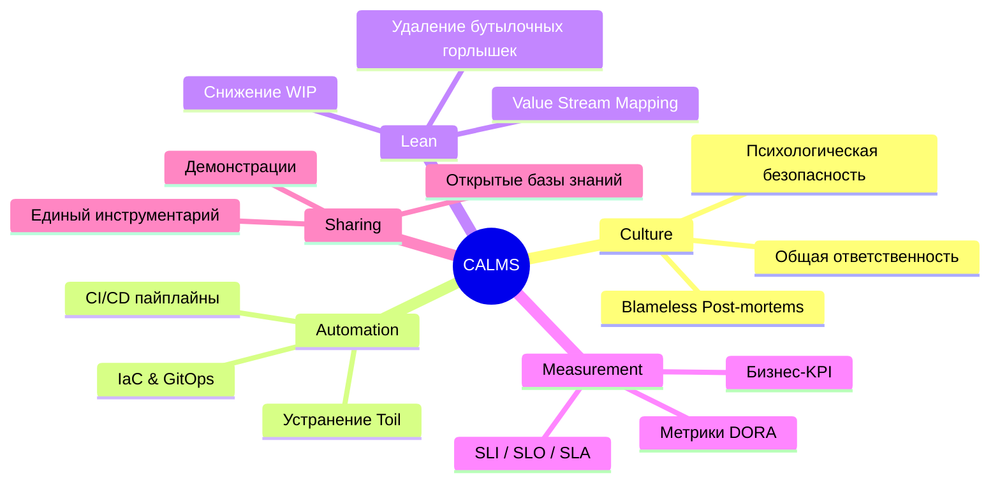

# Модель CALMS: ДНК настоящего DevOps

## Боль, которую мы лечим
Представьте компанию, которая купила Kubernetes, наняла инженеров с лычкой "DevOps", переписала все скрипты на Terraform и... время Time-to-Market всё равно составляет три месяца, а релизы сопровождаются ночными созвонами с валидолом. Почему? Потому что автоматизация хаоса дает лишь автоматизированный хаос.

CALMS — это фреймворк, придуманный Джезом Хамблом, который объясняет, что DevOps — это не инструменты, а баланс пяти элементов. Если вытянуть одну ножку у этого стула, он рухнет.

## Как работает CALMS (и что это вообще такое)



### 1. Culture (Культура)
Без культуры общих целей разработчики будут пилить фичи, а админы — защищать стабильность серверов, ненавидя друг друга.
**Антипаттерн:** Поиск виноватых при инциденте ("Чей коммит положил прод? Уволить!").
**Best Practice:** Blameless Post-mortems. Мы ищем не "кто виноват", а "какой недостаток системы позволил человеку совершить эту ошибку и как автоматизировать защиту".

### 2. Automation (Автоматизация)
Если вы делаете что-то дважды — скриптуйте это. Но помните, автоматизация служит культуре, а не наоборот.

**Пример автоматизации (IaC) — Terraform snippet:**
Вместо того чтобы кликать в AWS консоли, мы описываем инфраструктуру как код, чтобы её мог проревьюить разработчик:
```hcl
resource "aws_autoscaling_group" "web" {
  name                      = "web-asg"
  max_size                  = 5
  min_size                  = 2
  health_check_grace_period = 300
  health_check_type         = "ELB"
  
  # Автоматизация реагирует на нагрузку без участия человека
  target_group_arns = [aws_lb_target_group.front.arn]
}
```

### 3. Lean (Бережливое производство)
Наследие заводов Toyota в мире IT. Суть в том, чтобы видеть поток создания ценности целиком и не копить "незавершенку" (Work In Progress - WIP).
Зачем вам CI/CD, собирающий билды за 2 минуты, если потом QA-отдел тестирует их вручную две недели? Вы просто перенесли бутылочное горлышко. Lean учит оптимизировать систему целиком, а не локально.

### 4. Measurement (Измерения)
Нельзя улучшить то, что вы не измеряете. Нам нужны метрики производительности (DORA) и доступности систем (SLI/SLO).

**Пример (Prometheus AlertRule для контроля SLO):**
```yaml
groups:
- name: availability_slo
  rules:
  - alert: HighErrorRate
    expr: |
      sum(rate(http_requests_total{status=~"5.."}[5m])) 
      / 
      sum(rate(http_requests_total[5m])) > 0.05
    for: 1m
    labels:
      severity: critical
    annotations:
      summary: "Error rate is above 5% - SLO is burning"
```

### 5. Sharing (Обмен знаниями)
Снятие барьеров (Silos) между командами. Когда команда разработки пишет код, она делится с Ops-командой тем, как его мониторить. Когда Ops пишет Helm-чарт, они показывают разработчикам, как его конфигурировать.

## Day 2 Operations: Трейдоффы и подводные камни

### Автоматизация ради автоматизации (Over-engineering)
В Day 2 многие команды попадают в ловушку: они тратят месяцы на написание идеального Kubernetes-оператора для сервиса, который обновляется раз в год. **Трейдофф:** стоимость создания и поддержки автоматизации должна быть меньше, чем стоимость ручной работы (Toil), которую она заменяет.

### Культовый карго-культ
Нельзя внедрить Culture через приказ гендиректора. Это медленный, мучительный процесс трансформации, который часто саботируется средним менеджментом, боящимся потерять контроль (Lean требует делегирования). 

### Goodhart's Law в метриках (Measurement)
"Когда мера становится целью, она перестает быть хорошей мерой".
Если привязать KPI разработчиков к количеству релизов в день, они начнут деплоить изменение одной запятой в README. Метрики должны подсвечивать проблемы для команды, а не быть инструментом карательной системы менеджмента. 

### Границы применимости
CALMS универсален, но его реализация сильно зависит от контекста. В стартапе на 5 человек "Sharing" — это просто крикнуть через стол, а "Automation" — это Bash-скрипт на коленке. В энтерпрайзе на 5000 человек — это внутренние порталы разработчика (Backstage) и сложные платформенные команды. Важно не тащить энтерпрайз-практики в стартап и наоборот.
