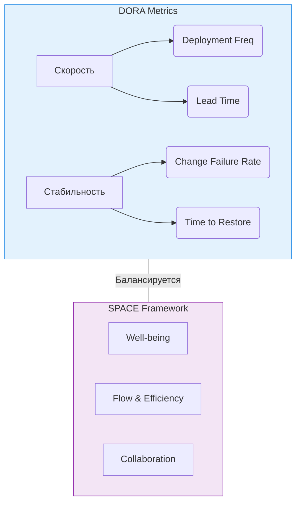

# DORA и SPACE метрики: Как измерить DevOps и не сойти с ума

## Проблема: Слепота управления и "интуитивная" разработка
Долгое время эффективность разработки измерялась строками кода, количеством закрытых тасок или отработанными часами. Это приводило к тому, что команды пилили фичи ради фичей, а эксплуатация (Ops) страдала от нестабильных релизов. Возникла боль: как понять, что наш процесс доставки (delivery) действительно работает хорошо? Как балансировать между скоростью (Time-to-Market) и стабильностью (отсутствием инцидентов), при этом не выжигая инженеров?

Ответом стали два взаимодополняющих фреймворка: **DORA** (скорость и стабильность) и **SPACE** (здоровье и продуктивность инженеров).

## Как это работает в production

**DORA (DevOps Research and Assessment)** выделяет 4 ключевые метрики, делящиеся на две группы:
* **Скорость (Throughput):**
  * *Deployment Frequency (DF)*: Как часто мы деплоим в прод?
  * *Lead Time for Changes (LT)*: Сколько времени проходит от коммита до прода?
* **Стабильность (Stability):**
  * *Change Failure Rate (CFR)*: Какой процент релизов приводит к инцидентам/откатам?
  * *Time to Restore Service (MTTR)*: Как быстро мы чиним прод, если он упал?

**SPACE** дополняет DORA, так как одни лишь цифры доставки ничего не говорят о выгорании:
* **S**atisfaction & well-being (Удовлетворенность)
* **P**erformance (Производительность — например, impact на бизнес)
* **A**ctivity (Активность — коммиты, PR)
* **C**ommunication & collaboration (Коммуникация — ревью, шаринг знаний)
* **E**fficiency & flow (Эффективность — время в состоянии "потока", количество прерываний)



## Показательные примеры

Сбор DORA метрик часто автоматизируют через CI/CD пайплайны. Ниже пример JSON-пейлоада, который пайплайн может отправлять в систему аналитики (например, Datadog или кастомный сервис) при успешном деплое:

```json
{
  "event_type": "deployment",
  "service": "billing-api",
  "environment": "production",
  "timestamp": "2026-07-25T17:00:00Z",
  "commit_hash": "a1b2c3d4",
  "lead_time_minutes": 45,
  "status": "success",
  "initiator": "ci-bot"
}
```

А вот пример PromQL для подсчета Change Failure Rate:
```promql
sum(rate(deployments_failed_total{env="prod"}[7d])) 
/ 
sum(rate(deployments_total{env="prod"}[7d]))
```

## Неочевидные нюансы и Day 2 Operations

### Трейдоффы и антипаттерны
* **Закон Гудхарта:** "Когда мера становится целью, она перестает быть хорошей мерой". Если привязать KPI и бонусы к метрикам DORA, разработчики начнут дробить коммиты на микроскопические, чтобы накрутить Deployment Frequency, или скрывать инциденты, чтобы улучшить CFR.
* **Игнорирование контекста (Антипаттерн):** Сравнивать метрики DORA команды монолита на Java и команды микросервиса на Go — бессмысленно. Метрики должны использоваться для отслеживания тренда *внутри* одной команды, а не для стравливания команд между собой.

### Оверхед и сбор данных
* **Day 2 боль:** Сбор Lead Time часто ломается, если у вас сложный branching strategy (например, долгоживущие feature-ветки). Трекинг времени от *первого коммита* до прода может выдавать странные результаты.
* Для SPACE метрик автоматизированный сбор (активность в Git/Jira) должен обязательно дополняться регулярными анонимными опросами (Satisfaction), иначе картина будет однобокой.

### Границы применимости
DORA идеально ложится на продуктовые команды с независимым релизным циклом. Для систем с жестким compliance (медицина, аэрокосмос) или on-premise софта с коробочными релизами раз в полгода, гнаться за Deployment Frequency в прод бессмысленно — там фокус смещается на MTTR и Lead Time до стейджинга.
