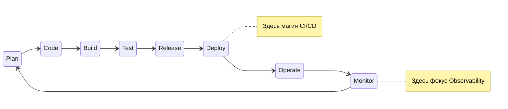

# DevOps: Обзор и методология

## Фундамент: От боли к потоку
DevOps родился из фундаментальной проблемы IT-индустрии нулевых годов: релизный цикл занимал месяцы, поставка ПО была непредсказуемой магией, а бизнес страдал от невозможности быстро проверить гипотезы на рынке. DevOps — это не профессия и не набор утилит (как бы ни пытались продать это вендоры). Это философия, базирующаяся на аббревиатуре **CALMS**: Culture, Automation, Lean, Measurement, Sharing. Мы меняем культуру, автоматизируем рутину, убираем потери (Lean), измеряем всё и делимся знаниями.

## Как это работает
В основе методологии лежит **непрерывный цикл (Infinite Loop)**. Мы стремимся минимизировать размер батча (изменения), чтобы быстрее доставлять ценность и быстрее получать обратную связь.



## Примеры и практики

**Антипаттерн:** Считать, что внедрение Kubernetes и GitLab CI автоматически сделало компанию "DevOps-ориентированной", при этом оставляя релизы раз в квартал с ручным QA-согласованием.
**Best Practice:** Конфигурация как код (IaC) и CI/CD пайплайны как единственный источник истины для продакшена.

Пример простого, но идеологически верного пайплайна:
```bash
# Истинный DevOps пайплайн стремится к автоматизации всего, включая откат
deploy_app() {
  if ! kubectl apply -f ./manifests; then
    echo "Deployment failed, alerting Slack..."
    curl -X POST -H 'Content-type: application/json' --data '{"text":"Deploy failed!"}' $SLACK_WEBHOOK
    exit 1
  fi
  
  if ! run_smoke_tests; then
    echo "Smoke tests failed. Rolling back..."
    kubectl rollout undo deployment/myapp
    exit 1
  fi
}
```

## Неочевидные нюансы (Трейдоффы и Day 2)
- **Day 2 Operations:** Построить CI/CD пайплайн легко (Day 1). Поддерживать его, обновлять версии Runner-ов, управлять секретами, чистить артефакты, когда у вас 500 микросервисов — это ад Day 2.
- **Миф о "DevOps инженере":** Найм одного человека на эту должность не решает проблем компании, а часто создает единую точку отказа. DevOps — это то, что вы *делаете*, а не то, что вы *покупаете*.
- **Оверхед микросервисов:** DevOps часто идет рука об руку с микросервисной архитектурой, но для большинства компаний монолит с хорошей автоматизацией деплоя принесет больше пользы и меньше боли в поддержке распределенных транзакций и трейсинга.
