# DevSecOps: Безопасность как встроенная функция, а не тормоз

## Какую боль мы решаем?
В традиционной разработке безопасность была "бутылочным горлышком" (bottleneck). Команда разработки месяцами пилит фичу, проводит тесты, и в день перед релизом передает билд в отдел ИБ. Безопасники прогоняют код через тяжелые сканеры и выкатывают PDF-отчет на 500 страниц уязвимостей. Релиз откладывается, бизнес в ярости, разработчики демотивированы. Еще хуже, когда сканирования нет вообще, и уязвимость находят хакеры на проде (даунтаймы, утечки, репутационные потери).

DevSecOps решает эту боль через концепцию **"Shift Left"** (сдвиг влево): интеграция практик безопасности на самые ранние этапы жизненного цикла разработки (SDLC). Безопасность становится автоматизированной, прозрачной частью конвейера.

## Как это работает?
Вместо ручного аудита в конце, в CI/CD пайплайн встраиваются легковесные инструменты автоматической проверки. Разработчик делает коммит и уже через 5 минут знает, если случайно принес уязвимую зависимость или оставил токен в коде.

```mermaid
graph LR
    Code[Write Code\nIDE Plugins] --> Commit[Commit]
    Commit --> SAST[SAST & Secret Scan\nSemgrep / Gitleaks]
    SAST --> SCA[SCA\nDependency Check]
    SCA --> Build[Build Docker Image]
    Build --> ImageScan[Image Scanning\nTrivy / Clair]
    ImageScan --> DeployStg[Deploy to Staging]
    DeployStg --> DAST[DAST\nOWASP ZAP]
    DAST --> Prod[Promote to Prod]
    
    style SAST fill:#f9d0c4,stroke:#333,stroke-width:2px
    style SCA fill:#f9d0c4,stroke:#333,stroke-width:2px
    style ImageScan fill:#f9d0c4,stroke:#333,stroke-width:2px
    style DAST fill:#f9d0c4,stroke:#333,stroke-width:2px
```



## Примеры конфигурации и Best Practices

**Best Practice:** Сканирование Docker-образа прямо в пайплайне перед пушем в Registry.
Пример GitHub Actions YAML с использованием Trivy:

```yaml
name: Build and Scan
on: [push]
jobs:
  build-and-scan:
    runs-on: ubuntu-latest
    steps:
      - name: Checkout code
        uses: actions/checkout@v3

      - name: Build an image from Dockerfile
        run: |
          docker build -t my-app:${{ github.sha }} .

      - name: Run Trivy vulnerability scanner
        uses: aquasecurity/trivy-action@master
        with:
          image-ref: 'my-app:${{ github.sha }}'
          format: 'table'
          exit-code: '1'          # Уронить пайплайн при наличии уязвимостей
          ignore-unfixed: true    # Игнорировать CVE без выпущенных патчей
          severity: 'CRITICAL,HIGH' # Реагировать только на высокий уровень риска
```

**Антипаттерн в Dockerfile:** Запуск приложения от имени `root` и использование `latest` тега, из-за чего в прод едет непредсказуемый и потенциально уязвимый образ.

```dockerfile
# АНТИПАТТЕРН!
FROM node:latest
WORKDIR /app
COPY . .
RUN npm install
# Нет смены пользователя, приложение работает под root!
CMD ["npm", "start"]
```

## Неочевидные нюансы и Day 2 Operations

*   **Где отстреливает ногу (False Positives):** Самая частая ошибка при внедрении DevSecOps — настроить сканеры блокировать билд на *любой* найденной уязвимости. Пайплайны начинают падать на 100% коммитов из-за ложных срабатываний или уязвимостей, которые невозможно проэксплуатировать в вашем контексте. Команда начинает ненавидеть ИБ. *Решение:* Внедрять "мягко" (сначала в режиме audit-only), фильтровать только CRITICAL и настраивать процессы исключений (Risk Acceptance).
*   **Оверхед на пайплайны:** Каждый новый сканер замедляет сборку. Если CI-цикл увеличивается с 5 минут до 40 минут из-за DAST-сканирования, разработчики перестанут часто коммитить, нарушая суть Continuous Integration. Тяжелые проверки лучше выносить в ночные прогоны (Nightly Builds).
*   **Day 2 Operations:** Инструменты находят уязвимости, но их кто-то должен исправлять. Появляется рутина по сортировке (триажу) CVE. Необходим четкий SLA: за сколько дней закрывается Critical, а за сколько — Medium.
*   **Границы применимости:** DevSecOps требует высокой зрелости процессов DevOps. Если у вас нет стабильного CI/CD, тестов и автоматизации инфраструктуры, попытка "навесить" безопасность сверху приведет только к хаосу. Сначала — стабильный Delivery, потом — Security.
