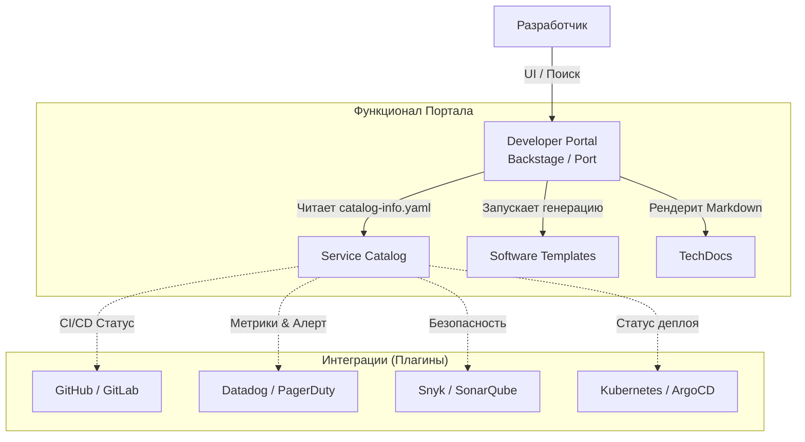

# Internal Developer Portal (IDP): Backstage, Port и другие

## Какую боль мы решаем?

По мере роста компании и перехода на микросервисную архитектуру, наступает момент, когда никто не понимает, как выглядит система целиком. 
Типичные проблемы разработчиков в энтерпрайзе:
* "Я хочу создать новый сервис, где мне взять шаблон, чтобы там сразу были настроены CI/CD, линтеры и докер?"
* "Упал сервис `auth-proxy-v2`. Чей он? Кому звонить среди ночи?"
* "Где документация по API сервиса биллинга? Она в Confluence, в Readme.md или в Notion?"
* "Какие сервисы используют уязвимую версию библиотеки log4j?"

**Internal Developer Portal (Внутренний портал разработчика)** — это единая витрина (Single Pane of Glass) вашей внутренней платформы разработки. Если Platform Engineering — это двигатель и ходовая часть вашей инфраструктуры, то Developer Portal — это приборная панель и руль для разработчика.

## Как это работает в production

Самые популярные решения на сегодня: **Spotify Backstage** (open-source монстр на TypeScript/React) и **Port** (SaaS альтернатива).

Портал обычно решает три главные задачи:
1. **Software Catalog (Каталог ПО)** — реестр всех сервисов, библиотек, пайплайнов и их владельцев.
2. **Software Templates (Шаблоны)** — кнопка "Создать сервис", которая генерирует бойлерплейт код, репозиторий, пайплайны и регистрирует сервис в каталоге.
3. **TechDocs** — документация как код (Docs-like-code), которая рендерится прямо в портале из Markdown файлов, лежащих рядом с кодом.



### Пример конфигурации: Регистрация сервиса в Backstage

Вся магия строится на децентрализации. Команда платформы не заполняет каталог руками. В корне каждого репозитория с микросервисом лежит файл-описание (аналог манифеста в k8s), который портал регулярно сканирует.

Пример `catalog-info.yaml` (Backstage):

```yaml
apiVersion: backstage.io/v1alpha1
kind: Component
metadata:
  name: payment-gateway
  description: Сервис для обработки платежей
  annotations:
    # Интеграции с внешними системами через плагины
    github.com/project-slug: mycompany/payment-gateway
    pagerduty.com/integration-key: abcdef12345
    sonar.io/project: payment-gateway-backend
spec:
  type: service
  lifecycle: production
  owner: team-payments # Ссылка на сущность Group
  system: billing-system
  dependsOn:
    - component: user-auth-service
```

## Неочевидные нюансы: скрытые трейдоффы и Day 2

### Где это отстреливает ногу?

1. **Backstage — это не готовый продукт, это фреймворк.** 
   Главный антипаттерн при внедрении Backstage — думать, что вы скачаете бинарник, запустите его, и всё заработает. На самом деле, Backstage — это TypeScript/React приложение, которое вам **придется разрабатывать и поддерживать**. Вам понадобятся фронтендеры в команде DevOps/Platform для написания кастомных плагинов и обновления зависимостей. Если у вас нет на это ресурсов, лучше смотреть в сторону SaaS-решений вроде Port или Cortex.
2. **Проблема пустого каталога (Garbage In - Garbage Out).** 
   Портал бесполезен, если в нем нет данных. Заставить сотни разработчиков добавить `catalog-info.yaml` во все их репозитории — это огромная организационная задача. Если каталог не актуален, доверие к порталу падает, и им перестают пользоваться.

### Day 2 Operations (Жизнь после запуска)

* **Устаревание плагинов:** В экосистеме Backstage сотни open-source плагинов. Многие из них написаны энтузиастами и забрасываются. При обновлении ядра Backstage вы регулярно будете сталкиваться с конфликтами версий в плагинах.
* **Синхронизация организационной структуры:** Владельцы сервисов (`owner`) должны мапиться на реальные команды. Синхронизация LDAP/Okta/GitHub Teams с внутренним каталогом портала часто становится сложной задачей, когда команды постоянно переформировываются.
* **Перегруженность UI:** По мере добавления плагинов (метрики, безопасность, CI/CD, cost management), карточка сервиса может превратиться в нечитаемую свалку виджетов. Крайне важно применять UX-подход и показывать разработчикам только самое важное.

## Итог

Developer Portal — это мощный инструмент для снижения когнитивной нагрузки и улучшения Developer Experience (DevEx). Он превращает хаос из десятков разрозненных SaaS-инструментов в единый, понятный интерфейс. Однако его внедрение требует значительных инвестиций не только в технологию, но и в культуру компании.
