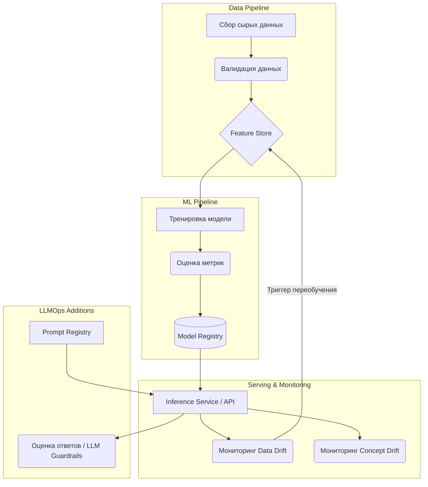

# MLOps и LLMOps

## Боль и эволюция: От ноутбука к production-ready конвейеру

В мире классической разработки мы давно привыкли к CI/CD: написал код, прогнал тесты, собрал артефакт, выкатил на сервер. Но когда дело доходит до машинного обучения, эта стройная картина рушится. Data Scientist обучает модель в Jupyter-ноутбуке на своей локальной машине, сохраняет веса в `model_v2_final_FINAL.pkl` и передает это инженерам со словами: "У меня на машине работает, точность 95%".

Инженеры пытаются запустить это в production: зависимости не совпадают, версия CUDA другая, данных в таком формате, как ожидает модель, в проде нет, а сама модель потребляет столько памяти, что OOM Killer сносит контейнер через пять минут. 

**MLOps (Machine Learning Operations)** появился, чтобы решить эту боль. Это набор практик на стыке ML, DevOps и Data Engineering, цель которого — сделать процесс деплоя, мониторинга и обновления моделей воспроизводимым и предсказуемым.

С появлением больших языковых моделей (LLM) возник **LLMOps**. Здесь к стандартным проблемам MLOps добавились новые: огромный размер моделей, сложность файнтюнинга, управление промптами (Prompt Engineering), борьба с галлюцинациями и защита от prompt injection.

## Архитектура: Как это работает



## Примеры конфигураций и Best Practices

### Model Registry (MLflow)
Вместо пересылки pickle-файлов, модели должны версионироваться.

```python
import mlflow

# Антипаттерн: model.save("model.pkl")

# Best Practice: Использование Model Registry
with mlflow.start_run():
    mlflow.log_param("learning_rate", 0.01)
    mlflow.sklearn.log_model(model, "random_forest_model", registered_model_name="fraud_detection")
```

### Деплой с помощью KServe (Kubernetes)
Декларативное описание serving'а модели.

```yaml
apiVersion: serving.kserve.io/v1beta1
kind: InferenceService
metadata:
  name: fraud-detector
spec:
  predictor:
    minReplicas: 2
    maxReplicas: 10
    scaleTarget: 70
    sklearn:
      storageUri: "s3://models-bucket/fraud_detection/v1"
      resources:
        limits:
          memory: "2Gi"
```

## Неочевидные нюансы и Day 2 Operations

1. **Тихие деградации (Data Drift).** Модель не падает с HTTP 500, она просто начинает выдавать неверные прогнозы, потому что изменилось поведение пользователей (например, после начала пандемии). В Day 2 MLOps критически важно настраивать алерты не только на CPU/RAM, но и на распределение входящих фичей и уверенность модели (confidence score).
2. **Оверхед на инфраструктуру.** Разворачивание Kubeflow или полноценного Feature Store для одной простой модели — классический overengineering. Начинайте с простого (FastAPI + Docker + MLflow), усложняйте по мере роста боли.
3. **LLMOps: Стоимость и Latency.** В LLMOps главная боль — не обучить модель, а дешево её хостить (vLLM, TGI) и управлять версиями промптов, так как малейшее изменение в системном промпте может сломать downstream-задачи.
4. **Холодные старты (Cold Starts).** Если вы используете Serverless или масштабируете GPU-ноды в ноль для экономии, загрузка весов LLM (даже квантованной) в память видеокарты может занимать десятки секунд, что ломает UX.
