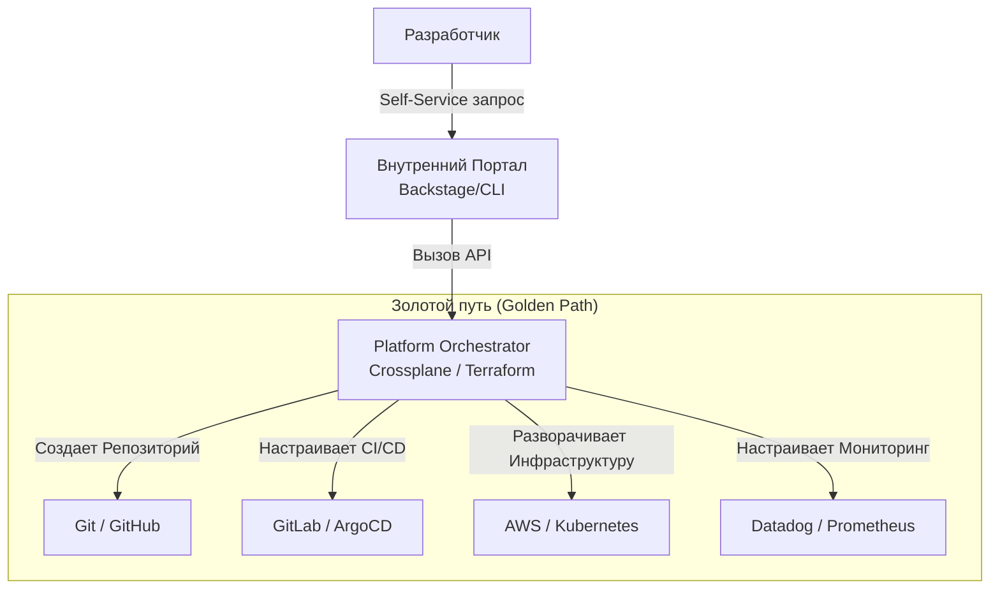

# Platform Engineering: Платформа как продукт

## Какую боль мы решаем?

Долгое время DevOps-трансформация подразумевала девиз "You build it, you run it". Идея прекрасная, но на практике она часто превращалась в кошмар для разработчиков. Представьте: продуктовая команда хочет выкатить новый микросервис на Go. Вместо того чтобы писать бизнес-логику, им нужно:
1. Написать Dockerfile.
2. Разобраться с Helm-чартами и написать манифесты Kubernetes.
3. Настроить CI/CD пайплайн в GitLab или GitHub Actions.
4. Выделить ресурсы в AWS (написать Terraform, настроить IAM роли).
5. Настроить мониторинг в Prometheus и дашборды в Grafana.

**Когнитивная нагрузка (Cognitive Load)** на разработчиков становится запредельной. Каждая команда начинает изобретать свои "костыли", плодить копипасту в инфраструктурном коде и отвлекаться от продукта. 

Здесь на сцену выходит **Platform Engineering**. Суть концепции в том, чтобы собрать все лучшие практики, инструменты и инфраструктуру компании в единый внутренний продукт — **Internal Developer Platform (IDP)**. Команда платформы (Platform Team) относится к разработчикам как к своим клиентам. Их задача — предоставить "Золотые пути" (Golden Paths), которые позволяют разработчикам получать нужную инфраструктуру по нажатию кнопки (Self-Service), не вникая в глубины Kubernetes или AWS, но при этом оставляя возможность "свернуть с пути", если это действительно необходимо.

## Как это работает в production

Вместо того чтобы разработчики ходили к админам с тикетами "создайте нам БД", они используют платформу. 
Обычно платформа состоит из:
1. **Developer Portal** (UI/CLI/API) — точка входа.
2. **Platform Orchestrator / Control Plane** — мозг, который понимает, что нужно создать.
3. **Инфраструктурные компоненты** — CI/CD, Kubernetes, Cloud Providers.



### Пример конфигурации: "Золотой путь" для базы данных

Вместо того чтобы разработчик писал 500 строк Terraform, команда платформы предоставляет абстракцию. Например, используя **Crossplane**, разработчик создает простой YAML манифест:

```yaml
# Прикладной разработчик пишет только это:
apiVersion: mycompany.platform/v1alpha1
kind: PostgreSQLInstance
metadata:
  name: payment-db
  namespace: payments-team
spec:
  parameters:
    storageGB: 50
    environment: production
```

Platform Controller (настроенный инженерами платформы) перехватывает этот YAML и разворачивает полноценный RDS в AWS с нужными бекапами, IAM-ролями и метриками, согласно политикам безопасности компании.

## Неочевидные нюансы: скрытые трейдоффы и Day 2

### Где это отстреливает ногу?

1. **Размер компании имеет значение.** Для стартапа из 10 человек строить IDP — это овер-инжиниринг. Платформенный подход окупается, когда у вас от 3-5+ продуктовых команд и зоопарк микросервисов.
2. **Платформа ради платформы.** Самый частый антипаттерн — когда Platform-команда уходит на полгода в изоляцию и строит "идеальную" платформу, которая оказывается неудобной, и разработчики отказываются ей пользоваться. **Платформа — это продукт**. Нужны CustDev, сбор обратной связи от разработчиков, MVP и постепенное внедрение.

### Day 2 Operations (Жизнь после запуска)

* **Поддержка и эволюция:** Технологии меняются. Вам нужно обновлять версии Terraform, Kubernetes, базы данных под капотом ваших "Золотых путей" так, чтобы для разработчиков это было прозрачно.
* **Overhead на интеграцию:** Любой новый инструмент (например, переход на новый сканер безопасности) требует написания плагинов и интеграции в общую платформу, что замедляет внедрение новшеств на уровне компании.
* **Shadow IT:** Если ваши "Золотые пути" слишком жесткие и не дают гибкости, команды начнут втайне создавать ресурсы в обход платформы, возвращая хаос.

## Итог

Platform Engineering — это не про то, чтобы запретить разработчикам трогать инфраструктуру, а про то, чтобы сделать правильный способ работы самым простым и удобным. Это мост между сложным миром Cloud Native и бизнес-задачами продуктовых команд.
