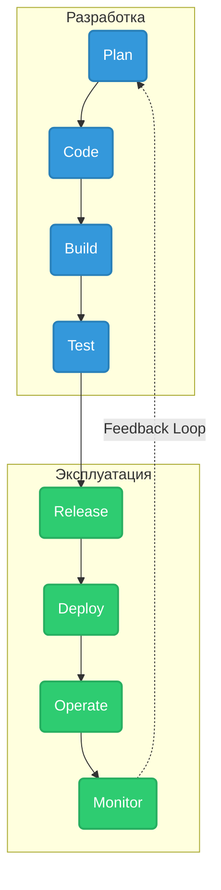

# Software Development Life Cycle (SDLC) в эпоху DevOps

## История одной боли
Когда-то доставка ПО напоминала игру в сломанный телефон: разработчики писали код и перебрасывали его "через стену" тестировщикам, а те, в свою очередь, передавали артефакты сисадминам, сопровождая их вордовским документом с инструкцией по развертыванию. Если что-то шло не так (а оно всегда шло не так), начинался поиск виноватых: "у меня на локалхосте всё работает", "ваша среда кривая", "а мы вообще не знаем, что вы там накодили". 

SDLC в парадигме DevOps — это ответ на эту боль. Это превращение разрозненных этапов в единый, непрерывный поток ценности (Value Stream), где разработка, тестирование и эксплуатация слиты воедино благодаря автоматизации и культуре общих целей.

## Как это выглядит в production
Современный SDLC визуализируют в виде бесконечной восьмерки (Infinity Loop), потому что жизненный цикл продукта не заканчивается после релиза — он сразу переходит в фазу мониторинга и планирования новых фич.



## Практический пример: CI/CD Pipeline
Сердце современного SDLC — это автоматизированный пайплайн. Вот пример того, как этапы Build, Test и Deploy отражаются в простом конфиге GitHub Actions:

```yaml
name: Production SDLC Pipeline
on:
  push:
    branches: [ "main" ]

jobs:
  build_and_test:
    runs-on: ubuntu-latest
    steps:
      - name: Checkout Code
        uses: actions/checkout@v4
        
      - name: Setup Go
        uses: actions/setup-go@v4
        with:
          go-version: '1.21'
          
      # Этап Code & Build
      - name: Compile Application
        run: go build -o myapp ./cmd/main.go
        
      # Этап Test (Unit & Security)
      - name: Run Tests
        run: go test -v -race ./...
        
      - name: Run SAST Scanner (Shift-Left Security)
        uses: securego/gosec@master
        with:
          args: ./...

  deploy:
    needs: build_and_test
    runs-on: ubuntu-latest
    environment: production
    steps:
      # Этап Release & Deploy
      - name: Trigger ArgoCD Sync
        run: |
          echo "Updating deployment manifest with new image tag"
          # В реальности здесь часто пушат новый тег в git-репозиторий манифестов (GitOps)
          # git commit -am "Update image to ${{ github.sha }}"
```

### Антипаттерн: "CI-театр"
Многие команды пишут пайплайны, но оставляют тесты опциональными (`continue-on-error: true` для линтеров или тестов) или, что еще хуже, тестируют только "зеленый путь". Это создает иллюзию автоматизации: CI крутится, галочки зеленые, но в production всё равно едут баги.

## Неочевидные нюансы и Day 2 Operations

### 1. Стоимость владения пайплайнами (Pipeline Rot)
CI/CD пайплайны — это тоже код. И он гниет. Со временем версии actions устаревают, раннеры требуют обновлений, а время сборки неумолимо растет. В Day 2 operations вам придется выделять ресурсы на "рефакторинг пайплайнов", внедрять кэширование и бороться за каждую секунду сборки, чтобы фидбек-луп не превратился из 2 минут в 40.

### 2. Скрытый оверхед "Shift-Left"
Мы стремимся сдвинуть проверки (безопасность, QA) влево, ближе к разработчику. Но если внедрить тяжелые сканеры уязвимостей, которые сыплют тысячами ложных срабатываний на каждый коммит, разработка встанет. **Трейдофф:** между скоростью поставки и параноидальным контролем качества. Решение: разделять быстрые тесты (на каждый коммит) и тяжелые (в ночных сборках).

### 3. Границы применимости непрерывного Deploy
Continuous Deployment (CD), когда каждый коммит в main едет сразу на прод без участия человека, звучит как сказка. Но это работает только если у вас:
* Идеальное покрытие автотестами (unit, integration, e2e)
* Выстроена система Feature Flags, чтобы скрыть сырой функционал
* Настроен идеальный мониторинг, способный автоматически откатить релиз при всплеске 5xx ошибок

Для финансовых, медицинских или embedded-систем полный CD часто является излишним риском, и там останавливаются на Continuous Delivery (артефакт готов к деплою, но кнопка нажимается человеком).
