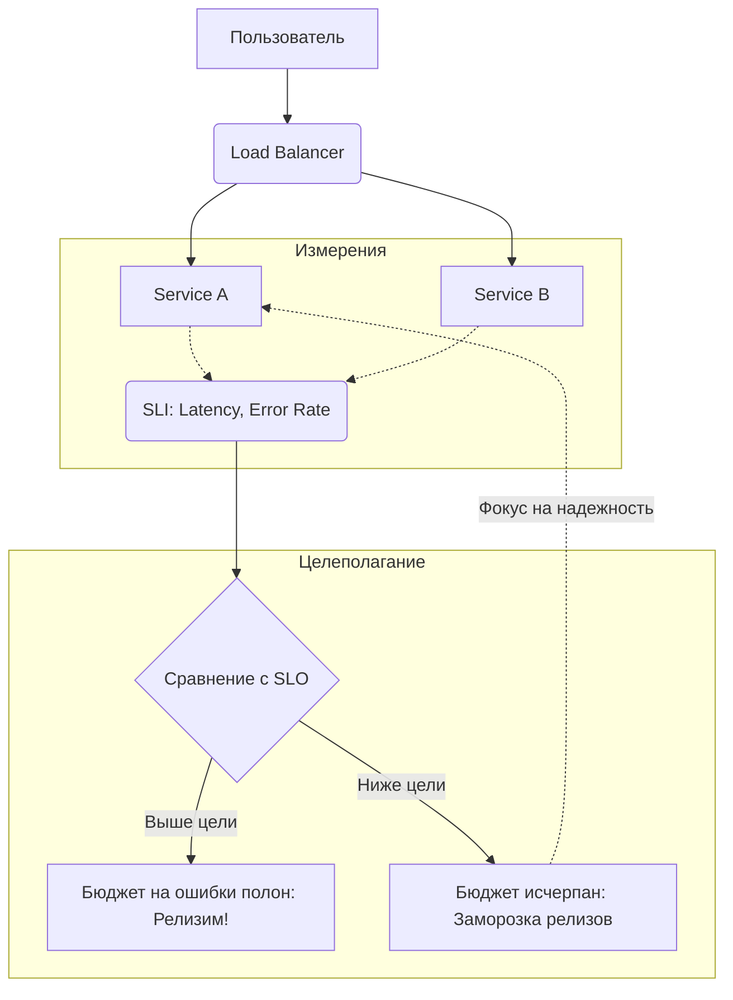

# Site Reliability Engineering (SRE)

## Боль: "Стена замешательства" между Dev и Ops

Исторически разработчики (Dev) получают бонусы за новые фичи и скорость их доставки. Эксплуатация (Ops) получает бонусы за то, что система не падает (uptime). Это создает конфликт интересов, известный как "стена замешательства" (Wall of Confusion). Разработчики кидают код "через стену", а админы боятся его деплоить, потому что любой релиз — это риск инцидента. 

**Site Reliability Engineering (SRE)** — это подход, придуманный в Google, который можно описать фразой: *"Что происходит, когда задачу эксплуатации поручают инженерам-программистам"*. 

SRE примиряет скорость и надежность с помощью математики и экономики: мы признаем, что 100% надежности недостижимо (и не нужно бизнесу), и используем **бюджет на ошибки (Error Budget)**. Пока бюджет есть — мы деплоим так быстро, как можем. Бюджет исчерпан — релизы фичей замораживаются, команда занимается техдолгом и стабильностью.

## Архитектура: Метрики и процесс



## Примеры и Best Practices

### SLO (Service Level Objective) и SLI (Service Level Indicator)

- **SLI:** Доля HTTP 200 запросов к `/login`, выполненных быстрее 200ms за последние 30 дней.
- **SLO:** 99.9% запросов должны соответствовать SLI.
- **Error Budget:** У нас есть право на 0.1% "плохих" запросов (около 43 минут даунтайма в месяц).

### Пример Alerting Rules (Prometheus)

Антипаттерн: алерт на высокую загрузку CPU (пользователю плевать на ваш CPU, если сервис отвечает быстро).
Best Practice: Alerting on Symptom (Алерты на симптомы) — например, истощение Error Budget'а (Burn Rate).

```yaml
groups:
- name: SRE_SLO_Alerts
  rules:
  - alert: HighErrorBudgetBurnRate
    expr: |
      (
        rate(http_requests_total{status=~"5.."}[1h]) 
        / 
        rate(http_requests_total[1h])
      ) > (1 - 0.999) * 14.4  # Убегает быстрее, чем должно
    labels:
      severity: page
    annotations:
      summary: "Сервис сжигает бюджет на ошибки слишком быстро"
```

## Неочевидные нюансы и Day 2 Operations

1. **Токсичность On-call дежурств.** SRE вводит строгое правило: дежурный инженер не должен тратить более 50% времени на "тушение пожаров" (Toil) и реактивную работу. Остальные 50% должны уходить на автоматизацию и улучшение систем (Engineering). Если пожаров слишком много, система возвращается разработчикам (Giveback).
2. **Blameless Postmortems.** Главный артефакт любого инцидента — постмортем, в котором запрещено искать виноватых (люди всегда ошибаются). Ищется ошибка в системе: почему система позволила человеку ошибиться, и как это автоматизировать.
3. **Фальшивое SRE.** Часто компании просто переименовывают отдел системных администраторов или Ops в "SRE-команду", не меняя процессы и не давая им права блокировать релизы при исчерпании бюджета на ошибки. Это антипаттерн (иногда называемый "SRE by title only").
4. **Оверхед на внедрение.** Внедрение честных SLO/SLI требует глубокого вовлечения продукта и бизнеса. Инженеры не могут сами придумать SLO, потому что только бизнес знает, при какой задержке пользователи начинают уходить к конкурентам.
