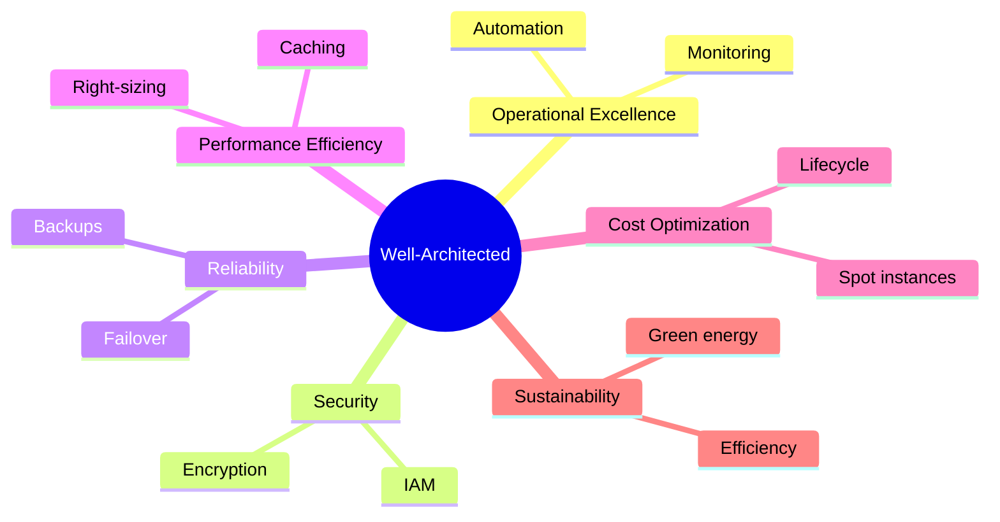

# Well-Architected Framework: Искусство не строить карточные домики

## Суть: От хаоса к предсказуемости
Каждый DevOps-инженер рано или поздно сталкивается с проектом, который исторически "просто работал", а потом вырос. Внезапно базы данных ложатся под нагрузкой, счета за облако пробивают потолок, а деплой превращается в русскую рулетку. Well-Architected Framework (WAF) — это не просто чек-лист от облачных провайдеров (AWS, Azure, GCP), это философия проектирования инфраструктуры. Мы решаем боль хрупких, дорогих и небезопасных систем, превращая их в отказоустойчивые, масштабируемые и экономичные механизмы. 

В production WAF помогает ответить на вопрос: "А мы вообще правильно всё сделали?". Это инструмент самоаудита, который не дает архитектуре сгнить. 

## 6 Столпов Архитектуры (Pillars)



## Практика: Инфраструктура как код

Одним из краеугольных камней WAF является автоматизация и безопасность. 

**Антипаттерн:** Ручное создание S3 бакетов через консоль, доступных всем подряд.

**Best Practice (Terraform):** Баскет с шифрованием, версионированием и блокировкой публичного доступа, соответствующий столпам Security и Reliability.

```hcl
resource "aws_s3_bucket" "secure_data" {
  bucket = "company-secure-data-prod"
}

resource "aws_s3_bucket_versioning" "versioning" {
  bucket = aws_s3_bucket.secure_data.id
  versioning_configuration {
    status = "Enabled"
  }
}

resource "aws_s3_bucket_public_access_block" "secure" {
  bucket                  = aws_s3_bucket.secure_data.id
  block_public_acls       = true
  block_public_policy     = true
  ignore_public_acls      = true
  restrict_public_buckets = true
}
```

## Day 2 Operations & Скрытые трейдоффы

**Где WAF отстреливает ногу:** 
- **Overhead на старте:** Попытка внедрить все практики WAF в стартапе на стадии MVP убьет Time-to-Market. Если вам нужно просто проверить гипотезу, избыточная надежность (Reliability) и сложный IAM (Security) станут гирей на ногах.
- **Трейдофф "Надежность vs Стоимость":** Развертывание в Multi-Region (Active-Active) делает систему невероятно надежной, но удваивает (или утраивает) косты и добавляет колоссальную сложность в синхронизации баз данных.

**Нюансы Day 2:**
WAF — это непрерывный процесс, а не разовая акция. Архитектура деградирует со временем. Появляются "зомби"-инстансы (ухудшают Cost Optimization), устаревают AMI (Security). На этапе Day 2 необходим регулярный автоматизированный аудит (например, через AWS Config или Steampipe), иначе принципы так и останутся на бумаге.
