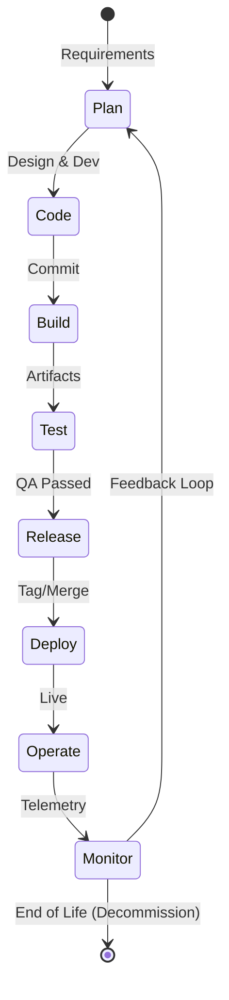

# Жизненный цикл приложения (ALM / SDLC): От идеи до вывода из эксплуатации

## Суть: Конвейер доставки ценности
Представьте себе приложение как живой организм. Оно рождается (Code), растет (Build/Test), выходит в большой мир (Deploy) и требует регулярного ухода (Operate/Monitor), пока в конце концов не отправится на покой. В классическом IT разработка писала код и кидала его "через стену" сисадминам. Жизненный цикл был разорван.

Сегодня DevOps объединяет этот цикл. Мы решаем боль "на моем локалхосте всё работало" и "мы не знаем, почему оно упало в проде". Понимание жизненного цикла позволяет автоматизировать каждый этап, сделав поставку фичей рутинной, скучной (в хорошем смысле) и безопасной операцией.

## Этапы жизненного цикла



## Практика: Автоматизация перехода между этапами

Переход от **Code** к **Deploy** должен быть максимально автоматизирован (CI/CD).

**Best Practice (GitHub Actions):** Минимальный и понятный пайплайн, который не просто собирает, но и проверяет безопасность и линтинг перед деплоем.

```yaml
name: Production Lifecycle Pipeline

on:
  push:
    branches: [ "main" ]

jobs:
  build-test:
    runs-on: ubuntu-latest
    steps:
      - uses: actions/checkout@v3
      - name: Run Linter
        run: make lint
      - name: Run Unit Tests
        run: make test
      - name: Build Docker Image
        run: docker build -t myapp:${{ github.sha }} .
        
  deploy-prod:
    needs: build-test
    runs-on: ubuntu-latest
    environment: production
    steps:
      - name: Deploy to Kubernetes
        run: |
          # В идеале здесь должен быть вызов GitOps инструмента (ArgoCD/Flux)
          kubectl set image deployment/myapp container=myapp:${{ github.sha }}
```

## Day 2 Operations & Скрытые трейдоффы

**Где жизненный цикл отстреливает ногу:**
- **Зацикливание на CI/CD (Day 1):** Очень часто команды вкладывают 90% усилий в автоматизацию сборки и релиза, забывая про Day 2 (Operate & Monitor). В итоге код доставляется быстро, но при инциденте нет ни метрик, ни логов, ни плейбуков.
- **Оверхед на тестирование:** Если тесты в пайплайне (E2E, интеграционные) идут 2 часа, разработчики перестают коммитить мелкие изменения, увеличивая размер батча. Это ломает саму идею быстрой обратной связи.

**Нюансы эксплуатации:**
- **Управление секретами:** Как конфигурация попадает в приложение? Если пароли вшиты в код на этапе Build, это провал. Они должны инжектиться на этапе Deploy/Operate (например, через HashiCorp Vault или External Secrets Operator).
- **Смерть приложения (Decommission):** Об этом часто забывают. Когда сервис больше не нужен, его нужно правильно вывести из эксплуатации: удалить данные с учетом GDPR, отключить доступы, освободить ресурсы. В противном случае мы получаем инфраструктурный долг и лишние траты.
