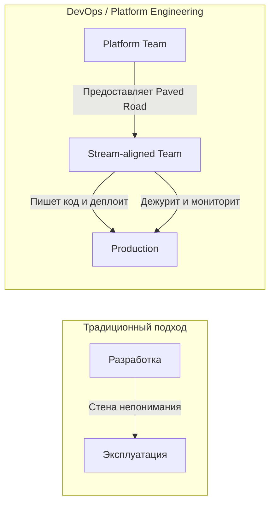

# Роли и зоны ответственности в DevOps

## История одной боли
Исторически разработка (Dev) и эксплуатация (Ops) жили по разные стороны баррикад. Разработчикам платили за скорость поставки фичей, а инженерам эксплуатации — за стабильность продакшена. Эта стена непонимания приводила к классической проблеме: «На моей машине всё работает, дальше — ваши проблемы». Релизы были редкими, болезненными и сопровождались бессонными ночами. DevOps зародился как культурный сдвиг, чтобы разрушить эту стену, объединив ответственность за весь жизненный цикл продукта.

## Как это работает
Вместо изолированных отделов мы строим кросс-функциональные команды, где инженеры вместе отвечают за код от коммита до мониторинга в проде. На практике это часто трансформируется в модель **Platform Engineering**, где отдельная команда создает внутреннюю платформу (Paved Road) как продукт для разработчиков, скрывая излишнюю сложность инфраструктуры.



## Примеры и практики

**Антипаттерн:** "DevOps-отдел", который просто забирает скрипты деплоя у админов, но разработчики по-прежнему не имеют доступа к логам и не отвечают за инциденты.
**Best Practice:** Четкое разделение через манифесты. Разработчики определяют потребности своего приложения (CPU, RAM, порты), а платформа обеспечивает их исполнение.

Пример контракта (Helm values или манифест внутренней платформы):
```yaml
app:
  name: payment-service
  team: billing-squad
  resources:
    requests:
      memory: "256Mi"
      cpu: "100m"
  alerts:
    slack_channel: "#alerts-billing"
```

## Неочевидные нюансы (Трейдоффы и Day 2)
- **Когнитивная перегрузка:** Если заставить разработчика знать и Kubernetes, и Terraform, и CI/CD, он перестанет писать бизнес-код. Граница применимости «You build it, you run it» заканчивается там, где начинается выгорание.
- **Day 2 Operations:** Кто просыпается ночью, если база данных упала? В зрелой культуре разработчики дежурят на первой линии для своих сервисов, но платформенная команда отвечает за базовую инфраструктуру.
- **Оверхед:** Построение хорошей внутренней платформы требует времени и высококлассных инженеров. Для стартапа из трех человек это отстрел ноги; им нужен просто Heroku или управляемый PaaS.
