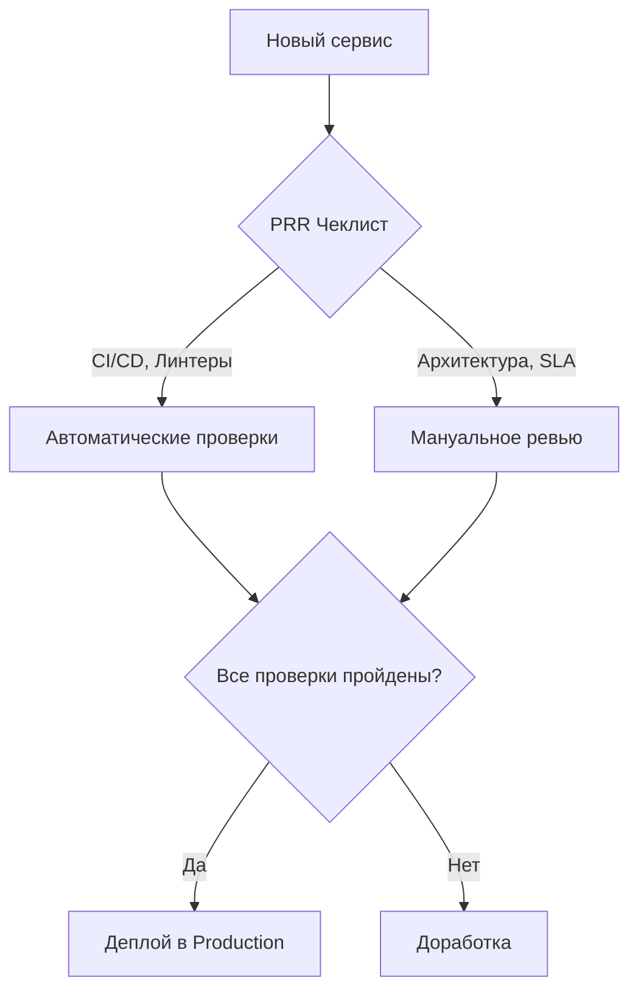

# Чеклисты и Production Readiness

## Боль ручных релизов
Когда-то деплой выглядел как многостраничный документ в Word, где сисадмин должен был выполнить 50 команд по порядку. Ошибка на шаге 37 приводила к даунтайму. Автоматизация (CI/CD) решила проблему повторяемости, но не решила проблему качества архитектуры и забытых требований (безопасность, мониторинг, бэкапы). Чеклисты переродились в **Production Readiness Review (PRR)** — формализованный, но гибкий процесс оценки сервиса перед выходом в большой мир.

## Как это работает
Чеклист — это не бюрократия ради бюрократии, а кристаллизованный опыт предыдущих падений. Он встраивается прямо в процесс работы над задачей или шаблонизируется в пайплайнах.



## Примеры и практики

**Антипаттерн:** Чеклист на 100 пунктов в Excel, который заполняется "для галочки" за час до релиза.
**Best Practice:** Чеклисты в виде кода (Policy as Code) или шаблонов Issue/Pull Request, где часть пунктов проверяется автоматически.

Пример `.github/pull_request_template.md`:
```markdown
## Production Readiness
- [ ] Метрики добавлены в Grafana dashboard
- [ ] Настроены алерты (Prometheus) и направлены в канал команды
- [ ] Нагрузочное тестирование пройдено (RPS > 1000)
- [ ] Секреты не захардкожены, используется Vault/AWS Secrets
```

## Неочевидные нюансы (Трейдоффы и Day 2)
- **Устаревание:** Чеклист — живой организм. Day 2 операции требуют, чтобы после каждого постмортема (Post-mortem) в чеклист добавлялся новый пункт, защищающий от повторения инцидента.
- **Усталость от чеклистов:** Если процесс согласования занимает дольше, чем написание кода, команда начнет саботировать правила.
- **Границы применимости:** Для внутренних админ-панелей и экспериментальных фичей нужен "Light" чеклист. Полный хардкор с резервированием в трех дата-центрах нужен только для Tier-1 сервисов (например, процессинг платежей).
