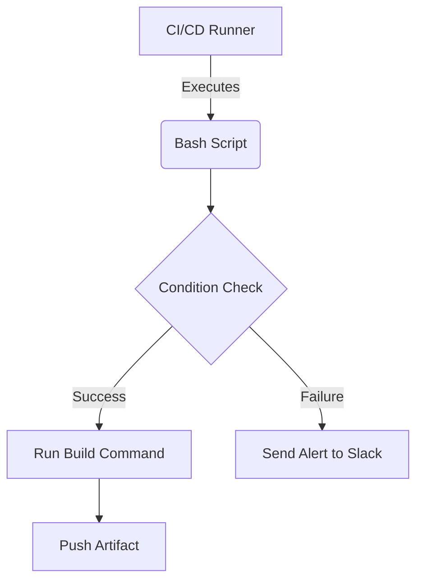

# Bash и Shell Scripting: Изолента DevOps

До появления развитых систем управления конфигурациями и CI/CD пайплайнов, инженерам приходилось выполнять массу рутинных задач: от сборки артефактов до деплоя и настройки окружения. Bash-скрипты стали универсальной "изолентой", позволяющей автоматизировать эти процессы, связывая воедино различные утилиты командной строки.

Даже сегодня, в эпоху Kubernetes и Terraform, Bash остается незаменимым клеем. Это язык, который доступен на любом Linux-сервере "из коробки" и идеально подходит для простых задач автоматизации, bootstrapping'а серверов и написания тонких оберток (wrappers) вокруг сложных команд.

## Как это работает в Production

В production-окружениях Bash чаще всего встречается в следующих сценариях:
1. **CI/CD Pipeline steps:** Выполнение сборки, тестов или сборки Docker-образов.
2. **Init-скрипты (Entrypoints):** Подготовка окружения перед запуском основного процесса в Docker-контейнере.
3. **Cron-задачи:** Выполнение простых периодических операций (например, очистка старых логов или бэкапы).



## Примеры и Best Practices

### The "Strict Mode" (Best Practice)
Первое и самое важное правило для любого production bash-скрипта — использование strict mode. Это предотвращает скрытые ошибки, когда скрипт продолжает работу после фейла одной из команд или использует неинициализированные переменные.

```bash
#!/usr/bin/env bash
set -euo pipefail
IFS=$'\n\t'

# -e: немедленный выход, если команда вернула ненулевой код (ошибка)
# -u: ошибка при использовании неопределенных переменных
# -o pipefail: возвращает код ошибки, если любая часть пайплайна упала
```

### Антипаттерн: Сложная логика и парсинг JSON
Пытаться распарсить сложный JSON с помощью `grep` и `awk` — это прямой путь к хрупкому коду. Для таких задач лучше использовать утилиту `jq` или переходить на более мощные языки вроде Python.

*Плохо (Антипаттерн):*
```bash
TOKEN=$(cat config.json | grep "token" | cut -d':' -f2 | tr -d '"' | tr -d ' ')
```

*Хорошо (Использование специализированных утилит):*
```bash
TOKEN=$(jq -r '.token' config.json)
```

## Неочевидные нюансы и Day 2 Operations

- **Границы применимости:** Как только ваш Bash-скрипт превышает 100-200 строк, начинает использовать сложные структуры данных (массивы, ассоциативные массивы) или требует сложной обработки ошибок (try-catch), это сигнал, что пора переписывать его на Python или Go.
- **Тестируемость:** Bash очень сложно тестировать. Хотя существуют фреймворки вроде BATS (Bash Automated Testing System), их использование часто неоправданно усложняет проект. В большинстве случаев скрипты тестируются вручную, что увеличивает риск регрессий.
- **ShellCheck:** Обязательный инструмент в Day 2. Линтер ShellCheck должен быть встроен в ваш CI пайплайн. Он найдет десятки неочевидных проблем, таких как забытые кавычки вокруг переменных, которые могут привести к уязвимостям (Word Splitting).
- **Скрытый оверхед (Subshells):** Использование конструкций вроде `$(command)` или пайплайнов `|` порождает новые дочерние процессы (subshells). В плотно загруженных системах или в скриптах, обрабатывающих тысячи строк в цикле, это может стать узким местом по производительности из-за накладных расходов на fork/exec.
