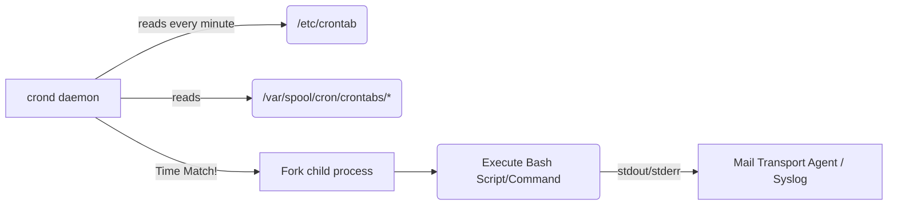

# Cron и планировщики: Пульс фоновых задач

Боль автоматизации часто упирается не только в *как* выполнить задачу, но и *когда*. Нам нужны регулярные бэкапы, ротация логов, очистка временных файлов и периодическая синхронизация данных. Исторически эту проблему решал `cron` — классический демон-планировщик в Unix-подобных системах.

Суть концепции: простая, декларативная конфигурация расписания, по которому ОС сама разбудит нужный процесс в нужное время. Это избавляет разработчиков от необходимости писать бесконечные циклы `while(true) { sleep(3600); do_work(); }` в своих приложениях, перенося ответственность за планирование на уровень ОС.

## Как это работает в Production

В production `cron` остается стандартом де-факто для локальных, привязанных к конкретному серверу задач. Демон `crond` каждую минуту просыпается, читает конфигурационные файлы (crontabs) и запускает задачи, время которых подошло.

В современных распределенных системах `cron` часто заменяется на Kubernetes CronJobs или внешние планировщики (Airflow, Temporal), но для базового обслуживания ОС и простых серверов (Pet-сервера) он незаменим.



## Примеры и Best Practices

### Базовый синтаксис
```crontab
# Минута Час ДеньМес Месяц ДеньНед Команда
0 2 * * * /usr/local/bin/backup.sh >/var/log/backup.log 2>&1
```

### Best Practice: Защита от наложения (Overlapping)
Если задача выполняется дольше, чем интервал ее запуска (например, бэкап завис, а cron запускает следующий), это может привести к эффекту снежного кома: исчерпанию памяти, CPU или места на диске. Всегда используйте локи.

*Хорошо (использование `flock`):*
```crontab
* * * * * /usr/bin/flock -n /tmp/myjob.lock /opt/scripts/myjob.sh
```

### Антипаттерн: Полагаться на окружение (Environment)
Cron запускает задачи в сильно урезанном окружении. В нем может не быть вашего `$PATH`, алиасов или переменных из `.bashrc`.
*Плохо:* вызов команды `npm run script` без указания путей.
*Хорошо:* использование абсолютных путей ко всем бинарникам или явный `source` нужного окружения внутри скрипта.

## Неочевидные нюансы и Day 2 Operations

- **Silent Failures (Тихие падения):** По умолчанию, если задача падает или пишет в stdout/stderr, `cron` пытается отправить вывод локальной почтой (MTA). Если почтовый сервер не настроен, выводы просто теряются в `/var/mail/`, и вы никогда не узнаете, что задача не работает. **Day 2 правило:** всегда перенаправляйте вывод логов в файл или систему логирования, и настраивайте мониторинг на эти логи.
- **Временные зоны и переводы часов:** Запуск задач в момент перехода на летнее/зимнее время (DST) может привести к тому, что задача выполнится дважды или не выполнится вообще (например, время прыгнуло с 2:00 на 3:00, а задача стояла на 2:30). Желательно, чтобы серверы работали в UTC.
- **Децентрализация (Сложность управления):** Когда у вас 50 серверов, разбросанные по ним crontab-файлы становятся кошмаром конфигурационного менеджмента. Необходимо использовать Ansible/Chef для их централизованного деплоя, либо переходить на распределенные планировщики, чтобы видеть статус всех джобов в единой панели.
- **Отсутствие Retry-механизмов:** Если задача упала из-за временного сетевого сбоя, `cron` не попробует запустить ее снова до следующего окна по расписанию. Всю логику повторных попыток (retries) необходимо реализовывать внутри самого скрипта.
