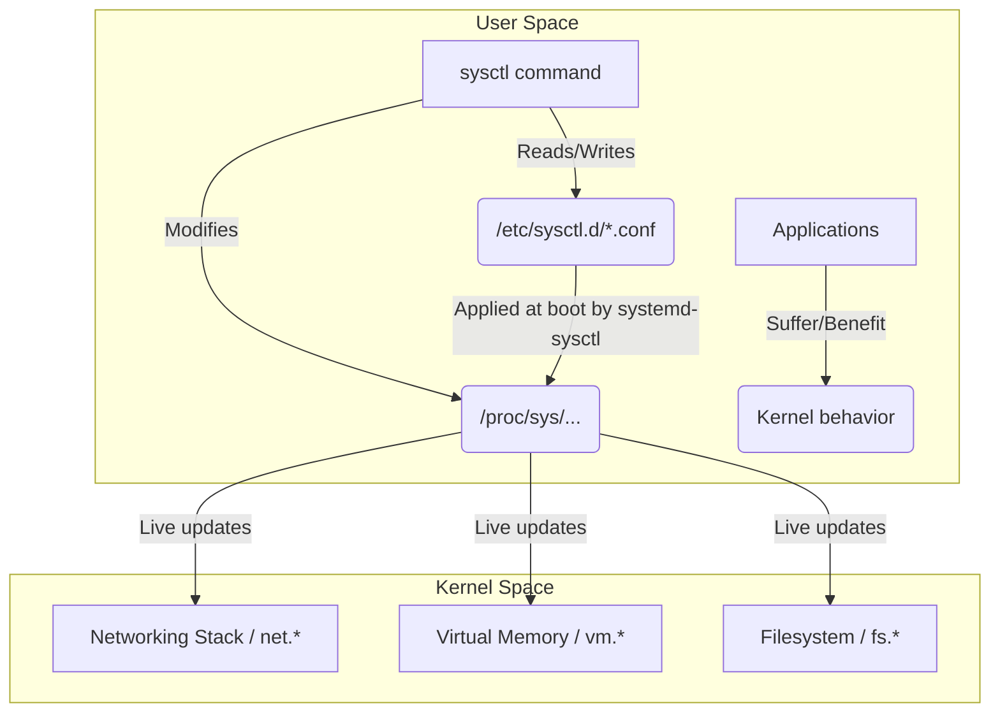

# Kernel Parameters (sysctl): Тюнинг ядра для Production

## Боль и её решение

Linux изначально поставляется с настройками «по умолчанию», которые рассчитаны на максимальную совместимость. Этот дефолт отлично работает и на старом ноутбуке, и на Raspberry Pi, и на стандартном веб-сервере. Но когда вы разворачиваете высоконагруженную базу данных, кэш-кластер на миллионы RPS или ingress-контроллер, вы неизбежно сталкиваетесь со стеной: внезапные таймауты соединений, загадочные ошибки «Too many open files» или непредсказуемое поведение OOM (Out Of Memory) Killer.

Проблема в том, что ядро не знает, какую задачу вы решаете. **sysctl** (и виртуальная файловая система `/proc/sys`) — это интерфейс управления параметрами ядра на лету, позволяющий подстроить ОС под конкретный профиль нагрузки. Это рычаги, с помощью которых DevOps-инженер превращает дефолтный Linux-сервер в специализированную молотилку пакетов или надежное хранилище.

## Как это работает (Mermaid)



## Показательные примеры

### Тюнинг сети (High-load Web / Load Balancer)
Когда сервер обрабатывает много мелких соединений, у него могут закончиться эфемерные порты или переполниться очередь backlog.
```ini
# /etc/sysctl.d/99-network-tuning.conf

# Расширяем диапазон локальных портов для исходящих соединений
net.ipv4.ip_local_port_range = 1024 65535

# Увеличиваем размер очереди для входящих соединений
net.core.somaxconn = 65535

# Защита от SYN-флуда и переиспользование TIME_WAIT сокетов
net.ipv4.tcp_syncookies = 1
net.ipv4.tcp_tw_reuse = 1
```

### Память и Базы Данных (PostgreSQL, Redis)
Поведение механизма выделения памяти сильно влияет на in-memory базы.
```ini
# /etc/sysctl.d/99-db-tuning.conf

# Запрещаем ядру выдавать памяти больше, чем физически доступно.
# Спасает Redis от неожиданных падений OOM Killer.
vm.overcommit_memory = 2

# Как часто ядро сбрасывает dirty pages на диск.
vm.dirty_ratio = 10
vm.dirty_background_ratio = 3
```

**Применение настроек на лету (без ребута):**
```bash
sysctl --system  # Перечитать все конфиги из /etc/sysctl.d/
sysctl -w vm.swappiness=10  # Изменить параметр прямо сейчас
```

## Нюансы и Day 2 Operations

### ⚠️ Антипаттерны
- **Слепое копирование StackOverflow:** Настройка `tcp_tw_recycle=1` раньше считалась панацеей, а с приходом NAT и балансировщиков стала ломать соединения (была удалена в ядре 4.12+). Никогда не применяйте sysctl, суть которого не понимаете.
- **Прямое редактирование `/etc/sysctl.conf`:** В современных дистрибутивах лучше использовать `/etc/sysctl.d/`. Это позволяет управлять конфигурацией модульно через Ansible/Terraform.

### 🔍 Скрытые трейдоффы и границы применимости
- **Оверхед на память (Network buffers):** Увеличение параметров вроде `net.ipv4.tcp_rmem` и `wmem` позволяет прокачивать гигабиты данных на одно соединение (полезно для CDN). Но каждое открытое TCP-соединение начнет резервировать больше RAM. Если у вас 1 миллион Websocket-соединений (IoT-брокер), вы мгновенно исчерпаете оперативную память сервера.
- **Эфемерность:** Изменения через `sysctl -w` пропадают после перезагрузки. Всегда фиксируйте настройки в файлах.
- **Контейнеры (Docker/Kubernetes):** Большинство параметров ядра (namespaces) глобальны для ноды (например, `vm.max_map_count`). В Kubernetes их нужно настраивать на уровне Worker Node или через init-контейнеры с `securityContext.privileged: true` (если кластер разрешает unsafe sysctls).

В конечном итоге, `sysctl` — это инструмент филигранной настройки. Изменяйте по одному параметру за раз, профилируйте (через Prometheus/eBPF) и наблюдайте за метриками.
