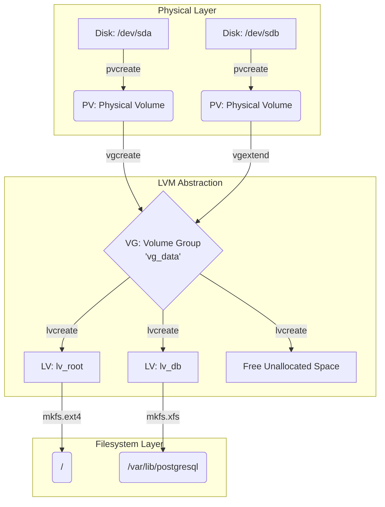

# LVM и разделы: Эластичное управление хранилищем

## Боль и её решение

Исторически разметка диска была болью, выбитой в камне. Вы создавали `/dev/sda1` под корень, `/dev/sda2` под `/var`, и если место в `/var` заканчивалось, начинался ад: остановка сервисов, загрузка с LiveCD, попытки сдвинуть границы разделов (с риском потерять данные) или костыли с симлинками на другие диски. В мире непрерывной доставки и 24/7 доступности (production) это неприемлемо.

**LVM (Logical Volume Manager)** решает проблему жесткой привязки файловых систем к физическим дискам, внедряя уровень абстракции. Он превращает диски в "пул ресурсов" (жидкость), из которого можно на лету "отливать" нужные объемы. Не хватает места базе данных? Просто добавляем новый диск в пул и расширяем том БД без даунтайма. LVM — это фундамент гибкой эксплуатации хранилищ на серверах.

## Как это работает (Mermaid)



## Показательные примеры

### 1. Идеальное расширение на лету (Zero Downtime)
База данных бьет тревогу: кончается место. Вы просите у виртуализации добавить еще один виртуальный диск (`/dev/sdc`) на 50GB.

```bash
# 1. Инициализируем новый диск как Physical Volume
pvcreate /dev/sdc

# 2. Добавляем его в общий пул (Volume Group 'vg_data')
vgextend vg_data /dev/sdc

# 3. Расширяем логический том на 10 Гигабайт и сразу ресайзим файловую систему (-r)
lvextend -r -L +10G /dev/vg_data/lv_db
```
*Результат:* Место увеличилось, база данных не прервала работу ни на секунду.

### 2. Снапшоты для безопасных апгрейдов
Перед опасным мажорным обновлением пакетов делаем снимок системы:
```bash
lvcreate -L 5G -s -n root_snap_before_upgrade /dev/vg_system/lv_root
# Если все сломалось:
lvconvert --merge /dev/vg_system/root_snap_before_upgrade
```

## Нюансы и Day 2 Operations

### ⚠️ Антипаттерны
- **Распределение 100% пространства пула (VG) сразу:** Самая частая ошибка новичков. Если вы отдадите всё место логическим томам (LV), вы теряете главную фишку LVM. Всегда оставляйте 20-30% VG неразмеченными. Это место пригодится для создания экстренных снапшотов или точечного расширения томов в будущем.
- **LVM поверх RAID без выравнивания (Alignment):** Если LVM не настроен под размер страйпа аппаратного RAID, производительность I/O сильно деградирует.

### 🔍 Скрытые трейдоффы и границы применимости
- **Оверхед производительности (Снапшоты):** LVM снапшоты работают по принципу Copy-On-Write (COW). Если вы создали снапшот высоконагруженной базы данных, производительность записи на оригинальный том может упасть в 2-3 раза (так как каждый измененный блок сначала копируется в снапшот). Снапшоты LVM — это временный инструмент для бэкапа/обновления, а не постоянное хранилище версий (в отличие от ZFS/Btrfs).
- **Сложность восстановления при сбоях:** Если один из дисков (PV) в пуле (VG) выходит из строя (и это не RAID), теряется консистентность всего пула. Восстановить данные с уцелевших кусков LVM значительно сложнее, чем с простого ext4/xfs раздела. LVM не заменяет RAID, он работает *поверх* него.
- **Облачные среды:** В AWS/GCP использование LVM часто избыточно. Облачные блочные хранилища (EBS) сами по себе эластичны — можно увеличить размер диска в консоли провайдера и сделать `resize2fs` на лету без LVM-слоя, экономя на сложности управления.
