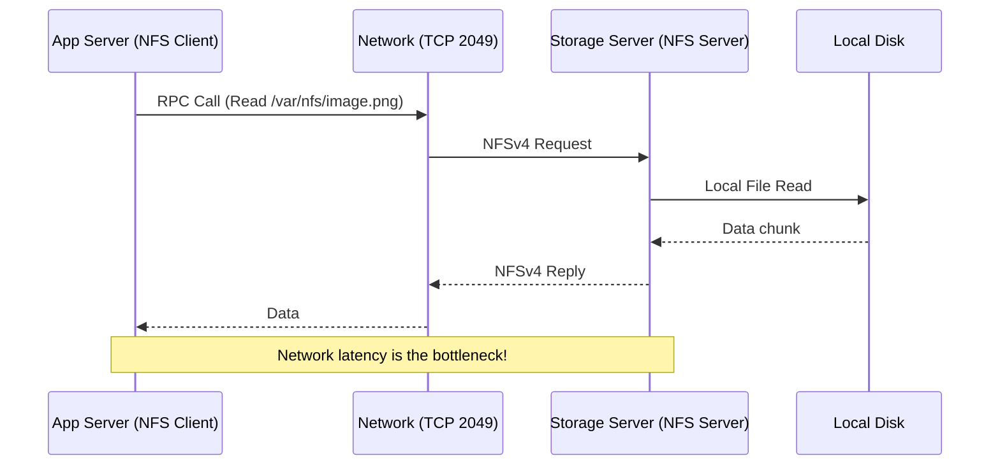

# NFS и Samba: Шарим файлы, собираем грабли

## Суть концепции
Представьте, что у вас есть кластер из 5 backend-серверов, и пользователи загружают аватарки. Если сервер сохранит аватарку локально, при следующем запросе пользователя балансировщик может перекинуть на другой сервер, и картинки он не увидит. Нам нужно общее сетевое хранилище (Shared Storage).

Здесь на сцену выходят сетевые файловые системы:
- **NFS (Network File System):** Стандарт UNIX-мира. Быстро, просто, интегрировано в ядро.
- **Samba (SMB/CIFS):** Стандарт Windows-мира. Поддерживает сложную систему прав (ACL), интеграцию с Active Directory.

В DevOps мире мы чаще используем NFS (особенно NFSv4) для шаринга конфигураций, медиа-файлов или Persistent Volumes в Kubernetes (ReadWriteMany), если нет возможности использовать S3-совместимое объектное хранилище.

## Архитектура и Взаимодействие



## Примеры и Практика

### Быстрый старт NFS
**Сервер:**
```bash
# /etc/exports
# Шарим директорию для подсети с синхронной записью
/data/shared   10.0.0.0/24(rw,sync,no_subtree_check,no_root_squash)
```

**Клиент (в /etc/fstab):**
```fstab
10.0.0.5:/data/shared  /mnt/shared  nfs  defaults,_netdev,noatime,nodiratime  0  0
```

## Day 2 Operations, Best Practices & Антипаттерны

**Best Practices:**
- **NFSv4:** Всегда старайтесь использовать 4-ю версию. Она работает через один TCP порт (2049), что радикально упрощает настройку фаерволов по сравнению с NFSv3, которому нужен RPCbind и куча случайных портов.
- **Опции монтирования:** Используйте `_netdev` (дождаться сети при загрузке) и `noatime/nodiratime` (не писать время доступа — экономит IO).
- **Hard vs Soft mounts:** Для критичных данных используйте `hard` (клиент будет бесконечно ждать ответа от сервера, приложение "зависнет" в статусе D - Uninterruptible Sleep, но не потеряет данные). `soft` вернет ошибку I/O по таймауту, что может привести к data corruption.

**Антипаттерны:**
- **Базы данных поверх NFS:** Худшее, что можно сделать. Высокие задержки сети и особенности блокировок (file locking) гарантированно убьют производительность СУБД (PostgreSQL/MySQL), а при моргании сети вы получите битые индексы. Исключение: специализированные enterprise-решения вроде NetApp.
- **no_root_squash бездумно:** Эта опция позволяет root-пользователю на клиенте оставаться root-ом на сервере NFS. Это огромная дыра в безопасности, если клиентский сервер скомпрометирован. Всегда предпочитайте squash и выдачу прав определенным UID/GID.

## Неочевидные нюансы и Трейдоффы
- **Проблема UID/GID:** В NFS (без Kerberos) права доступа базируются на числовых ID пользователя. Если на клиенте пользователь "app" имеет UID 1001, а на сервере NFS UID 1001 принадлежит пользователю "hacker", то "app" получит доступ к файлам хакера. ID должны быть синхронизированы (например, через LDAP/FreeIPA) или замаплены.
- **S3 vs NFS:** В современной cloud-native разработке NFS считается "legacy" подходом для хранения пользовательских файлов. S3 (MinIO, AWS S3) масштабируется лучше, не имеет проблем с POSIX lock'ами и работает по понятному HTTP API. NFS оставляют для stateful legacy-приложений, которые не умеют в S3.
- **Оверхед на мелких файлах:** NFS ужасно работает с директориями, где лежат миллионы мелких файлов (например, кэш). Команды `ls` или `find` будут выполняться минутами из-за огромного количества RPC-вызовов (metadata overhead).
