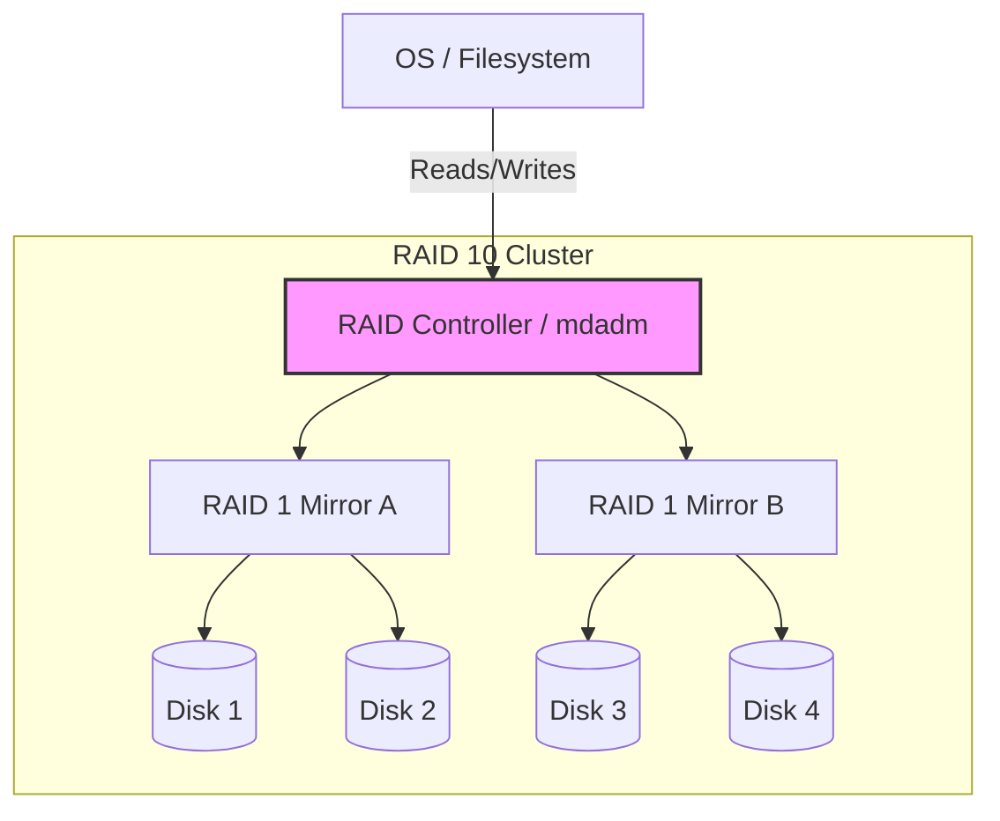

# RAID в Production: Отказ диска — это рутина, а не пожар

## Суть концепции
В мире, где железо смертно, а данные бессмертны, RAID (Redundant Array of Independent Disks) — это базовый гигиенический минимум. Какую боль мы решаем? Диски выходят из строя постоянно. Без RAID потеря диска означает простой сервиса, панику, восстановление из бэкапов и потерянные транзакции. RAID позволяет объединить несколько физических дисков в один логический том, обеспечивая либо отказоустойчивость (зеркалирование/четность), либо скорость (чередование), либо и то, и другое.

В DevOps парадигме мы относимся к инфраструктуре как к коду, но на нижнем уровне все равно крутятся шпиндели или флеш-чипы. Софтверный RAID (через `mdadm` или ZFS/Btrfs) стал стандартом de facto, вытеснив аппаратные контроллеры (которые сами по себе становятся единой точкой отказа - SPoF).

## Как это работает (Архитектура)



Наиболее популярные уровни:
- **RAID 0 (Stripe):** Только скорость, никакой надежности. Умер один диск — умер весь массив. (Кэши, ephemeral storage).
- **RAID 1 (Mirror):** Точная копия. Дорого, но максимально надежно и быстро на чтение. (ОС, СУБД логи).
- **RAID 5 / 6 (Parity):** Баланс объема и надежности. Считает контрольные суммы. Медленно на запись (write penalty). (Архивы, файлопомойки).
- **RAID 10 (1+0):** Зеркалированные страйпы. Золотой стандарт для баз данных. Дорого по дискам (50% overhead), но быстро и надежно.

## Примеры и Практика

### Создание RAID 1 (mdadm)
```bash
# Создаем зеркало из двух дисков
mdadm --create --verbose /dev/md0 --level=1 --raid-devices=2 /dev/nvme0n1 /dev/nvme1n1

# Обязательно сохраняем конфиг, иначе после ребута массив может не собраться!
mdadm --detail --scan >> /etc/mdadm/mdadm.conf
update-initramfs -u
```

### Мониторинг (Day 2 Operations)
Если диск умер, вы должны узнать об этом до того, как умрет второй.
```bash
# Статус массивов
cat /proc/mdstat

# В Prometheus/Grafana обязательно собираем метрики через node_exporter (node_md_disks, node_md_state).
```

## Best Practices & Антипаттерны

**Best Practices:**
- Использовать **RAID 10** для любых нагрузок, чувствительных к задержкам и IOPS (PostgreSQL, MySQL).
- Настраивать регулярный **Scrubbing** (проверка целостности массива) через cron/systemd timers, чтобы выявлять silent data corruption.
- Держать Hot Spare (горячий резерв) для критичных массивов.

**Антипаттерны:**
- **RAID 5 для больших SATA/NL-SAS дисков (от 4TB).** Время ребилда такого массива может занимать дни. В процессе ребилда нагрузка на оставшиеся диски колоссальная, и вероятность смерти второго диска во время ребилда (URE - Unrecoverable Read Error) стремится к 100%. Массив рассыпается полностью.
- **Использование дисков из одной партии.** Если вы купили 4 диска одной модели, произведенных в один день, они, скорее всего, умрут с разницей в пару дней/недель из-за одинаковой наработки на отказ. Разбавляйте вендоров/партии.
- **RAID вместо бэкапа.** RAID защищает от смерти железа. Он не защищает от `rm -rf /` или `DROP TABLE`, выполненного уставшим админом.

## Скрытые Трейдоффы и Границы
- **Overhead (Write Penalty):** В RAID 5 на каждую логическую запись происходит 4 физических операции (считать данные, считать четность, записать данные, записать четность). Это убивает производительность на random write.
- **Аппаратный vs Программный:** Современные CPU настолько быстры, что программный `mdadm` или ZFS часто превосходят аппаратные контроллеры, плюс вы не привязаны к проприетарному железу при аварии материнской платы.
- **Облака:** В AWS (EBS), GCP (PD) диски уже имеют внутреннюю репликацию (аналог RAID). Собирать RAID на уровне OS из облачных дисков стоит только для обхода лимитов IOPS или пропускной способности (RAID 0 из нескольких EBS для максимальной скорости).
