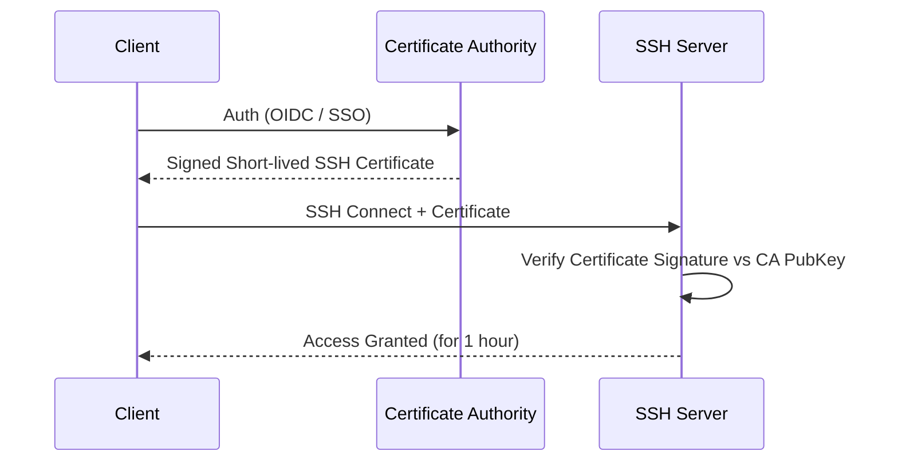

# SSH и SSH Hardening в Production

## Боль эксплуатации
Исторически, доступ к серверам был адской болью: telnet передавал всё в открытом виде (включая пароли), а первые версии SSH страдали от уязвимостей. В эпоху Cloud Native и микросервисов, мы управляем тысячами эфемерных машин. Классический подход "положил публичный ключ на сервер и забыл" приводит к катастрофам: уволенный сотрудник забирает доступ с собой, украденный приватный ключ дает злоумышленнику полный контроль над инфраструктурой, а аудит доступов превращается в кошмар. 

SSH Hardening — это не просто настройка конфига, это процесс обеспечения нулевого доверия (Zero Trust) на уровне доступа к вычислительным ресурсам.

## Как это работает под капотом



В современном production мы уходим от статических ключей в сторону **краткосрочных сертификатов (SSH Certificates)**, интегрированных с Identity Providers (Vault, Teleport, OIDC).

## Практика и Best Practices

### Антипаттерны (Отстрел ноги)
- Использование паролей (`PasswordAuthentication yes`).
- Использование ключей RSA меньше 4096 бит или устаревших алгоритмов (DSA).
- Долговременные (бессрочные) SSH-ключи, лежащие на дисках разработчиков.
- Одинаковый ключ для доступа ко всем серверам (lateral movement attack).

### Hardening базового sshd_config

Минимум, который должен быть на каждом сервере (например, через Ansible):

```sshdconfig
# /etc/ssh/sshd_config
PermitRootLogin no
PasswordAuthentication no
PermitEmptyPasswords no
PubkeyAuthentication yes

# Ограничение алгоритмов до современных (Ed25519)
KexAlgorithms curve25519-sha256@libssh.org,diffie-hellman-group-exchange-sha256
Ciphers chacha20-poly1305@openssh.com,aes256-gcm@openssh.com,aes128-gcm@openssh.com
MACs hmac-sha2-512-etm@openssh.com,hmac-sha2-256-etm@openssh.com

# Защита от долговисящих TCP соединений
ClientAliveInterval 300
ClientAliveCountMax 2

# Ограничение пользователей
AllowGroups ssh-users
```

## Неочевидные нюансы и Day 2 Operations

**Трейдоффы сертификатов:**
Внедрение SSH CA требует инфраструктуры. Если ваш Vault/Teleport упадет, никто не сможет зайти на сервера. Внедряется механизм Break-Glass (резервные ключи в физическом сейфе или AWS Secrets Manager с алертом в Slack при доступе).

**Оверхед и границы применимости:**
- Для 5 серверов разворачивать Teleport — оверхед. Достаточно Ansible с ротацией статических ключей и Fail2Ban.
- Для 500+ серверов без CA наступает ад аудита: кому принадлежит ключ `ssh-rsa AAAAB3... user@macbook`?

**Day 2:**
Аудит сессий. В серьезных enterprise-средах SSH-сессии записываются (Session Recording), например с помощью Teleport или `script` + централизованное логирование, чтобы ответить на вопрос "кто сделал `rm -rf /` в 3 ночи?".
