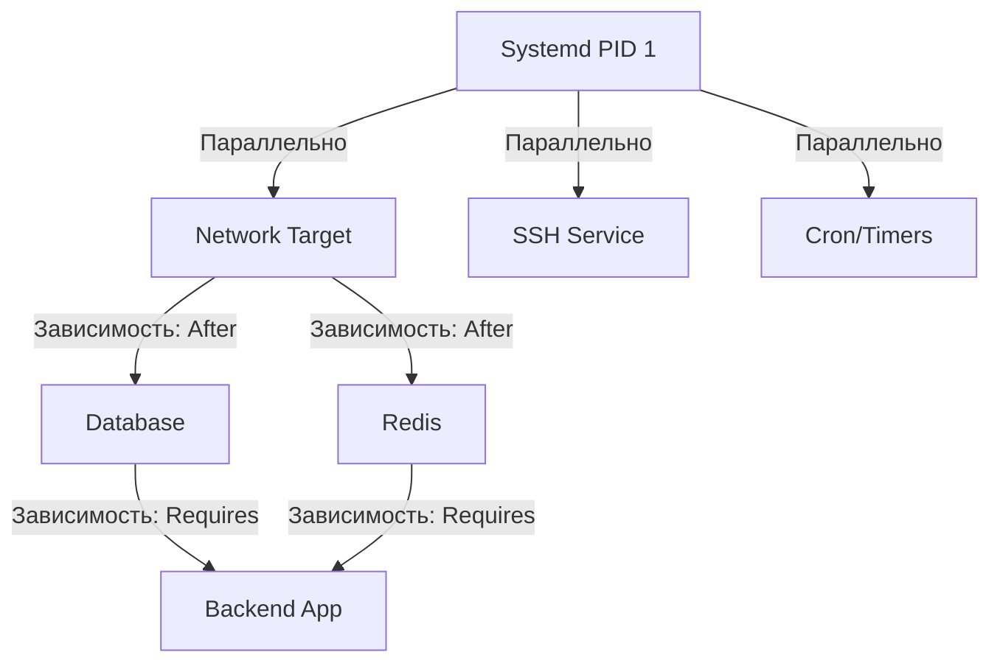

# Основы Systemd

Долгое время мир Linux жил с SysVinit. Это был простой, но до боли неповоротливый скриптовый менеджер инициализации. Представьте себе запуск сложного production-сервера: база данных ждет сеть, кэш ждет базу, а приложение ждет кэш. В SysVinit процессы запускались строго последовательно, через громоздкие bash-скрипты в `/etc/init.d/`. Если один скрипт зависал — весь процесс загрузки вставал колом. Кроме того, старые системы инициализации часто теряли "осиротевшие" процессы (zombies) при падении основного демона, что приводило к утечкам ресурсов.

Systemd пришел, чтобы решить эти боли. Это не просто система инициализации, а огромный монолитный комбайн, который берет на себя управление всем: от сервисов и сокетов до таймеров и монтирования дисков.

## Как это работает

Главная фишка Systemd — **параллельный запуск** и **строгий контроль** через механизмы ядра (cgroups). Systemd является процессом с PID 1. Когда система стартует, он строит граф зависимостей всех компонентов (юнитов) и запускает независимые компоненты параллельно. За счет использования `cgroups`, Systemd точно знает, какие дочерние процессы породил сервис, и может гарантированно убить их все, не оставляя зомби.



## Best Practices & Примеры

### Основные команды (Day 1)
```bash
# Статус, логи и зависимости
systemctl status myapp.service
systemctl restart myapp.service
# Посмотреть, почему сервис упал
journalctl -u myapp.service -n 50 --no-pager
# Посмотреть граф зависимостей
systemctl list-dependencies myapp.service
```

### Day 2 Operations и Нюансы

**Скрытые трейдоффы и архитектурные споры**
Systemd часто критикуют за нарушение философии UNIX ("делай что-то одно, но делай хорошо"). Он вбирает в себя NTP, DNS (systemd-resolved), логирование (journald) и даже управление контейнерами (systemd-nspawn). В production это значит, что падение или баг в Systemd (или в D-Bus, от которого он зависит) может положить всю систему без возможности восстановления без ребута.

**Журналирование (Journald)**
Бинарные логи journald — это палка о двух концах.
* *Плюс:* Единый формат, структурированные данные, метаданные (кто запустил, PID, cgroup).
* *Минус (Оверхед и Отстрел ноги):* По умолчанию journald может сожрать весь диск, если не настроить лимиты.
* *Best Practice:* Всегда ограничивайте размер логов в `/etc/systemd/journald.conf`:
  ```ini
  [Journal]
  SystemMaxUse=1G
  SystemKeepFree=5G
  MaxRetentionSec=1month
  ```

**Границы применимости**
Systemd идеален для управления "железными" или виртуальными машинами (VM) и монолитными демонами. Однако в мире Kubernetes и контейнеров Systemd внутри контейнера — это антипаттерн (хотя иногда используется в сложных legacy-миграциях). Контейнер должен управлять одним процессом, и роль PID 1 там выполняет сам рантайм (Docker/containerd).
