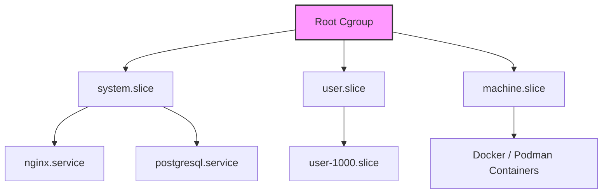

# Cgroups (Control Groups) и Systemd: Изоляция ресурсов

Представьте сервер, на котором крутится база данных, пара микросервисов и крон-джоба бэкапа. В один прекрасный момент плохо написанный скрипт бэкапа съедает весь CPU и память. База данных начинает тормозить, а затем OOM Killer (Out Of Memory) убивает критичный микросервис. Это классическая проблема "шумного соседа" (noisy neighbor).

**Cgroups (Control Groups)** — это механизм ядра Linux, позволяющий ограничивать, изолировать и измерять потребление ресурсов (CPU, Memory, I/O, Network) для группы процессов. В современном Linux именно `systemd` является менеджером cgroups по умолчанию, выстраивая процессы в иерархию (Slices, Scopes, Services).

## Архитектура и интеграция с Systemd



- **Slices**: Концептуальные группы (system, user, machine).
- **Scopes**: Группы процессов, созданные внешне, но управляемые systemd (например, SSH сессии пользователей).
- **Services**: Конкретные сервисы systemd.

Каждый запускаемый через systemd сервис автоматически помещается в свою собственную изолированную cgroup.

## Примеры и Best Practices

**Ограничение памяти сервиса:**
Чтобы защитить систему от утечек памяти (memory leaks) в приложении, мы задаем лимиты:

`/etc/systemd/system/myapp.service`:
```ini
[Service]
ExecStart=/usr/bin/myapp
# Жесткий лимит. Если процесс превысит - получит SIGKILL от OOM Killer
MemoryMax=1G
# Мягкий лимит. При достижении система попытается вытеснить память этого юнита (swap/drop caches)
MemoryHigh=800M
```
*Для применения:* `systemctl daemon-reload && systemctl restart myapp`

**Ограничение CPU:**
```ini
[Service]
# Позволяет использовать максимум 50% времени одного ядра (в cgroups v2)
CPUQuota=50%
```

**Мониторинг:**
Вместо классического `top`, DevOps-инженеры используют инструменты для просмотра иерархии:
```bash
# Показать дерево cgroups и использование ресурсов в реальном времени
systemd-cgtop

# Узнать, к какой cgroup принадлежит процесс
cat /proc/1234/cgroup
```

## Скрытые нюансы и Day 2 Operations

- **Cgroups v1 vs v2**: Мир активно перешел на cgroups v2 (unified hierarchy). v1 был хаотичным (каждый тип ресурсов, например CPU или память, имел свою отдельную иерархию). v2 предоставляет единое дерево. Если вы работаете с современными Kubernetes/Docker, убедитесь, что включен v2 (команда `stat -fc %T /sys/fs/cgroup/` должна вернуть `cgroup2fs`).
- **CPU Throttling**: Даже если сервер простаивает и у него свободны все ядра, процесс с заданным `CPUQuota` будет принудительно "задушен" (throttled) при превышении лимита. Это драматически увеличивает latency (особенно критично для многопоточных Java и Go приложений). В production иногда лучше использовать `CPUShares` (или `CPUWeight` в v2) — это относительные приоритеты. Если сервер свободен — процесс получит максимум, если занят — ресурсы распределятся пропорционально весу.
- **Синхронизация с Runtime (OOM Kill Policy)**: Когда срабатывает `MemoryMax`, ядро убивает процесс. Для Java (JVM) или Node.js приложений критически важно синхронизировать настройки рантайма (`-Xmx`, `--max-old-space-size`) с лимитами cgroups (рантайм должен "думать", что памяти чуть меньше, чем дает cgroup), чтобы Garbage Collector успевал очищать память до того, как придет безжалостный OOM Killer от ядра.
- **I/O Оверхед**: Ограничение I/O через cgroups (например, `IOReadBandwidthMax`) исторически работало непредсказуемо, особенно с буферизированным I/O. В cgroups v2 это исправили через механизм blkio/io, но накладывать I/O лимиты на продакшн базы данных все еще считается рискованным занятием.
