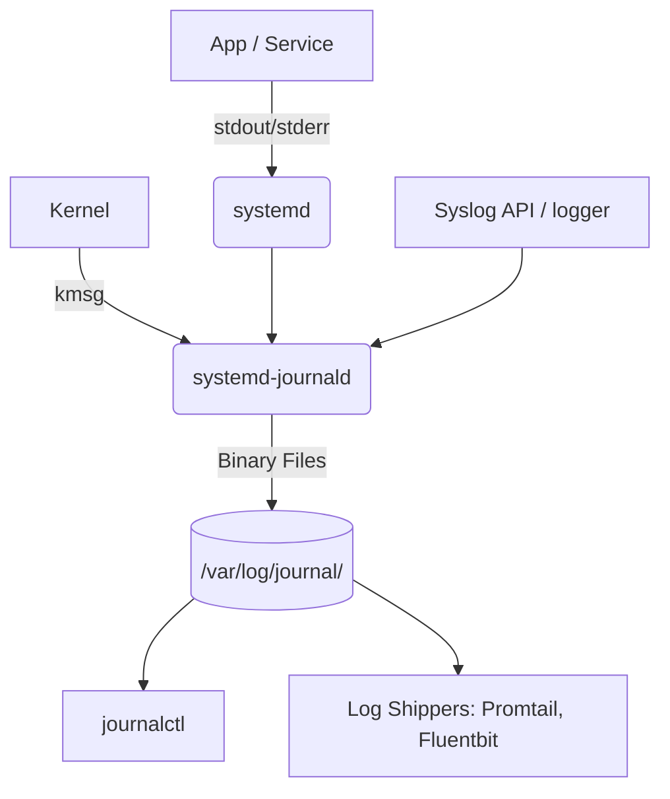

# Systemd-Journald: Структурированный логгинг для DevOps

Исторически сбор логов в Linux был болью: текстовые файлы от Syslog (`/var/log/messages`, `/var/log/syslog`) приходилось парсить регулярками. Каждое приложение писало логи в своем формате, ротация зависела от `logrotate` и cron-джобов. Когда происходил инцидент, расследование превращалось в поиск иголки в стоге сена из разрозненных текстовых файлов. 

**Journald** был создан, чтобы решить эту проблему: он собирает логи централизованно, в бинарном формате и, самое главное, *структурированно*. Каждый лог — это не просто строка текста, а набор метаданных (кто записал, какой PID, какой юнит systemd, время до микросекунд).

## Архитектура и как это работает



В production `journald` часто выступает как первый надежный буфер перед отправкой логов в централизованное хранилище (Elasticsearch, Loki, Splunk) через легковесные агенты (Fluent Bit, Promtail).

## Примеры и Best Practices

**Поиск логов:**
Забудьте про `grep`. Используйте возможности структурированных запросов:
```bash
# Логи конкретного сервиса с момента последней загрузки сервера
journalctl -u nginx.service -b 0

# Логи за последние 10 минут, только ошибки и фатальные (priority 0-3)
journalctl --since "10 min ago" -p err

# Логи конкретного процесса по PID
journalctl _PID=1234
```

**Антипаттерн: Оставить дефолтные лимиты**
По умолчанию `journald` может занять до 10% диска. На серверах с большими дисками это гигабайты логов, что замедляет `journalctl` и впустую тратит место. 
**Best Practice:** Явно ограничивать размер.

`/etc/systemd/journald.conf`:
```ini
[Journal]
Storage=persistent
SystemMaxUse=500M
SystemKeepFree=1G
MaxRetentionSec=1month
```
После изменения необходимо применить настройки: `systemctl restart systemd-journald`.

## Скрытые нюансы и Day 2 Operations

- **Performance Overhead**: Так как `journald` пишет логи синхронно и индексирует их, приложения, пишущие огромное количество логов в `stdout/stderr` (десятки тысяч строк в секунду), могут упереться в CPU или задержки I/O самого `journald`. Для супер-нагруженных приложений (например, высоконагруженные прокси или базы данных) иногда лучше писать логи напрямую в файл или сокет.
- **Потеря логов (Rate Limiting)**: По умолчанию `journald` отбрасывает логи, если их слишком много (контролируется параметрами `RateLimitIntervalSec` и `RateLimitBurst`). Вы увидите сообщение *"Suppressed XXX messages"*. В production это может скрыть критические трейсы стека при масштабной аварии.
- **Повреждение бинарных файлов**: В случае жесткого сбоя сервера (hard reboot, OOM, power loss) бинарный файл `journal` может повредиться. Для проверки целостности используется `journalctl --verify`. При повреждении обычно достаточно удалить испорченные файлы, и journald создаст новые.
