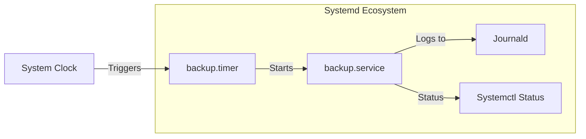

# Systemd Timers (Альтернатива Cron)

Классический `cron` служил нам десятилетиями. Но в современных DevOps-реалиях у него есть фатальные недостатки:
1. **Отсутствие зависимостей:** `cron` не может подождать, пока поднимется сеть или примонтируется диск. Он просто стреляет в пустоту.
2. **Мониторинг логов:** Вывод cron-джобов часто отправляется в локальную почту (`/var/mail`), которую никто не читает, или требует костылей с `> /var/log/myjob.log 2>&1`.
3. **Overlapping (Наложение):** Если скрипт выполняется дольше, чем интервал `cron`, запустится второй экземпляр, что может убить базу блокировками (приходится городить `flock`).

**Systemd Timers** решают все эти проблемы, разделяя логику расписания (Timer) и логику выполнения (Service).

## Как это работает

Для работы таймера нужны два файла с одинаковым именем:
1. `myjob.timer` — описывает КОГДА запускать.
2. `myjob.service` — описывает ЧТО запускать.

Когда срабатывает таймер, он просто делает `systemctl start myjob.service`.



## Примеры и Best Practices

### 1. Сервис-файл (`/etc/systemd/system/backup.service`)
```ini
[Unit]
Description=Daily Database Backup
# Не даем запуститься, если нет сети
Requires=network-online.target

[Service]
Type=oneshot
ExecStart=/usr/local/bin/backup.sh
# Systemd гарантирует, что вторая копия не запустится, пока не отработает первая!
```

### 2. Таймер-файл (`/etc/systemd/system/backup.timer`)
```ini
[Unit]
Description=Run backup daily

[Timer]
# Запускать каждый день в 02:00 ночи
OnCalendar=*-*-* 02:00:00

# Если сервер был выключен ночью, запустить пропущенный бекап при загрузке
Persistent=true

# Рандомизация запуска для предотвращения Thundering Herd (шторма нагрузки)
RandomizedDelaySec=15m

[Install]
WantedBy=timers.target
```
*Для применения:* `systemctl enable --now backup.timer` (обратите внимание, мы включаем `.timer`, а не `.service`).

## Нюансы и Day 2 Operations

### Борьба со штормом (Thundering Herd)
Если у вас 1000 серверов, и на всех стоит `cron` на 00:00 для скачивания обновлений, ровно в полночь ваша сеть "ляжет". `RandomizedDelaySec=15m` размажет запуск по интервалу с 00:00 до 00:15 случайным образом для каждой машины. Это гениальная фича для масштабной инфраструктуры.

### Отладка и просмотр расписания
В отличие от `crontab -l`, Systemd дает прекрасную визуализацию того, когда что запустится:
```bash
# Посмотреть все таймеры, когда был прошлый запуск и когда следующий
systemctl list-timers --all
```

### Отстрел ноги: Часовые пояса и OnCalendar
Синтаксис `OnCalendar` мощный, но неочевидный. По умолчанию он использует локальное время сервера. Если ваши сервера живут в разных таймзонах, а вы ожидаете синхронного бэкапа, будет беда. 
* *Best Practice:* Всегда настраивайте сервера в UTC, либо явно указывайте таймзону в правиле: `OnCalendar=*-*-* 02:00:00 UTC`.

### Оверхед
Для простого скрипта "попинговать эндпоинт раз в минуту" создание двух файлов в `/etc/systemd/system/` может показаться бюрократией. Да, порог входа выше, чем `crontab -e`. Но в парадигме Infrastructure as Code (Ansible/Terraform) раскатать два файла так же легко, как и один, а надежность возрастает многократно.
