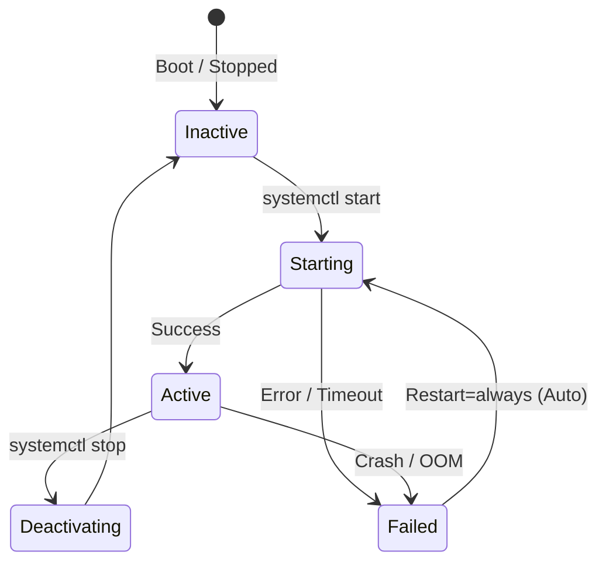

# Units и Services в Systemd

Управление сервисами в production требует гарантий: процесс должен перезапуститься при падении, ему нужно ограничить доступ к памяти и дескрипторам файлов, и он должен запускаться только тогда, когда готова база данных. До Systemd это реализовывалось костылями из shell-скриптов, supervisor'ов и ulimit'ов. 

В Systemd всё это описывается декларативно через **Юниты (Units)**. Самый популярный тип юнита — `.service`, который описывает, как управлять конкретным процессом.

## Жизненный цикл сервиса



## Идеальный production Service-файл

Ниже пример правильного оформления микросервиса (например, на Go) со всеми Best Practices для production-среды.

```ini
# /etc/systemd/system/backend-app.service
[Unit]
Description=Backend Golang App
# Не запускаем, пока не поднимется сеть
After=network-online.target
Wants=network-online.target

[Service]
# Type=simple означает, что Systemd считает сервис запущенным сразу после fork
# Type=notify лучше, если приложение умеет слать sd_notify() о своей готовности
Type=simple
User=appuser
Group=appuser
WorkingDirectory=/opt/app

# Читаем секреты и конфиги (не хардкодим!)
EnvironmentFile=/etc/app/config.env

ExecStart=/opt/app/backend-bin
# Перезапуск при падении
Restart=on-failure
RestartSec=5s

# Security & Limits (Важнейшая часть)
LimitNOFILE=65536
ProtectSystem=full
# Запрещаем доступ к /home
ProtectHome=yes
# Запрещаем получение новых привилегий
NoNewPrivileges=yes

[Install]
# Запускать при обычном многопользовательском режиме
WantedBy=multi-user.target
```

## Day 2 Operations, Антипаттерны и "Отстрел ног"

### 1. Ловушка `StartLimitIntervalSec` (Отстрел ноги)
Если ваш сервис циклически падает сразу после старта, `Restart=always` будет долбить систему. Systemd защищается от этого параметрами `StartLimitIntervalSec` и `StartLimitBurst`.
* *Боль:* По умолчанию, если сервис упал 5 раз за 10 секунд, Systemd переводит его в статус `failed` и **больше не пытается перезапустить**, даже если база данных в итоге поднялась. 
* *Решение:* Если вы хотите, чтобы сервис пытался подняться вечно, нужно явно сбрасывать лимиты:
  ```ini
  StartLimitIntervalSec=0
  RestartSec=10
  ```

### 2. Зависание при остановке (Day 2)
Иногда процесс не хочет умирать при `systemctl stop`. По умолчанию Systemd шлет `SIGTERM`, ждет `TimeoutStopSec` (обычно 90 секунд) и затем шлет жесткий `SIGKILL`. 
* *Нюанс:* Для graceful shutdown (например, завершения HTTP-соединений) 90 секунд может быть мало или много. Всегда тюньте `TimeoutStopSec` под специфику приложения.

### 3. Оверхед Type=simple
При `Type=simple` Systemd не ждет фактической готовности порта приложения. Если у вас другой сервис зависит от этого (`Requires=app.service`), он стартанет сразу же, и скорее всего упадет, так как приложение еще не успело открыть сокет. 
* *Best Practice:* Если возможно, используйте `Type=notify` (требует интеграции в код) или `Type=exec` / `Type=forking` в зависимости от архитектуры процесса.
