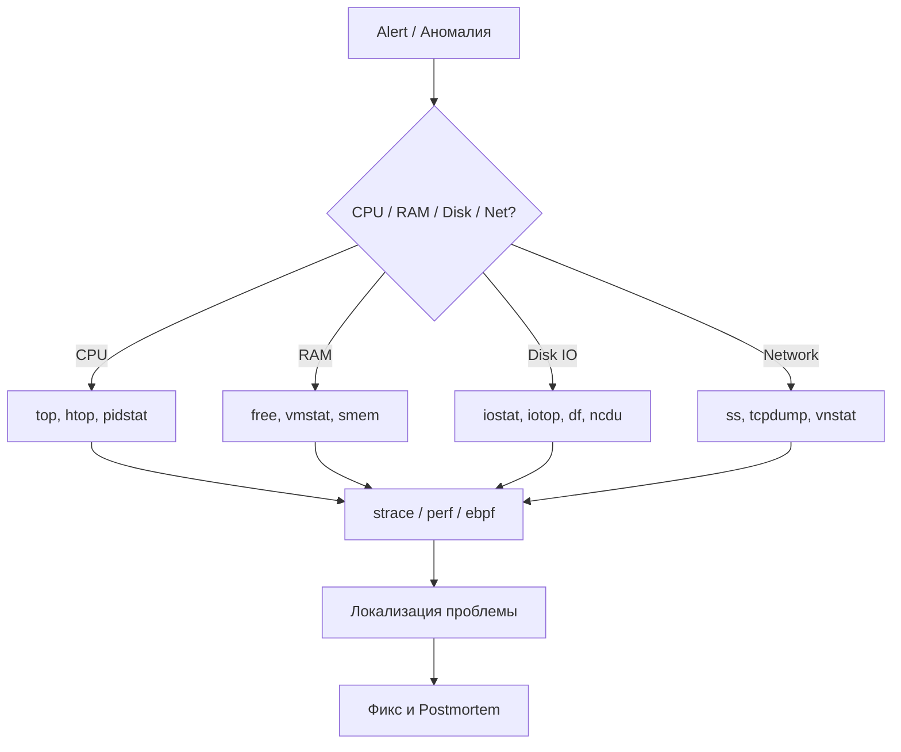

# Troubleshooting Linux: Искусство тушить пожары

Любая система, какой бы надежной она ни казалась на этапе проектирования, рано или поздно ломается в production. Начинает течь память, заканчиваются иноды, сеть начинает дропать пакеты, или внезапный всплеск IOPS кладет базу данных. Боль эксплуатации заключается в том, что когда мониторинг начинает кричать красным, счет идет на минуты. Troubleshooting — это не просто хаотичный набор команд, это методология поиска иголки в стоге сена, когда сено горит.

## Как это работает на практике

Эффективный траблшутинг строится на методологиях вроде **USE** (Utilization, Saturation, Errors) или **RED** (Rate, Errors, Duration). Мы идем от общего к частному: от высокоуровневых метрик к конкретному процессу и системному вызову. 



## Показательные примеры и Best Practices

**1. Исчерпание файловых дескрипторов (Too many open files)**
Частая проблема нагруженных веб-серверов.
```bash
# Кто сожрал дескрипторы?
lsof | awk '{print $1}' | sort | uniq -c | sort -rn | head

# Смотрим лимиты конкретного процесса
cat /proc/<PID>/limits
```
*Best Practice:* Всегда настраивайте `ulimit` (или `LimitNOFILE` в systemd) для production-сервисов. Дефолтных 1024 почти никогда не хватает.

**2. Почему процесс завис или тормозит?**
Если утилиты вроде `top` показывают, что процесс потребляет CPU, но приложение не отвечает, нужно заглянуть "под капот".
```bash
# Трассировка системных вызовов
strace -c -p <PID> # Сводка по сисколлам (что занимает время)
strace -T -p <PID> # Время выполнения каждого вызова
```

**3. Сетевые аномалии**
Когда приложение говорит "Connection refused" или таймаутит.
```bash
# Быстрый чек открытых портов и очередей
ss -tulnp

# Дамп трафика для анализа в Wireshark
tcpdump -i any port 80 -w /tmp/capture.pcap
```

## Неочевидные нюансы и Day 2 Operations

- **Оверхед от инструментов:** Использование `strace` приостанавливает процесс при каждом системном вызове, что может замедлить его в 10-50 раз. В production на высоконагруженном узле это может добить сервис. Для Day 2 операций лучше использовать `perf` или `eBPF` (BCC tools), которые работают на уровне ядра и имеют минимальный оверхед.
- **D-State (Uninterruptible Sleep):** Процесс со статусом `D` в `top` обычно ждет I/O (например, отвалившийся NFS-диск) и не реагирует на `SIGKILL` (`kill -9`). Единственный путь кроме перезагрузки — починить зависшую подсистему.
- **Исчерпание Inodes:** Место на диске есть (`df -h`), а файлы не создаются. Причина — кончились индексные дескрипторы (`df -i`) из-за миллионов мелких файлов (часто это сессии или кэш). Удалять их через `rm -rf` нельзя (выдаст `Argument list too long`), нужно использовать `find . -type f -delete`.
- **OOM Killer:** Когда заканчивается RAM, ядро убивает самый "жирный" процесс. Проверять это нужно через `dmesg -T | grep -i oom`. Антипаттерн — отключать OOM Killer. Правильный путь — настраивать `oom_score_adj` для критичных процессов и лимиты в cgroups/Kubernetes.
