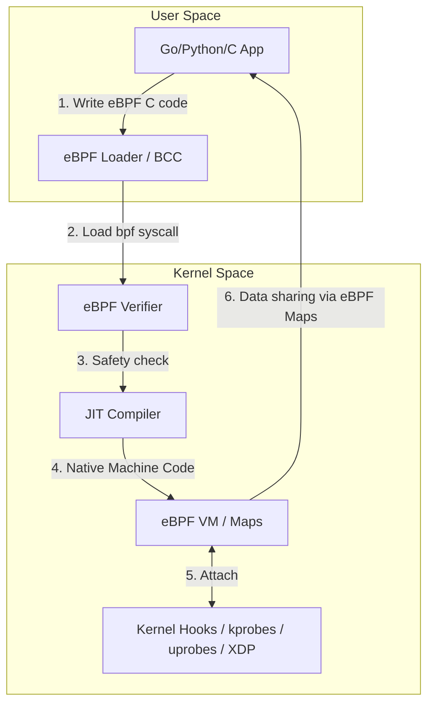

# eBPF (Основы)

## Боль и её решение
Исторически расширение возможностей ядра Linux требовало написания модулей ядра (Kernel Modules). Это было больно: малейшая ошибка — и Kernel Panic уносит весь сервер (а с ним и десятки подов) в перезагрузку. Обновление версии ядра часто ломало совместимость модулей. С другой стороны, делать всё в User Space (через ptrace или iptables) — это огромный оверхед на переключение контекста.
**eBPF (Extended Berkeley Packet Filter)** — это виртуальная машина внутри ядра Linux. Она решает эту боль, позволяя запускать песочные (sandboxed) программы прямо в ядре без его перекомпиляции и без риска уронить систему. Это дает беспрецедентную, безопасную и высокопроизводительную наблюдаемость, безопасность и сетевую маршрутизацию с околонулевым оверхедом (Zero-instrumentation).

## Как это работает в Production
В проде eBPF — это фундамент для современных Cloud-Native инструментов:
- **Сеть:** Cilium заменяет kube-proxy, обходя сложный и медленный стек iptables/netfilter, роутя пакеты напрямую на уровне сокетов.
- **Безопасность:** Tetragon, Falco или Tracee отслеживают системные вызовы в реальном времени, блокируя, например, запуск `curl` внутри продакшен контейнера с БД.
- **Обсервабилити:** Pixie, Parca (непрерывный профайлинг). Вы можете смотреть задержки SQL-запросов, собирая их прямо из сетевых пакетов, вообще не меняя код приложения.



## Примеры и Best Practices

**Антипаттерн:** Попытка написать сложную бизнес-логику внутри eBPF программы. eBPF имеет жесткие ограничения по инструкциям, и Верификатор просто отклонит слишком сложный код или код с потенциально бесконечными циклами.

**Best Practice:** Фильтруйте и агрегируйте данные в eBPF (в ядре), а сложный анализ и отправку метрик делайте в User Space (через eBPF Maps — хэш-таблицы, разделяемые между ядром и юзерспейсом).

**Пример bpftrace:** Однострочник для отслеживания всех запускаемых процессов в системе (кто вызывает `execve`):
```bash
sudo bpftrace -e 'tracepoint:syscalls:sys_enter_execve { printf("%s called %s\n", comm, str(args->filename)); }'
```
*Запускать аккуратно, так как требует root, но это отлично показывает мощь динамического трейсинга.*

## Неочевидные нюансы (Day 2 operations)
- **Строгий Верификатор (Verifier):** Это ваш лучший друг и злейший враг. Он гарантирует, что программа не зациклится и не прочитает чужую память. Если ядро старое (например, CentOS 7 / kernel 3.10), eBPF работать не будет или будет крайне ограничен (современный eBPF требует ядра 4.14+, а лучше 5.8+). Иногда приходится "разворачивать" (unroll) циклы вручную (через `#pragma unroll`), чтобы угодить верификатору.
- **Оверхед (CPU/Mem):** Хоть eBPF и быстр, запуск скрипта на КАЖДЫЙ сетевой пакет (через XDP) или на КАЖДЫЙ аллокатор памяти (malloc uprobe) может убить производительность CPU. Используйте агрегацию (histograms/maps) в ядре, а не пересылайте каждое событие (через perf buffers/ring buffers) в юзерспейс.
- **Day 2 Updates:** eBPF-программы компилируются под конкретную структуру ядра (BTF - BPF Type Format). Благодаря механизму CO-RE (Compile Once – Run Everywhere), современные eBPF программы могут переноситься между разными версиями ядра, но для старых ядер может потребоваться установка `kernel-headers` на каждом узле кластера, что является огромной болью при эксплуатации.
