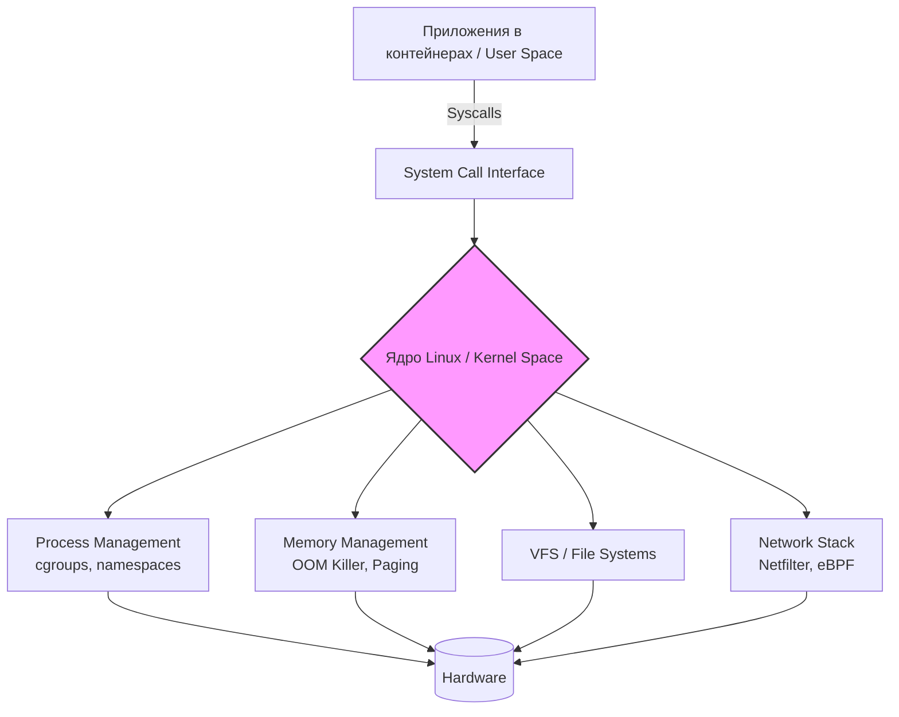

# ОС и Ядро Linux в Production

## Суть: Зачем DevOps инженеру понимать ядро?
Ядро Linux — это дирижер всех ресурсов сервера. В мире микросервисов и контейнеров мы часто абстрагируемся от "железа", но когда поды в Kubernetes начинают "голодать" по CPU, приложения падают с OOM (Out Of Memory), или сеть неожиданно тормозит — абстракции рушатся. Знание ядра помогает решать боль эксплуатации: понимать, как лимитируются ресурсы (cgroups), изолируются процессы (namespaces) и обрабатываются системные вызовы. Без этих знаний DevOps инженер превращается в слепого пользователя инструментов, не способного отладить сложную аварию.

## Как это работает в Production
Ядро выступает прослойкой между "железом" (CPU, RAM, Диски, Сеть) и пользовательским пространством (User Space), где живут наши приложения. Приложения не могут напрямую трогать ресурсы, они общаются с ядром через системные вызовы (syscalls).



## Показательные примеры и Best Practices

**Тюнинг параметров ядра через sysctl:**
Большинство дефолтных настроек ядра расчитаны на десктопы или общие случаи. В высоконагруженном production их обязательно нужно тюнить.
```bash
# Увеличиваем размер очереди для входящих соединений (спасает от сброса TCP при спайках трафика)
sysctl -w net.core.somaxconn=65535
# Уменьшаем склонность ядра к использованию swap (чтобы In-Memory БД не тормозили)
sysctl -w vm.swappiness=1
```
*Best Practice:* Оформляйте эти изменения в `/etc/sysctl.d/99-custom.conf`, чтобы они переживали рестарт ноды.

**Анализ проблем через `dmesg`:**
Приложение умерло, а в его логах пусто? Идем в ring-buffer ядра — там будет ответ, если вмешалась система.
```bash
dmesg -T | grep -i oom-killer
# Вывод покажет, какой процесс съел всю память и был "застрелен" ядром ради спасения системы.
```

## Неочевидные нюансы и Day 2 Operations

*   **Антипаттерн: "Отключим OOM-Killer"**. Никогда не пытайтесь отключить механизм Out-Of-Memory Killer. Если память действительно закончится, система зависнет намертво (kernel panic). Вместо этого используйте `oom_score_adj` для приоритизации процессов (например, защитите процесс `sshd` или агента мониторинга, дав ему отрицательный скор, чтобы ядро убивало их в последнюю очередь).
*   **Скрытые трейдоффы eBPF**: eBPF (Extended Berkeley Packet Filter) позволяет писать безопасные программы, работающие прямо в ядре без его перекомпиляции. Это стандарт де-факто для современного сетевого трафика (используется в Cilium для сети K8s). *Трейдофф:* Это мощно, но требует свежих версий ядра (5.4+). На старых Enterprise-дистрибутивах (например, CentOS 7) вы получите массу проблем с совместимостью и багами.
*   **Оверхед Context Switch**: Слишком частые системные вызовы приводят к переключению контекста между User Space и Kernel Space. Для высоконагруженных сетевых приложений (например, ingress-балансировщиков) это становится узким местом. *Границы применимости:* Если вы упираетесь в CPU при парсинге пакетов, стандартный стек ядра вам уже не подходит. Решение — технологии типа DPDK или XDP (через тот же eBPF), которые байпасят классический сетевой стек ядра, передавая пакеты напрямую в приложение.
