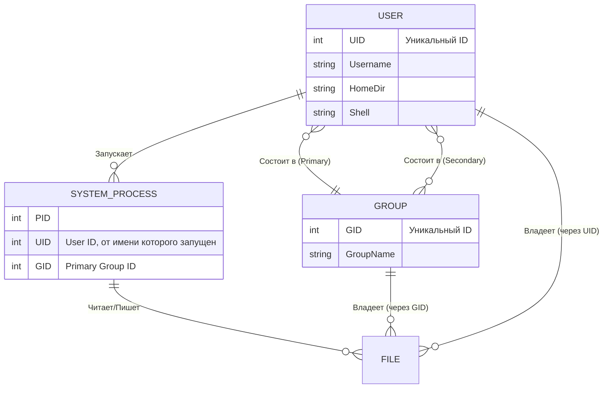

# Пользователи и группы в Linux: Изоляция и управление доступом

## Суть концепции: DevOps-история

В эпоху до контейнеров на одном "железном" сервере часто крутилась целая солянка: база данных, веб-сервер, крон-джобы, а в соседней папке лежали скрипты Васи из отдела аналитики. Если бы все эти процессы запускались от имени всемогущего `root`, уязвимость в веб-сервере немедленно привела бы к полному компрометированию всей машины. Злоумышленник (или кривой скрипт) удалил бы базу, поменял пароли и поставил майнер.

Боль, которую решает концепция пользователей и групп, — это **сегрегация ответственности и изоляция (Sandboxing) на уровне ОС**. 

В production каждый сервис (Nginx, PostgreSQL, Redis) должен работать от имени собственного уникального системного пользователя. Это гарантирует, что если Nginx взломают, хакер сможет читать только файлы, принадлежащие пользователю `nginx`, и не сможет получить доступ к данным `postgres`. Группы, в свою очередь, позволяют организовать коллективный доступ — например, добавить разработчиков в группу `docker`, чтобы они могли собирать образы без использования `sudo`.

## Как это работает (Наглядная схема)



## Примеры, Best Practices и Антипаттерны

### Управление сервисными аккаунтами
```bash
# Best Practice: Создание системного пользователя для демона (без права логина и домашней директории)
useradd --system --no-create-home --shell /usr/sbin/nologin prometheus

# Добавление существующего пользователя в дополнительную группу (например, docker)
usermod -aG docker injurka
```

### Антипаттерны
- **Использование Shared-аккаунтов:** Заводить пользователя `deploy` с одним паролем, который знают 10 человек. *Решение:* Персональные пользователи и SSH-ключи, добавление нужных людей в группу `deployers`.
- **Запуск приложений от root:** Контейнеры и процессы, бегущие из-под рута, нарушают изоляцию.
- **Отказ от `sudo`:** Попытки раздать права через изменение владельцев системных файлов вместо настройки `/etc/sudoers`.

## Неочевидные нюансы: скрытые трейдоффы и Day 2 Operations

1. **Где отстреливает ногу: UID/GID Mismatches (NFS и Контейнеры)**
   В Linux права доступа привязываются не к строковому имени `nginx`, а к числовому идентификатору (например, UID `104`). 
   - *NFS:* Если на сервере A пользователь `alice` имеет UID `1000`, а на сервере B UID `1000` принадлежит `bob`, то при монтировании общего NFS-диска файлы `alice` будут выглядеть как файлы `bob`.
   - *Docker/Kubernetes:* Если внутри контейнера приложение работает от UID `1000`, а вы монтируете volume с хоста, где файлы принадлежат UID `1001`, приложение упадет с ошибкой "Permission Denied".

2. **Day 2 Operations: Централизация (LDAP/FreeIPA/Active Directory)**
   Управлять `/etc/passwd` вручную на 5 серверах — нормально. На 500 — невозможно. В production-масштабах локальные пользователи (кроме root и сервисных аккаунтов) исчезают. На сцену выходит NSS (Name Service Switch) и PAM (Pluggable Authentication Modules), которые позволяют ОС запрашивать список пользователей и пароли из центрального каталога. Трейдофф: при падении сети на сервер нельзя будет зайти под своей доменной учеткой.

3. **Security: Rootless Containers**
   Исторически демон Docker работает от root. Добавление пользователя в группу `docker` эквивалентно выдаче прав `sudo` без пароля (через `docker run -v /:/host -it ubuntu bash`). В современном DevOps тренд сместился к Rootless-режимам (Podman, Rootless Docker) и использованию `subuid`/`subgid`, где пользователю выделяется диапазон "фейковых" UID, которые мапятся на реальные в изолированном пространстве имен (User Namespaces).

4. **Оверхед от групп**
   Пользователь в Linux может состоять во множестве групп. Однако протокол NFS по умолчанию ограничивает количество групп в запросе до 16. Если пользователь состоит в 20 группах, при доступе к сетевой шаре права от 17-й и последующих групп могут быть проигнорированы, что приводит к загадочным проблемам с доступом.
