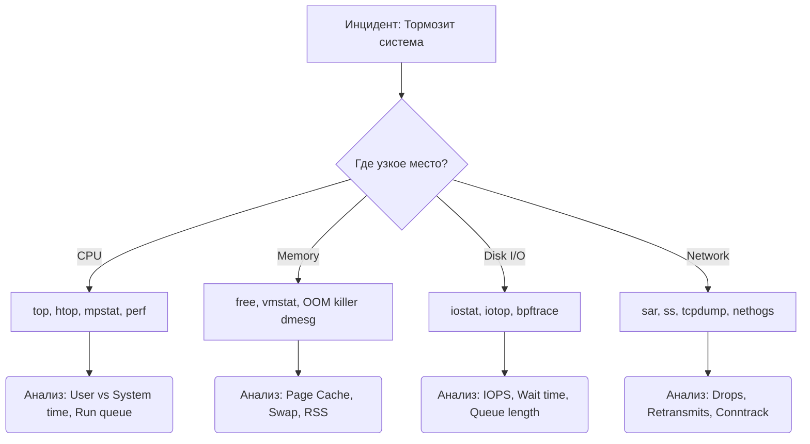

# Производительность Linux в Production

## Боль эксплуатации
Выкатили новый микросервис на Go, и вдруг поды в Kubernetes начали рестартиться по OOM. Или база данных PostgreSQL стала отвечать по 5 секунд, хотя CPU свободен на 80%. Типичный подход "давайте докинем железа" спасает до первого приличного счета от облачного провайдера. Настоящая боль DevOps — это понять, в какую именно подсистему Linux (CPU, Memory, Disk I/O, Network) упирается приложение, и почему метрики в Grafana врут (например, путая load average с утилизацией CPU).

## Инструментарий: Модель USE

Брендан Грегг (Brendan Gregg) подарил нам методологию **USE (Utilization, Saturation, Errors)**. Для каждого ресурса мы проверяем эти три показателя.



## Практика и Best Practices

### Память и Page Cache (Классика)
**Антипаттерн:** Пугаться, что `free` показывает мало свободной памяти.
Linux использует всю доступную память под дисковый кэш (Page Cache). Это нормально. Смотреть нужно на `available`, а не `free`.

### CPU: Load Average vs CPU Usage
**Антипаттерн:** Считать, что Load Average = 10 при 8 ядрах — это всегда проблема CPU.
В Linux Load Average включает процессы в состоянии `Uninterruptible sleep (D)` (обычно ждут диска или сети). Если LA высокий, а CPU `%usr` низкий — вы уперлись в I/O!

### Полезный пример: Поиск виновника I/O
Когда сервер "встал", `top` покажет высокий `%wa` (iowait). Кто жрет диск?
```bash
# Установка iotop (если нет, можно использовать pidstat -d)
sudo iotop -oP

# Смотрим очередь к диску и утилизацию:
iostat -xz 1
# Если %util близок к 100% и await растет — диск не справляется.
```

## Неочевидные нюансы и Day 2 Operations

**Скрытые трейдоффы (OOM Killer):**
По умолчанию Linux позволяет приложениям выделять больше памяти, чем есть физически (Memory Overcommit). Когда память реально заканчивается, приходит OOM (Out Of Memory) Killer и убивает процесс с максимальным `oom_score`.
*Day 2:* Вы можете защитить критичные демоны (например, `sshd` или `kubelet`), выставив им `oom_score_adj = -1000`.

**Границы применимости:**
BPF (eBPF) — серебряная пуля современного перфоманс-анализа. Позволяет без оверхеда заглядывать внутрь ядра. Но!
Написание сырых bpf-скриптов — боль. Используйте готовые инструменты из пакета `bcc-tools` (например, `execsnoop`, `biolatency`).

**Оверхед мониторинга:**
Сбор метрик каждую секунду (node-exporter, telegraf) сам по себе потребляет ресурсы. Опрашивать некоторые подсистемы слишком часто (например, полный список процессов через `/proc`) может вызвать тормоза на высоконагруженных системах.
