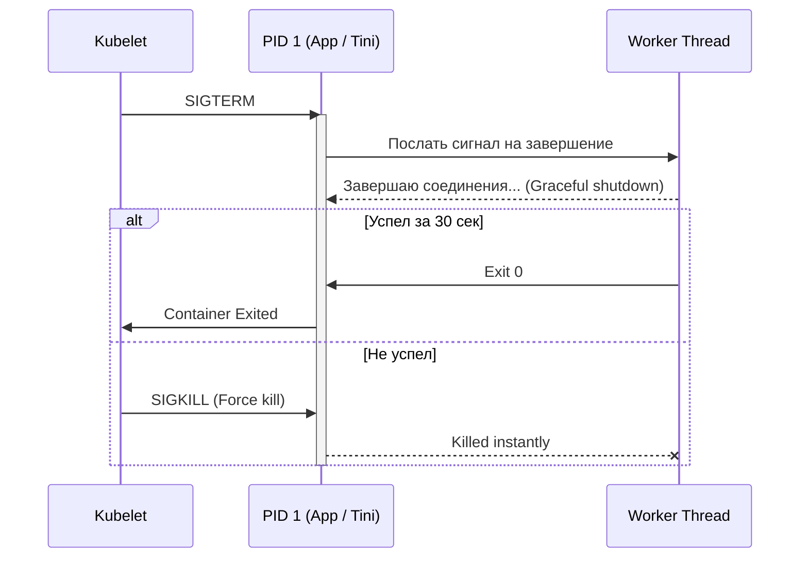

# Процессы и сигналы в Linux

## Боль и её решение
В мире, где всё — это процесс (или тред, что для ядра почти одно и то же), неумение управлять их жизненным циклом приводит к зомби-апокалипсисам в контейнерах, потерянным соединениям при релизах и невозможности корректно завершить работу приложения. Сигналы — это примитивный, но мощный механизм IPC (межпроцессного взаимодействия), позволяющий ядру, пользователю или другому процессу "пнуть" наше приложение. Мы решаем боль graceful degradation и zero-downtime deployments: вместо грубого убийства (OOM-killer или SIGKILL) мы просим приложение аккуратно завершиться (SIGTERM), сбросить кэши или перечитать конфиги на лету (SIGHUP).

## Как это работает в Production
В Kubernetes/Docker процесс с PID 1 (обычно ваше приложение или init-система, вроде systemd, tini, dumb-init) отвечает за обработку сигналов.
Когда вы делаете `kubectl delete pod`, Kubelet отправляет **SIGTERM** процессу с PID 1. У приложения есть `terminationGracePeriodSeconds` (по умолчанию 30с), чтобы закрыть активные соединения, дописать данные на диск и завершиться. Если приложение игнорирует SIGTERM (например, потому что это bash-скрипт, который не пробросил сигнал дочернему процессу), через 30 секунд прилетит безжалостный **SIGKILL**, и данные будут потеряны.



## Примеры и Best Practices

**Антипаттерн:** Запуск приложения в Dockerfile через shell-форму: `CMD java -jar app.jar`.
В этом случае PID 1 становится `/bin/sh -c`, который по умолчанию **не передаёт** сигналы дочерним процессам. Ваша Java не получит SIGTERM и будет убита по таймауту SIGKILL.

**Best Practice:** Использовать exec-форму: `CMD ["java", "-jar", "app.jar"]`. Либо использовать легковесный init (например, `tini`), если у вас рождаются дочерние процессы (чтобы автоматически собирать процессы-зомби):
```dockerfile
ENTRYPOINT ["/sbin/tini", "--"]
CMD ["node", "app.js"]
```

**Обработка сигналов в Bash (trap):**
```bash
#!/bin/bash
trap 'echo "Получен SIGTERM! Очищаю tmp..."; rm -f /tmp/lock; exit 0' SIGTERM
echo "Работаем..."
while true; do sleep 1; done
```

## Неочевидные нюансы (Day 2 operations)
- **Зомби-процессы (Zombie):** Процесс завершился, но его родитель не вызвал `wait()`, чтобы прочитать статус выхода. Зомби не потребляют CPU или RAM, но **занимают место в таблице процессов**. Когда таблица переполняется (PID exhaustion), система не может создать ни одного нового процесса (даже `ls`). Решение: убить родителя зомби (тогда их усыновит init и соберёт) или использовать `tini` в контейнерах.
- **Uninterruptible Sleep (D-state):** Процесс ждёт I/O (например, отвалившийся NFS) и не может быть убит даже SIGKILL. Помогает только восстановление I/O или жесткая перезагрузка узла.
- **Оверхед на сигналы:** Отправка сигналов требует переключения контекста в ядро. В высоконагруженных системах массовая рассылка сигналов (например, отладка через профайлер) может вызвать задержки, поэтому лучше использовать более современные механизмы IPC (очереди сообщений, shared memory) для интенсивного обмена данными.
