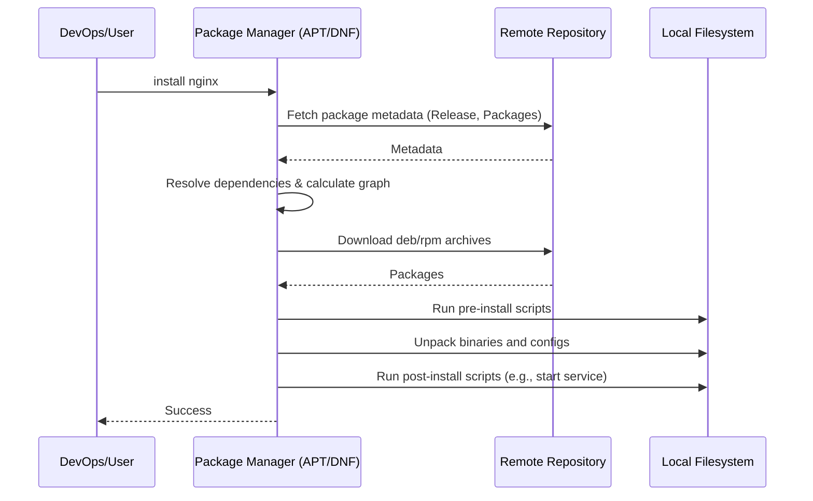

# Управление пакетами в Linux: Искусство зависимостей

Боль эксплуатации и доставки софта в мире до пакетных менеджеров (или в экосистемах без строгих правил) состояла в "Dependency Hell" — аде зависимостей. Установка одной программы требовала установки десятка библиотек определенных версий, которые, в свою очередь, ломали уже установленные программы. Пакетные менеджеры (APT, YUM/DNF, Pacman) решили эту боль, предоставив детерминированный способ установки, обновления и удаления софта вместе с разрешением конфликтов.

Для DevOps-инженера пакетный менеджер — это фундамент создания консистентных окружений. Без него не собрать reproducible Docker image и не подготовить идемпотентный Ansible playbook.

## Как это работает

Пакет — это архив с бинарниками, конфигурационными файлами и метаданными (список зависимостей, скрипты pre/post-install). Пакетный менеджер скачивает индексы из репозиториев, вычисляет граф зависимостей и выполняет транзакцию по изменению состояния системы.



## Практика и примеры

**Debian/Ubuntu (APT / dpkg)**
```bash
# Обновление кэша индексов
apt update
# Установка конкретной версии (важно для production!)
apt install nginx=1.18.0-0ubuntu1.4
# Поиск пакета, которому принадлежит файл
dpkg -S /etc/nginx/nginx.conf
```

**RHEL/CentOS (YUM / DNF)**
```bash
# История транзакций - супер полезно для откатов
dnf history
# Откат конкретной транзакции
dnf history undo 3
```

**Best Practice: Идемпотентность и фиксация версий**
В конфигурационном управлении (Ansible/Chef) или при сборке Docker-образов *всегда* фиксируйте версии пакетов, иначе завтрашний билд может сломаться из-за минорного обновления библиотеки в апстриме.

*Пример (Dockerfile):*
```dockerfile
# Антипаттерн
RUN apt-get update && apt-get install -y python3

# Best Practice
RUN apt-get update && apt-get install -y --no-install-recommends \
    python3=3.10.6-1~22.04 \
    && rm -rf /var/lib/apt/lists/*
```

## Неочевидные нюансы и Day 2 Operations

- **Day 2 Operations - Зеркалирование:** В крупных инфраструктурах серверы не должны ходить в интернет за каждым пакетом. Это долго и небезопасно. Поднимаются локальные зеркала (например, Nexus Repository Manager или Artifactory) для кэширования и контроля того, какие пакеты вообще разрешено ставить.
- **Pre/Post-install скрипты как слабое звено:** Пакет — это не просто файлы, это код, выполняющийся от имени `root`. Скрипты в RPM/DEB могут содержать ошибки, зависать, интерактивно запрашивать ввод, ломая автоматизацию (поэтому всегда нужен `DEBIAN_FRONTEND=noninteractive`).
- **Оверхед на обновление кэша:** В эфемерных средах (CI/CD) выполнение `apt-get update` каждый раз отнимает время и сеть.
- **Границы применимости:** Традиционные пакетные менеджеры уровня ОС плохо подходят для управления зависимостями самого приложения (Python `pip`, Node `npm`, Go `mod`). Смешивание системных пакетов и пакетов приложения (например, установка Python-библиотек через `apt` и `pip` одновременно) неминуемо ведет к конфликтам. Изолируйте приложения в виртуальные окружения или контейнеры.
