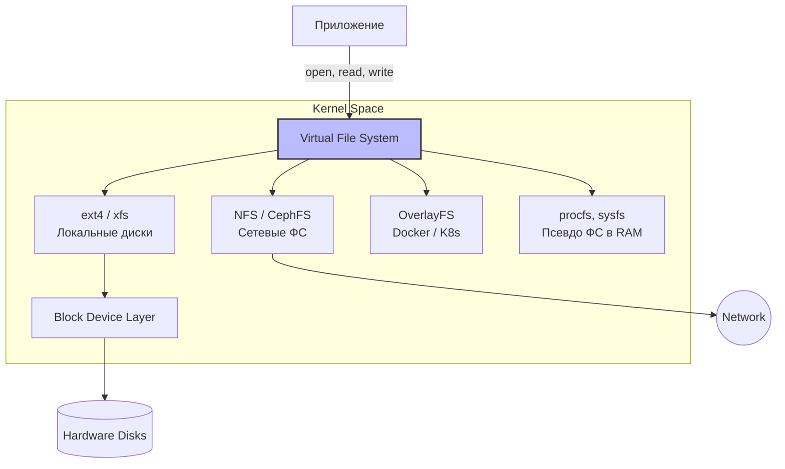

# Файловые системы и VFS: Взгляд DevOps

## Суть: Боль хранения и доставки
Для приложения в Linux "всё есть файл" — от конфигураций на диске до сетевых сокетов и устройств. Боль DevOps инженера часто кроется в медленных дисках, исчерпании inodes (когда место физически есть, а файлы создать нельзя) и "зомби-файлах", которые занимают место даже после удаления. Понимание того, как Linux абстрагирует работу с хранилищем через VFS (Virtual File System) и как работают современные ФС (ext4, XFS, overlayfs), критично для стабильного и производительного production.

## Как это работает
Linux использует VFS как универсальную абстракцию. Приложению неважно, пишет ли оно на локальный NVMe SSD (через ext4), в распределенную сеть (NFS, Ceph) или в виртуальную слоистую ФС контейнера (OverlayFS) — оно делает один и тот же простой системный вызов `write()`. VFS транслирует этот вызов в драйвер конкретной файловой системы.



## Показательные примеры и Best Practices

**Авария: Исчерпание Inodes**
Бывает, что мониторинг показывает 50% свободного места на диске, но приложение падает с ошибкой `No space left on device`. Это значит, что закончились inodes (индексные дескрипторы) из-за миллионов мелких файлов (например, кэшей сессий PHP или старых неротированных логов).
```bash
# Проверка количества свободных inodes (колонка IUse%)
df -i
# Поиск директорий с наибольшим числом файлов (чтобы найти виновника)
find /var -xdev -type d -print0 | while IFS= read -r -d '' dir; do
    echo "$(find "$dir" -maxdepth 1 | wc -l) $dir"
done | sort -rn | head -n 5
```

**Авария: Удаленный файл все еще занимает место**
Приложение пишет огромный лог, диск заполняется. Вы делаете `rm app.log`, но место в `df -h` не освобождается.
*Почему?* Команда `rm` удалила лишь ссылку на файл в структуре директории (dentry), но сам процесс приложения всё ещё держит файловый дескриптор открытым (ссылка на inode активна). Ядро не удалит данные, пока файл открыт.
```bash
# Ищем удаленные, но всё ещё открытые процессы файлы
lsof +L1
# Best Practice: Обнуление файла без удаления (truncate)
# Не делайте rm для активно пишущихся логов без logrotate!
> /var/log/app/app.log
```

## Неочевидные нюансы и Day 2 Operations

*   **Трейдоффы OverlayFS (Docker/K8s)**: Контейнеры используют слоистую OverlayFS, где нижние слои — это read-only образ, а верхний — слой для записи (container layer). *Проблема:* Интенсивная запись в контейнер (в его внутреннюю ФС) создает огромный I/O оверхед из-за механизма Copy-on-Write (CoW). Ядру приходится копировать файл из нижнего слоя в верхний перед модификацией. *Решение:* Базы данных и приложения с интенсивным I/O **всегда** должны писать в подключенные тома (volumes/bind mounts). Тома монтируются в обход OverlayFS напрямую к хостовой ФС.
*   **Выбор ФС: ext4 vs XFS**: XFS лучше масштабируется для огромных файлов и параллельных потоков ввода-вывода (отличный выбор для баз данных). Ext4 стабильнее для универсальных задач и миллионов мелких файлов. *Day 2 оверхед:* Увеличить размер раздела XFS можно на лету (`xfs_growfs`), но **уменьшить (shrink) XFS нельзя** — только через полное форматирование и восстановление из бэкапа. Ext4 поддерживает shrink.
*   **Антипаттерн `noatime` vs `relatime`**: Исторически в статьях советовали монтировать диски с флагом `noatime` (не обновлять время доступа к файлу), чтобы снизить I/O нагрузку от постоянных записей метаданных. Современные ядра по умолчанию используют `relatime`, который обновляет `atime` только если он старше времени модификации (`mtime`). Это убирает 99% I/O оверхеда, но не ломает приложения (типа почтовых агентов и бэкапов), которым `atime` действительно нужен. Ручной тюнинг `noatime` сегодня — это, как правило, преждевременная оптимизация.
