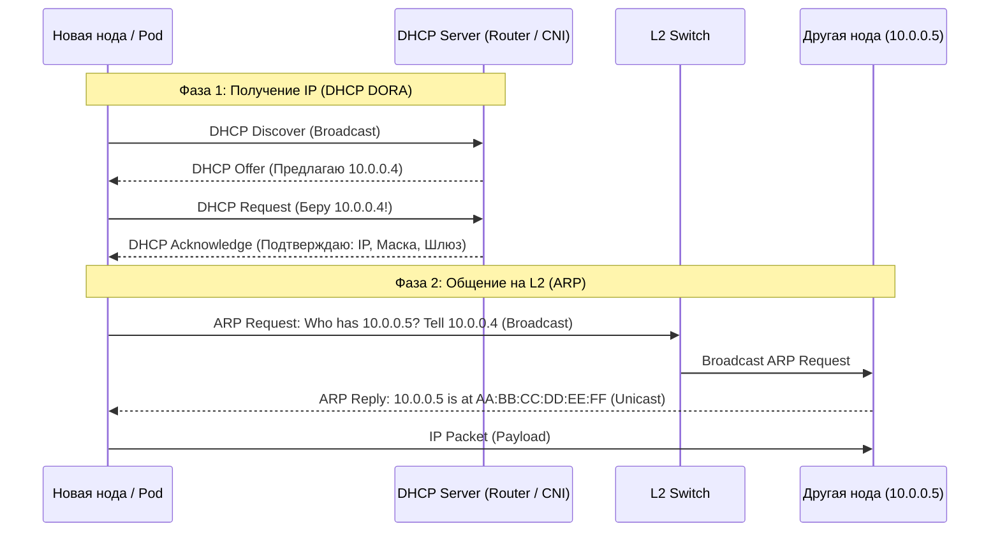

# DHCP и ARP: От MAC к IP и обратно

## DevOps-история: Суть и Боль
В начале времён, когда серверы были большими, а кластеры маленькими, сетевые интерфейсы настраивались руками. IP-адреса прописывались в конфигурационных файлах, а соответствие IP-адреса физической сетевой карте (MAC-адресу) статично заносилось в коммутаторы. 
С приходом облаков, виртуализации и контейнеризации (где поды живут минуты) ручное управление стало невозможным. Нам потребовался механизм автоматической выдачи IP-адресов железу и виртуалкам — так появился **DHCP** (Dynamic Host Configuration Protocol). 
Но IP — это логический уровень (L3), а коммутаторы гоняют кадры по MAC-адресам (L2). Чтобы пакет для `10.0.0.5` нашел свою физическую карту, узлу нужно узнать MAC-адрес получателя. Для этого существует **ARP** (Address Resolution Protocol).

Эти два протокола — фундамент, на котором держится вся динамическая инфраструктура, от PXE-загрузки голых серверов до общения подов в Kubernetes.

## Как это работает

- **DHCP (DORA)**: Процесс из 4 шагов. Клиент рассылает широковещательный запрос **D**iscover. Сервер предлагает IP ( **O**ffer ). Клиент запрашивает этот IP ( **R**equest ). Сервер подтверждает ( **A**cknowledge ), выдавая вместе с IP маску, шлюз и DNS.
- **ARP**: Когда узлу нужно отправить IP-пакет, он кричит в локальную сеть: "Эй, у кого IP 10.0.0.5? Скажите свой MAC!". Владелец отвечает, и этот ответ кешируется (ARP Cache) для будущих пакетов.



## Day 2 Operations: Нюансы эксплуатации и грабли

1. **Rogue DHCP (Поддельный сервер)**: 
   - **Боль:** В сети случайно или злонамеренно появляется чужой DHCP-сервер (кто-то воткнул домашний роутер в корпоративный свитч). Узлы начинают получать неверные шлюзы и теряют связь с миром.
   - **Решение:** Настройка `DHCP Snooping` на корпоративных коммутаторах (разрешать DHCP-ответы только с доверенных портов).
2. **Переполнение ARP-таблиц (Broadcast Storms)**:
   - **Боль:** Если у вас гигантский плоский L2-домен (одна подсеть на тысячи хостов), широковещательные ARP-запросы начинают сжирать полосу пропускания, а ARP-таблицы на коммутаторах переполняются.
   - **Решение:** Дробление сети на VLAN-ы / меньшие подсети (L3 маршрутизация).
3. **Stale ARP Cache**:
   - **Боль:** Если IP-адрес переехал на другую машину (например, при фейловере Keepalived/VRRP), соседи могут по-прежнему слать трафик на старый MAC.
   - **Решение:** Использование Gratuitous ARP (GARP) — узел сам рассылает уведомление "Я теперь владею этим IP, обновите кэш!", не дожидаясь запроса.
4. **Proxy ARP в Kubernetes**:
   - Плагины вроде Calico часто используют Proxy ARP: маршрутизатор (нода) отвечает своим MAC-адресом на ARP-запросы к IP-адресам подов, хитро перехватывая L2 трафик и маршрутизируя его на L3.

## Примеры команд (Bash)

```bash
# Посмотреть таблицу ARP (узнать MAC соседей по локальной сети)
ip neigh show
# Или старой утилитой:
arp -an

# Принудительно запросить новый IP-адрес по DHCP (например, при смене сети)
sudo dhclient -v eth0

# Очистить ARP-кэш для конкретного IP (если железо сменилось, а кэш залип)
sudo ip neigh flush 192.168.1.5

# Отправить Gratuitous ARP вручную (полезно при ручном переезде IP)
sudo arping -U -c 3 -I eth0 192.168.1.100
```
