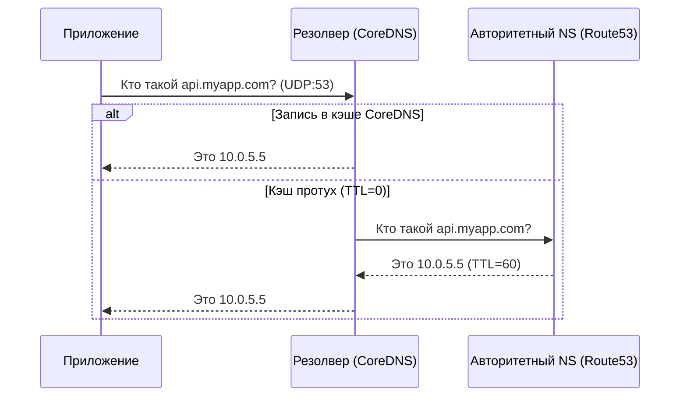

# DNS: Service Discovery и главная точка отказа

DNS (Domain Name System) часто описывают как "телефонную книгу интернета", но в DevOps — это основа Service Discovery. Без DNS микросервисы в Kubernetes, облачные балансировщики и CDN просто не смогли бы находить друг друга в динамическом окружении, где IP-адреса меняются ежесекундно. 

Известная шутка гласит: "Это не может быть DNS. Это не DNS. Окей, это был DNS." Поломка DNS ломает всё.

## Какую боль мы решаем?

В статичном мире можно прописать IP-адреса в конфигах, но в cloud-native средах поды пересоздаются, скейлятся, узлы умирают.
Боль заключается в том, как направить трафик на сущность, чей IP-адрес заранее неизвестен и постоянно меняется. DNS позволяет использовать абстрактные имена (например, `api.default.svc.cluster.local`), скрывая под капотом всю динамику.

## Как это работает в production

DNS-разрешение (resolution) — это цепочка запросов. Если локальный кэш (например, на узле) пуст, запрос летит к рекурсивному резолверу (например, CoreDNS в Kubernetes), который либо отдает свой кэш, либо опрашивает корневые (Root), доменные (TLD) и, наконец, авторитетные (Authoritative) сервера, которые владеют конкретной зоной.

### Визуализация DNS-разрешения



## Примеры из практики

Использование утилиты `dig` для траблшутинга, чтобы увидеть не только IP, но и TTL, и конкретный сервер, который ответил:

```bash
# Посмотреть A-записи
dig +short A google.com

# Посмотреть полную трассировку (recursion)
dig +trace google.com
```

CoreDNS — стандартный DNS-сервер в Kubernetes. Его конфигурация (`Corefile`) позволяет перехватывать запросы, делать rewrite и forward. Пример ConfigMap:

```yaml
apiVersion: v1
kind: ConfigMap
metadata:
  name: coredns
  namespace: kube-system
data:
  Corefile: |
    .:53 {
        errors
        health
        # Разрешение внутренних имен k8s
        kubernetes cluster.local in-addr.arpa ip6.arpa {
           pods insecure
           fallthrough in-addr.arpa ip6.arpa
        }
        # Проксирование всех остальных запросов наружу
        forward . 8.8.8.8
        cache 30 # Кэшировать ответы на 30 секунд!
    }
```

## Day 2 Operations: где отстреливает ногу

### 1. TTL и Кэширование (Особенно NXDOMAIN)
Приложения (например, Java JVM или старые версии Node.js) могут кэшировать DNS-ответы бесконечно или игнорировать TTL (Time To Live). Если в облаке поменялся IP у базы данных, приложение будет продолжать стучаться в старый IP, пока вы его не рестартанете.
Еще хуже — кэширование **NXDOMAIN** (ответ "домен не найден"). Если сервис кратковременно был недоступен в DNS, клиенты могут закэшировать этот отказ, и сервис будет лежать "дольше", чем длился сам сбой.

### 2. UDP Truncation и TCP Fallback
По умолчанию DNS использует UDP (порт 53). Но если ответ слишком большой (например, много A-записей для балансировки или включен DNSSEC), он не влезает в стандартный UDP-пакет (512 байт). В этом случае ставится флаг `TC (Truncated)`, и клиент **обязан** повторить запрос по TCP (порт 53). Если ваш фаервол пропускает порт 53 только по UDP, большие DNS-ответы начнут молча дропаться, что приведет к труднодиагностируемым таймаутам.

### 3. Ndots в Kubernetes
В Kubernetes приложения получают параметр `ndots:5` в `/etc/resolv.conf`. Это означает, что если приложение ищет внешнее имя `google.com`, оно сначала сделает 5 бесполезных DNS-запросов (типа `google.com.default.svc.cluster.local`, `google.com.svc.cluster.local` и т.д.), сильно перегружая CoreDNS.
**Лечение:** Указывать FQDN с точкой на конце (`google.com.`) или тюнить `dnsConfig` в Pod'е.
