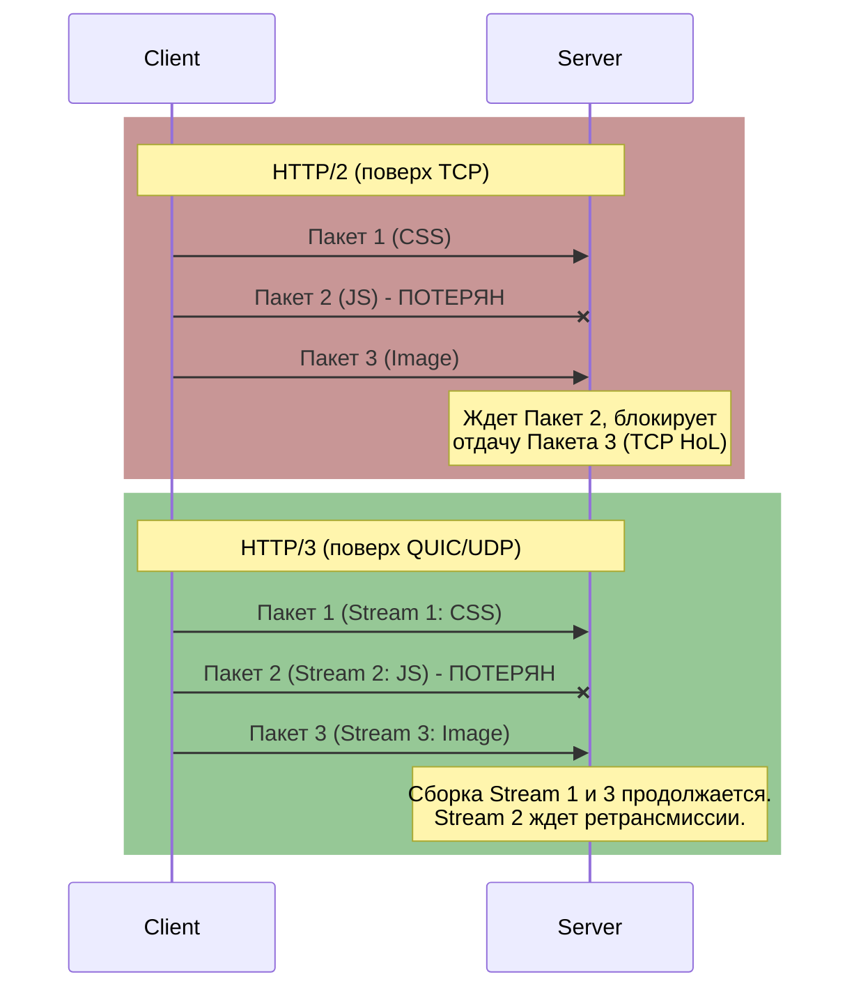

# Эволюция протоколов: HTTP/1.1, HTTP/2 и HTTP/3 (QUIC)

В мире эксплуатации и доставки контента скорость и надежность — это всё. История развития HTTP — это история борьбы с сетевыми задержками и неэффективностью передачи данных, где каждая новая версия пыталась решить "боль" предыдущей.

## Боль эксплуатации: От HTTP/1.1 к HTTP/3

### HTTP/1.1: Эпоха очередей
**Проблема:** HTTP/1.1 работает по принципу "один запрос — один ответ" в рамках одного TCP-соединения. Это порождает проблему **Head-of-Line (HoL) Blocking** на уровне HTTP: если первый запрос завис, остальные ждут. 
**Костыли прошлого:** Чтобы обойти это, браузеры открывали по 6 TCP-соединений к одному домену, а разработчики использовали спрайты (склеивание картинок) и минификацию. В production это приводило к огромному количеству TIME_WAIT соединений на балансировщиках и лишнему расходу ресурсов.

### HTTP/2: Бинарный и мультиплексированный
**Решение:** HTTP/2 внедрил **мультиплексирование** — множество запросов и ответов могут летать параллельно внутри одного TCP-соединения. Заголовки стали сжиматься (HPACK), а формат стал бинарным.
**Новая боль:** Мы избавились от HoL Blocking на уровне HTTP, но столкнулись с ним на уровне TCP. Если теряется хотя бы один TCP-пакет, весь поток данных во всех мультиплексированных HTTP-запросах останавливается до его повторной передачи (TCP retransmission). На сетях с потерями (мобильный интернет) HTTP/2 мог работать даже хуже HTTP/1.1.

### HTTP/3 (QUIC): Избавление от оков TCP
**Решение:** HTTP/3 построен поверх протокола **QUIC**, который работает поверх **UDP**. TCP полностью выброшен. QUIC сам обеспечивает надежность доставки, но делает это независимо для каждого потока данных. Потеря пакета бьет только по одному ресурсу, остальные продолжают грузиться. 
Дополнительный плюс — **Connection Migration**: при переключении с Wi-Fi на LTE IP-адрес меняется, но соединение не рвется, так как оно идентифицируется Connection ID, а не связкой IP:Port.

## Визуализация: Проблема потери пакетов



## Применение в Production

### Как это выглядит в Nginx
Пример конфигурации Nginx для поддержки HTTP/3 (требует собранного Nginx с модулем quic):

```nginx
server {
    listen 443 ssl;         # TCP для HTTP/1.1 и HTTP/2
    listen 443 quic reuseport; # UDP для HTTP/3 (QUIC)
    
    server_name example.com;

    # SSL сертификаты (QUIC требует TLS 1.3)
    ssl_certificate     /etc/ssl/certs/example.crt;
    ssl_certificate_key /etc/ssl/private/example.key;
    ssl_protocols       TLSv1.2 TLSv1.3;

    # Сигнализируем клиенту о поддержке HTTP/3 через заголовок Alt-Svc
    add_header Alt-Svc 'h3=":443"; ma=86400';

    location / {
        proxy_pass http://backend;
    }
}
```

### Day 2 Operations & Как отстрелить ногу

1. **UDP Firewall Blocking:**
   - *Боль:* Многие корпоративные фаерволы и провайдеры (DPI) агрессивно режут UDP-трафик, принимая его за DDoS (amplification атаки).
   - *Day 2:* Обязательно обеспечьте graceful fallback до HTTP/2. Заголовок `Alt-Svc` именно для этого: клиент сначала идет по TCP, узнает про h3 и пытается перейти на UDP. Если UDP заблокирован, он останется на TCP.

2. **CPU Overhead:**
   - *Боль:* QUIC реализует шифрование и контроль перегрузок в user-space, а не в ядре ОС (как TCP). Это вызывает значительный рост утилизации CPU на балансировщиках и edge-нодах (в 2-3 раза больше CPU на мегабит по сравнению с TLS/TCP).
   - *Day 2:* Используйте аппаратную акселерацию (eBPF, UDP GRO/GSO в ядре Linux) и внимательно мониторьте CPU Load при перекате на HTTP/3.

3. **Мониторинг и Observability:**
   - Стандартные утилиты типа `tcpdump` покажут вам просто зашифрованный UDP-трафик. Отладка усложняется. Требуются инструменты, умеющие парсить QUIC (Wireshark с выгрузкой ключей) или сбор метрик непосредственно с Load Balancer (Envoy/Nginx prometheus metrics: `nginx_http3_requests_total`).

4. **Асимметричный роутинг и ECMP:**
   - В Kubernetes или при использовании ECMP балансировки UDP-пакеты одного QUIC-соединения могут прилетать на разные поды/серверы балансировщиков. 
   - *Решение:* Требуется поддержка eBPF-маршрутизации или корректная настройка stateful балансировки для UDP, чтобы все пакеты одного Connection ID летели в один worker-процесс (в Nginx это делает `reuseport`).
