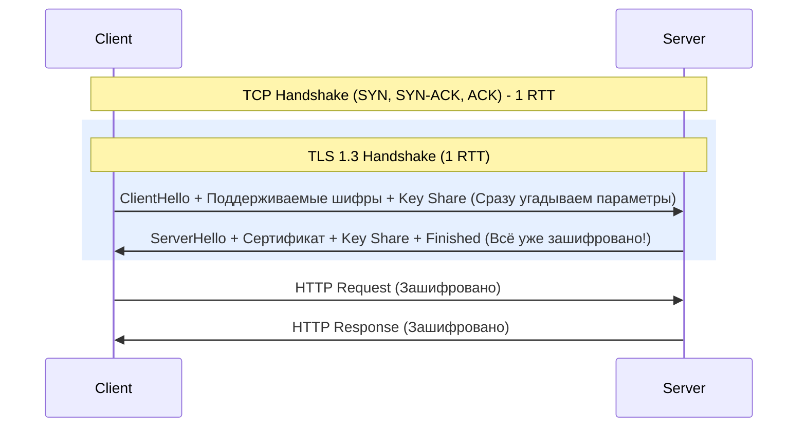

# HTTPS, TLS, SSL: Доверие и Шифрование

В современной инфраструктуре передача данных в открытом виде (HTTP) — это моветон и грубейшее нарушение безопасности. HTTPS решает три фундаментальные задачи (CIA-подобная триада для транзита данных):
1. **Шифрование (Confidentiality):** Защита от прослушивания (MitM).
2. **Целостность (Integrity):** Гарантия того, что данные не были изменены в пути.
3. **Аутентификация (Authentication):** Гарантия того, что сервер — именно тот, за кого себя выдает (с помощью сертификатов).

## Эволюция: Почему SSL мертв

- **SSL (1.0, 2.0, 3.0):** Устарел и полон критических уязвимостей (POODLE и др.). Использовать категорически запрещено. Термин "SSL-сертификат" остался исключительно как исторический жаргон.
- **TLS 1.2:** Долгое время был золотым стандартом. Надежен, но требует 2 раунд-трипа (2-RTT) для установки защищенного соединения, что добавляет задержки.
- **TLS 1.3:** Современный стандарт. Ускорил хэндшейк до 1-RTT (и даже 0-RTT для повторных соединений) и выбросил старые, уязвимые шифры (например, RSA-обмен ключами заменен на обязательный Perfect Forward Secrecy через ECDHE).

## Как это работает: TLS 1.3 Handshake

В отличие от TLS 1.2, версия 1.3 кардинально сокращает время установки соединения.



## Практика в Production: TLS Termination & Cert-Manager

В микросервисной архитектуре (Kubernetes) мы редко настраиваем TLS на каждом отдельном приложении. Обычно используется паттерн **TLS Termination (Offloading)** на уровне Ingress Controller (Nginx, Traefik) или внешнего Load Balancer. Внутри кластера трафик часто ходит по обычному HTTP, хотя Zero Trust архитектуры (Service Mesh) требуют mTLS (mutual TLS) и внутри.

### Пример: Автоматизация сертификатов в Kubernetes (cert-manager)

Боль эксплуатации в том, что сертификаты протухают. Ручное обновление — гарантированный инцидент. Для этого используется Let's Encrypt и `cert-manager`.

```yaml
# ClusterIssuer для автоматического получения сертификатов
apiVersion: cert-manager.io/v1
kind: ClusterIssuer
metadata:
  name: letsencrypt-prod
spec:
  acme:
    server: https://acme-v02.api.letsencrypt.org/directory
    email: devops@example.com
    privateKeySecretRef:
      name: letsencrypt-prod-account-key
    solvers:
    - http01:
        ingress:
          class: nginx
---
# Ingress с автоматическим TLS
apiVersion: networking.k8s.io/v1
kind: Ingress
metadata:
  name: my-app-ingress
  annotations:
    cert-manager.io/cluster-issuer: "letsencrypt-prod"
spec:
  ingressClassName: nginx
  tls:
  - hosts:
    - app.example.com
    secretName: my-app-tls-secret # cert-manager сам создаст и обновит этот secret
  rules:
  - host: app.example.com
    http:
      paths:
      - path: /
        pathType: Prefix
        backend:
          service:
            name: my-app-svc
            port:
              number: 80
```

## Day 2 Operations & Отстреленные ноги

1. **Протухшие сертификаты (The Classic Outage):**
   - *Боль:* Даже с автоматизацией (Let's Encrypt) бывают сбои (rate limits, упал webhook, изменился DNS). Итог — сервис недоступен, браузеры показывают страшную красную страницу.
   - *Day 2:* Мониторинг срока действия сертификатов — абсолютный must-have. Используйте Prometheus экспортеры (например, `ssl_exporter` или метрики самого cert-manager: `certmanager_certificate_expiration_timestamp_seconds`). Настройте алерты за 14 и 7 дней до истечения.

   *Быстрая проверка руками (bash):*
   ```bash
   echo | openssl s_client -servername app.example.com -connect app.example.com:443 2>/dev/null | openssl x509 -noout -dates
   ```

2. **Слабые Cipher Suites и Compliance:**
   - *Боль:* Если оставить дефолтные настройки TLS, секьюрити-аудиторы (PCI-DSS, банковские стандарты) забракуют систему за поддержку старых шифров.
   - *Day 2:* Явно указывайте разрешенные протоколы и шифры. Отключайте TLS 1.0 и 1.1. В Nginx/HAProxy используйте конфигурации от Mozilla SSL Configuration Generator (Intermediate или Modern).

3. **CPU Overhead при TLS Termination:**
   - *Боль:* Шифрование/расшифровка (особенно RSA) — дорогая операция. При мощном DDoS атаке на TLS layer (создание множества соединений) Ingress Controller может "лечь" по CPU.
   - *Day 2:* Переход на ECDSA сертификаты (они быстрее RSA). Использование балансировщиков с аппаратной поддержкой криптографии, либо тюнинг кэша сессий TLS (`ssl_session_cache shared:SSL:10m;`), чтобы не делать полный хэндшейк каждый раз.

4. **Mutual TLS (mTLS) Complexity:**
   - Внедрение Service Mesh (Istio/Linkerd) включает mTLS между всеми подами. Это решает проблему Zero Trust, но драматически усложняет дебаг (tcpdump показывает мусор) и требует управления внутренним CA (Certificate Authority).
