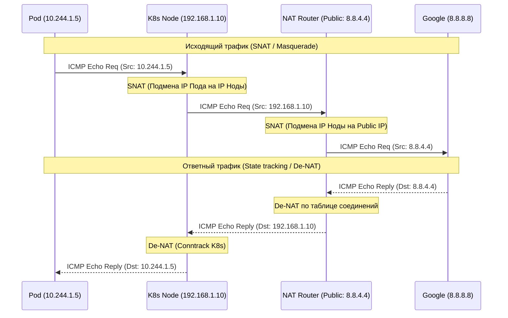

# ICMP и NAT: Диагностика и преодоление границ

## DevOps-история: Суть и Боль
Когда базовая сеть построена (IP выданы, MAC изучены), возникают две фундаментальные потребности эксплуатации. 

Первая: **Как понять, что сеть вообще работает, и диагностировать проблемы маршрутизации?** Для этого был создан **ICMP** (Internet Control Message Protocol). Это служебный протокол: он не носит пользовательские данные, у него нет портов (в отличие от TCP/UDP). Он отвечает за эхо-запросы (пинги) и сообщения об ошибках (сеть недоступна, время жизни пакета истекло).

Вторая: **Что делать, если публичных IPv4-адресов на всех не хватает?** В корпоративных сетях и кластерах Kubernetes мы используем "серые", приватные IP (RFC 1918), которые не маршрутизируются в интернете. Чтобы выпустить Pod или домашний ноутбук во внешнюю сеть, мы используем **NAT** (Network Address Translation). NAT на лету подменяет приватный Source IP на публичный IP маршрутизатора при выходе, и делает обратную подмену (De-NAT) при возврате ответа.

## Как это работает в связке

NAT опирается на механизм `conntrack` (отслеживание состояний соединений), чтобы помнить, какому внутреннему клиенту предназначается ответный пакет извне. Когда вы пингуете гугл из пода, ICMP пакет проходит через несколько слоев NAT.



## Day 2 Operations: Нюансы эксплуатации и грабли

1. **Переполнение таблицы Conntrack**:
   - **Боль:** NAT (через iptables/nftables) работает с отслеживанием соединений (`nf_conntrack`). При DDoS-атаке, баге приложения (тысячи короткоживущих TCP-сессий) или огромном микросервисном трафике таблица переполняется.
   - **Симптом:** В `dmesg` сыпется `nf_conntrack: table full, dropping packet`. Пакеты просто исчезают.
   - **Решение:** Тюнинг `sysctl -w net.netfilter.nf_conntrack_max=...`, либо использование бессерверных/stateless балансировщиков (DSR).
2. **Отстрел ноги: Тотальный блок ICMP**:
   - **Боль:** Безопасники любят правило "Блокируем весь ICMP, чтобы нас не пинговали". Это ломает **PMTUD** (Path MTU Discovery). Когда пакет слишком большой для узкого канала, роутер дропает его и шлет в ответ `ICMP Fragmentation Needed`. Если ICMP заблокирован, отправитель не уменьшает размер пакета.
   - **Симптом:** TCP handshake проходит, но как только начинается передача данных (большие пакеты), соединение "зависает" навсегда (Blackhole).
   - **Решение:** Никогда не блокируйте ICMP целиком. Разрешайте ICMP type 3 (Destination Unreachable) и type 11 (Time Exceeded).
3. **Hairpin NAT (NAT Loopback)**:
   - **Боль:** Внутренний клиент пытается обратиться к внутреннему же серверу, но используя Внешний (публичный) IP адрес роутера. Пакет доходит до роутера, DNAT-ится внутрь, сервер отвечает клиенту напрямую (по локалке), но клиент ожидал ответ от роутера! Соединение сбрасывается из-за асимметричного роутинга.
   - **Решение:** Настраивать Hairpin NAT (двойной NAT — подменяется и источник, и назначение), часто это делается автоматически в K8s CNI.

## Примеры (Bash / iptables)

```bash
# Базовая проверка связности (ICMP Echo)
ping -c 3 8.8.8.8

# Трассировка маршрута. 
# Использует UDP или ICMP с постепенно увеличивающимся TTL. 
# Возвращаются ICMP Time Exceeded от каждого роутера по пути.
traceroute 8.8.8.8

# Посмотреть текущую таблицу отслеживания соединений (включая NAT-трансляции)
sudo conntrack -L

# Типичное правило iptables для исходящего NAT (Masquerade) в K8s/Docker:
# "Для всего трафика из подсети 10.244.0.0/16 динамически подменять Source IP на IP выходного интерфейса"
sudo iptables -t nat -A POSTROUTING -s 10.244.0.0/16 -j MASQUERADE
```
