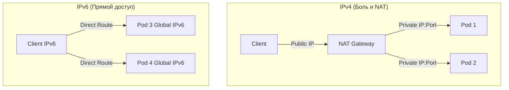

# IPv4 и IPv6: Боль маршрутизации и путь к Dual-Stack

В мире DevOps и платформенной инженерии IP-адресация — это не просто цифры, это фундамент для масштабирования. Исторически мы жили в эпоху IPv4, где главная боль — нехватка адресов. Из-за этого мы обросли слоями абстракций: NAT, PAT, сложными оверлейными сетями в Kubernetes (Flannel, Calico) с инкапсуляцией (VXLAN). Это создает огромный оверхед, усложняет траблшутинг и замедляет пакеты. 

IPv6 решает проблему радикально: адресов хватит на каждую песчинку. В production это означает отказ от NAT, плоские сети, где каждый под может иметь белый IP (или хотя бы уникальный global-scope IP внутри корпоративной сети), и упрощенный routing. Но на практике мы живем в переходном периоде, где балом правит Dual-Stack (поддержка обеих версий протокола).

## Как это работает в Production



В Kubernetes настройка Dual-Stack позволяет подам и сервисам получать как IPv4, так и IPv6 адреса, обеспечивая плавную миграцию.

### Пример Kubernetes Service (Dual-Stack)
```yaml
apiVersion: v1
kind: Service
metadata:
  name: my-dualstack-service
spec:
  ipFamilyPolicy: RequireDualStack
  ipFamilies:
  - IPv4
  - IPv6
  selector:
    app: my-app
  ports:
    - protocol: TCP
      port: 80
```

### Day 2 Operations: Где отстреливает ногу

1. **MTU и Path MTU Discovery (PMTUD):** В IPv6 промежуточные роутеры не фрагментируют пакеты. Если по пути есть туннель с меньшим MTU, а ICMPv6 заблокирован на Firewall (Drop All by default), пакеты просто исчезают (возникает Blackhole). *Всегда разрешайте ICMPv6 Packet Too Big!*
2. **Безопасность без NAT:** Многие инженеры ошибочно считают NAT механизмом безопасности. В IPv6 все узлы могут иметь публично маршрутизируемые адреса. Если забыть настроить строгие правила Security Groups / Network Policies, ваши внутренние сервисы окажутся доступны всему интернету.
3. **Разрешение имен (DNS):** Приложения должны уметь корректно обрабатывать AAAA-записи и делать fallback на IPv4 (механизм Happy Eyeballs), если IPv6 маршрут недоступен.
