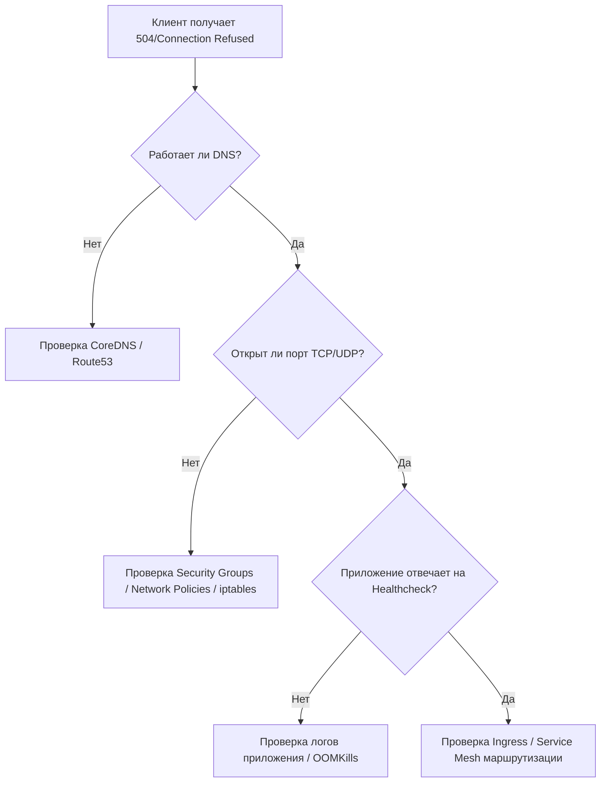

# Network Troubleshooting в DevOps: От паники к пониманию

**Какую боль мы решаем?**
Когда микросервис A не может достучаться до базы данных B, или пользователи видят 504 Gateway Timeout, начинается игра в пинг-понг между разработчиками ("наш код работает локально!") и сетевыми инженерами ("сеть работает, пинги ходят!"). Network Troubleshooting в мире DevOps — это не просто умение запустить `ping` или `traceroute`. Это системный подход к поиску "узкого горлышка" в сложных, динамических и эфемерных средах (Kubernetes, Service Mesh, облачные балансировщики), где IP-адреса меняются каждую секунду, а маршрутизация зависит от десятков правил iptables и eBPF. Боль, которую мы лечим — это часы простоя, потери бизнеса и бесконечные war rooms из-за "невидимых" проблем связности.

**Как это работает в production?**
В современном production сеть абстрагирована. У нас есть поды, сервисы, ingress-контроллеры, VPC, Security Groups. Траблшутинг начинается с понимания пути пакета (Packet Walk). Мы используем инструменты на разных уровнях модели OSI: от проверки разрешения DNS (`dig`, `nslookup`) и L4-соединений (`telnet`, `nc`, `ss`) до анализа HTTP/L7-трафика (`curl`, логи Ingress) и интроспекции ядра.



**Примеры из жизни (Bash/YAML)**

*Проверка базовой связности внутри Kubernetes Pod'а:*
```bash
# 1. Проверяем DNS резолв сервиса
kubectl exec -it my-pod -- dig +short my-database.production.svc.cluster.local

# 2. Проверяем доступность TCP порта (аналог telnet)
kubectl exec -it my-pod -- nc -vz my-database.production.svc.cluster.local 5432

# 3. Захват пакетов прямо из пода с помощью ephemeral containers (т.к. в alpine/scratch подах нет tcpdump)
kubectl debug -it my-pod --image=nicolaka/netshoot --target=my-container
# Внутри netshoot-контейнера:
tcpdump -i eth0 port 5432 -w /tmp/db.pcap
```

*Пример "отстрела ноги" — Kubernetes Network Policies:*
Часто разработчики применяют строгие правила сетевых политик, забывая про фундаментальные вещи, например DNS (UDP 53).
```yaml
apiVersion: networking.k8s.io/v1
kind: NetworkPolicy
metadata:
  name: default-deny-all
spec:
  podSelector: {}
  policyTypes:
  - Ingress
  - Egress
  # ОШИБКА: Egress закрыт полностью, DNS-запросы к CoreDNS дропаются.
  # Приложение не может отрезолвить ни один внешний или внутренний адрес.
  # РЕШЕНИЕ: Всегда явно разрешать трафик к kube-dns в namespace kube-system.
```

**Где применимо, а где отстреливает ногу?**
*   **Где применимо:** Понимание работы сетей необходимо в любой распределенной системе. Умение использовать утилиты-швейцарские ножи (вроде `netshoot` в K8s) или читать VPC Flow Logs — это must-have для DevOps-инженера.
*   **Где отстреливает ногу:** 
    *   **"Слепая" вера утилитам без понимания контекста.** Например, `ping` может не работать, потому что протокол ICMP заблокирован на уровне AWS Security Group или firewall'а, хотя TCP порт целевого приложения открыт и система прекрасно функционирует. Вы можете потратить часы, пытаясь починить `ping`, игнорируя реальную проблему.
    *   **tcpdump на высоконагруженных узлах.** Запуск захвата трафика без строгих BPF-фильтров на ingress-ноде с 10Gbps трафиком может привести к исчерпанию ресурсов CPU (softirq) или диска за считанные секунды, положив весь узел.

**Нюансы Day 2 operations**
В ежедневной эксплуатации (Day 2) ручной траблшутинг в консоли отходит на второй план. На первый выходит наблюдаемость (Observability) и проактивный мониторинг:
1.  **Service Mesh (Istio, Linkerd):** Мы перестаем смотреть в `tcpdump` и начинаем смотреть в метрики прокси-контейнеров (Envoy). Ошибки 503 (с флагами UF, URX) сразу покажут, где проблема — между Ingress и Pod'ом, или сам Pod разорвал соединение.
2.  **eBPF (Cilium, Hubble):** Позволяет видеть сетевые потоки и дропы на уровне ядра Linux практически без overhead'а. Инструмент Hubble CLI позволяет сказать: *"покажи мне все пакеты от сервиса A к B, которые были сброшены Network Policy"*.
3.  **VPC Flow Logs:** Анализ логов облачных провайдеров (через AWS Athena или ELK) для выявления аномалий, сканирования портов и заблокированного трафика между подсетями.
4.  **Синтетический мониторинг (Prometheus Blackbox Exporter):** Постоянные автоматические проверки (probe) доступности TCP/HTTP эндпоинтов снаружи и изнутри кластера, чтобы Alertmanager уведомил о проблеме связности до того, как придут разгневанные пользователи.

В Day 2 мы не просто чиним сломанную сеть, мы строим системы, которые сами диагностируют, где именно она сломалась.
