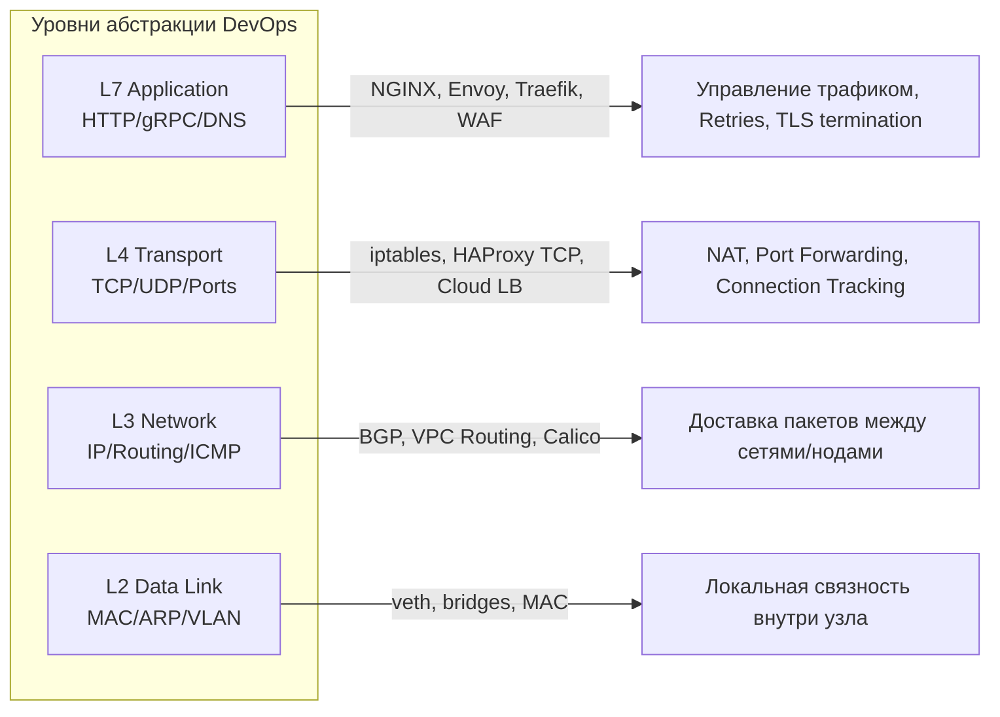

# Модели OSI и TCP/IP: Карты локализации проблем

В DevOps мы не используем модели OSI и TCP/IP для сдачи академических экзаменов. Мы используем их как фреймворк для локализации аварий (troubleshooting). Когда микросервис лежит, вопрос "На каком уровне проблема?" — это первый шаг к спасению production и уменьшению времени простоя (MTTR).

Эти модели помогают разделить ответственность: база данных (L7) не должна думать о том, как переслать байтик через океан (L1-L3), а маршрутизатор не должен вникать в JSON-payload приложения.

## Как это работает в Production

Мы каждый день оперируем терминами уровней:
- **L3/L4 (Сетевой и Транспортный):** Здесь живут IP, TCP, UDP, `iptables`, Security Groups в облаках, Network Policies в K8s. Здесь работают балансировщики (например, HAProxy) в режиме TCP (L4).
- **L7 (Прикладной):** Здесь HTTP, gRPC, TLS, Ingress Controllers (NGINX, Traefik), Service Mesh (Envoy, Istio), ALB. 

**Боль балансировки:** нужно решить, где распределять трафик. Балансировка на L4 работает молниеносно, потребляет мало CPU, но не может смотреть внутрь трафика (нельзя маршрутизировать по URL или кукам). Балансировка на L7 умнее, может делать rate-limiting по API-токенам, но потребляет ресурсы и добавляет задержку (latency).



## Примеры конфигураций и инструментов

**L4 (Транспортный уровень) - Управление с помощью iptables (или kube-proxy):**
```bash
# Разрешить входящий трафик на порт 80 (L4 правило - мы оперируем портом и протоколом TCP)
iptables -A INPUT -p tcp --dport 80 -j ACCEPT
```

**L7 (Прикладной уровень) - Ingress маршрутизация в Kubernetes:**
```yaml
apiVersion: networking.k8s.io/v1
kind: Ingress
metadata:
  name: app-ingress
spec:
  rules:
  - host: api.example.com # L7 роутинг по HTTP заголовку Host
    http:
      paths:
      - path: /v1
        pathType: Prefix
        backend:
          service:
            name: backend-v1
            port:
              number: 80
```

## Где применимо и где отстреливает ногу

Понимание уровней спасает от долгих и мучительных дебагов. Если `ping` (ICMP на L3) до хоста не проходит, нет смысла ковырять таймауты NGINX (L7) или проверять, слушает ли порт Node.js приложение (L4). Всегда начинайте траблшутинг снизу вверх (от сети к приложению).

**Где отстреливают ногу:**
- **Игнорирование состояния (Statefulness) на L4:** Фаерволы и NAT (через conntrack в ядре Linux) отслеживают TCP-сессии. Если сессия простаивает долгое время (idle), conntrack может её молча удалить. Приложение (на L7) думает, что соединение живо, пытается отправить данные, и получает RST-пакет (сброс). Решение: настройка TCP Keepalive как в ядре, так и в самом приложении.
- **Подмена IP (SNAT):** Балансировщики L4 (или NodePort в K8s) часто заменяют IP-адрес клиента на свой собственный, чтобы вернуть ответ нужным путем. В итоге приложение на L7 видит, что все запросы идут от внутреннего IP кластера, а не от реальных пользователей (ломается аналитика и rate-limiting). Приходится пробрасывать реальный IP через Proxy Protocol или L7-заголовок `X-Forwarded-For`.

## Нюансы Day 2 Operations

1. **TCP Тюнинг (Sysctl):** По умолчанию Linux настроен на "широкое потребление" и стабильность. Под высокими нагрузками (десятки тысяч RPS) придется тюнить параметры L4 в ядре:
   - Уменьшение `net.ipv4.tcp_fin_timeout` (быстрее освобождать ресурсы от закрытых соединений).
   - Защита от SYN Flood атак: включение `net.ipv4.tcp_syncookies = 1`.
2. **Прозрачность TLS (TLS Termination):** Нужно архитектурное решение, где расшифровывать трафик (L7). Разгрузка TLS на облачном балансировщике упрощает управление сертификатами, но трафик внутри внутренней сети (до подов) идет открытым текстом. Для создания Zero-Trust сети придется переносить TLS Termination на уровень каждого пода через Service Mesh (mTLS).
3. **Отслеживание соединений (Conntrack table full):** Команда `conntrack -L` станет вашим другом. Если таблица соединений переполняется (ошибка `nf_conntrack: table full, dropping packet`), новые соединения будут молча сбрасываться, и вы увидите хаотичные 502/504 ошибки и таймауты, хотя CPU сервера будет простаивать.
