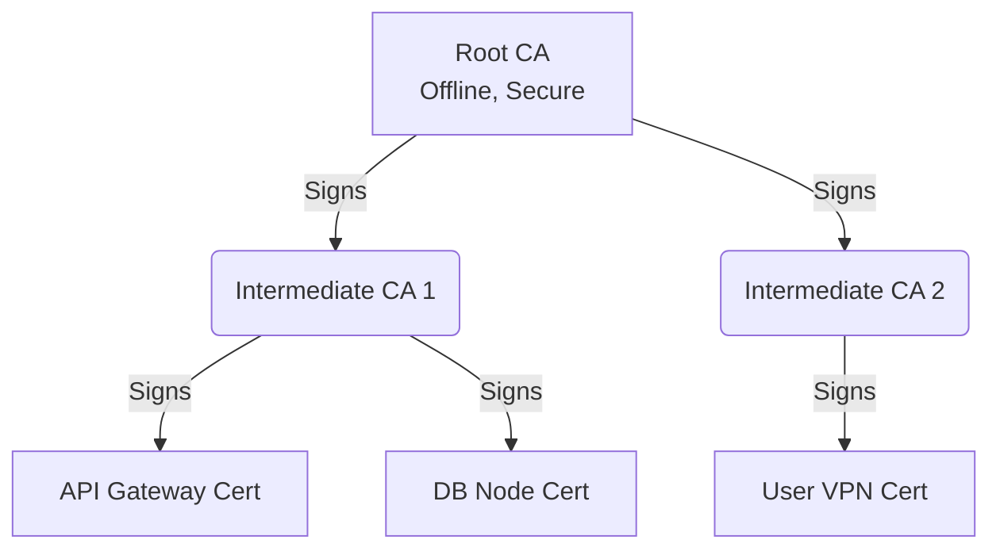

# PKI и Сертификаты: Доверие в распределенном мире

В эпоху монолитов и закрытых периметров доверие базировалось на сетевой топологии: если ты внутри приватной подсети, значит, ты "свой". С переходом к микросервисам, гибридным облакам и концепции Zero Trust эта модель рухнула. Возникла боль: как сервисам, базам данных и пользователям безопасно идентифицировать друг друга в открытой или скомпрометированной среде? 

Инфраструктура открытых ключей (PKI — Public Key Infrastructure) решает именно эту проблему. Она заменяет доверие к IP-адресу криптографически доказуемым доверием к удостоверению (сертификату).

## Как это работает под капотом

PKI строится на иерархии доверия. Root CA (Корневой центр сертификации) доверяет сам себе и выпускает сертификаты для Intermediate CA (Промежуточных центров). А они уже подписывают конечные сертификаты (Leaf certificates) для сервисов.



Когда сервис A хочет довериться сервису B, он проверяет, кем подписан сертификат B. Если цепочка подписей ведет к Root CA, которому сервис A доверяет, проверка пройдена.

## Где применимо и где "отстреливает ногу"

**Где применимо:**
- Защита внешнего трафика (HTTPS на Ingress/Load Balancer).
- Внутренний трафик (Service Mesh, mTLS между подами).
- Аутентификация машин и IoT-устройств.
- Подпись артефактов (например, контейнеров через Cosign).

**Где отстреливает ногу (и очень больно):**
- **Истечение сертификатов:** Это причина 90% инцидентов, связанных с PKI (вспомним глобальные сбои Epic Games или Spotify). Если забыть обновить сертификат, сервис просто перестанет отвечать.
- **Управление корневыми ключами:** Потеря приватного ключа Root CA означает, что скомпрометирована вся инфраструктура.
- **Отзыв сертификатов (CRL / OCSP):** Проверка статуса отзыва часто замедляет хэндшейки или падает из-за недоступности серверов отзыва.

## Практика: Автоматизация в Production

В production никто не выписывает сертификаты руками через `openssl`. Для этого используют автоматизаторы вроде cert-manager в Kubernetes.

**Пример: YAML манифест для cert-manager**

```yaml
apiVersion: cert-manager.io/v1
kind: Certificate
metadata:
  name: my-app-cert
  namespace: prod
spec:
  secretName: my-app-tls-secret
  duration: 2160h # 90 дней
  renewBefore: 360h # Автообновление за 15 дней до истечения
  issuerRef:
    name: letsencrypt-prod
    kind: ClusterIssuer
  commonName: api.example.com
  dnsNames:
  - api.example.com
```

## Day 2 Operations: Жизнь после деплоя

1. **Мониторинг:** Это критически важно. Вы должны алертить не когда сертификат протух, а когда скрипт автообновления не отработал за N дней до истечения. Используйте метрики `certmanager_certificate_expiration_timestamp_seconds` в Prometheus.
2. **Ротация Root CA:** Root CA живет долго (обычно 10-20 лет), но когда приходит время его менять, это становится ночным кошмаром. Нужно заранее добавить новый Root CA в trust store всех клиентов, прежде чем начинать выписывать сертификаты с новым Intermediate CA.
3. **Безопасное хранение:** Приватные ключи Intermediate CA должны храниться в HSM (Hardware Security Module) или облачных KMS (AWS KMS, HashiCorp Vault), а не просто в Kubernetes Secrets.
