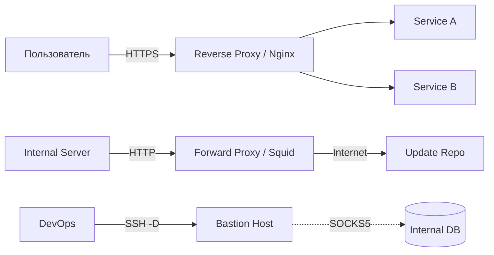

# Proxy и SOCKS: Управление трафиком

## Боль и её решение

В микросервисной архитектуре и современных корпоративных сетях возникает несколько взаимосвязанных проблем:
1. Как единой точкой принимать весь внешний трафик и маршрутизировать его на десятки разных внутренних сервисов, обеспечивая при этом SSL-терминацию и балансировку?
2. Как серверам из закрытого контура без доступа в интернет скачать пакеты обновлений, не выдавая им белые IP-адреса?
3. Как системному администратору получить доступ к внутреннему сервису (например, JMX консоли базы данных) без поднятия полноценного VPN, если есть только SSH-доступ к бастиону?

Решением этих проблем выступают прокси-серверы: **Reverse Proxy**, **Forward Proxy** и **SOCKS Proxy**.

## Как это работает



### Reverse Proxy (Обратный прокси)
Стоит "лицом" к клиентам. Защищает бэкенды, терминирует TLS, кэширует статику. Примеры: **Nginx**, **HAProxy**, **Envoy**, **Traefik**.

### Forward Proxy (Прямой прокси)
Стоит "лицом" в интернет от имени внутренних клиентов. Контролирует egress-трафик, блокирует нежелательные ресурсы, экономит трафик за счет кэширования. Пример: **Squid**.

### SOCKS Proxy
Работает на более низком уровне (Session layer, OSI L5). В отличие от HTTP-прокси, SOCKS прозрачно передает любой TCP/UDP трафик, не пытаясь его парсить. Идеально для туннелирования кастомных протоколов.

## Примеры конфигурации

### Reverse Proxy (Nginx)
```nginx
server {
    listen 443 ssl;
    server_name api.example.com;
    ssl_certificate /etc/nginx/certs/fullchain.pem;
    
    location / {
        proxy_pass http://internal-backend:8080;
        proxy_set_header Host $host;
        proxy_set_header X-Real-IP $remote_addr;
        proxy_set_header X-Forwarded-For $proxy_add_x_forwarded_for;
    }
}
```

### Динамический SOCKS-прокси через SSH
Поднятие временного туннеля для админа:
```bash
# Поднимает SOCKS5 прокси на localhost:1080 через bastion-host
ssh -D 1080 -q -C -N user@bastion.example.com

# Теперь можно использовать proxychains или настроить браузер
curl --socks5 localhost:1080 http://internal-wiki.local
```

## Где отстреливает ногу и Day 2 Operations

### Egress Forward Proxy
**Боль Day 2:** Поддержание списков разрешенных доменов (allowlists). Когда внутреннему сервису вдруг понадобился доступ к новому S3 API, это ломает пайплайны до тех пор, пока DevOps не добавит правило. 
**Day 2 Ops:** Использование прозрачного проксирования (Transparent Proxying) и централизованного управления политиками (например, через Cilium Egress Gateway в Kubernetes), а также агрессивный мониторинг заблокированных запросов.

### Reverse Proxy
**Боль Day 2:** Потеря реальных IP-адресов клиентов, если неправильно настроены заголовки `X-Forwarded-For`. В результате Rate Limiting банит весь трафик, думая, что он идет от одного пользователя (самого прокси).
Управление сотнями конфигов Nginx вручную приводит к ошибкам синтаксиса и падению всей точки входа.
**Day 2 Ops:** Использование Ingress-контроллеров (Traefik, Nginx-Ingress), которые генерируют конфиги динамически на основе манифестов. Внедрение Prometheus exporters для мониторинга HTTP 5xx ошибок, задержек и состояния upstream-серверов.

### SOCKS
**Боль Day 2:** SOCKS-туннели через SSH легко "зависают" (half-open connections) при нестабильной сети. 
**Решение:** Использование флагов `ServerAliveInterval` и `ServerAliveCountMax` в ssh_config, либо переход на более стабильные решения вроде VPN или Identity-Aware Proxy (IAP).
