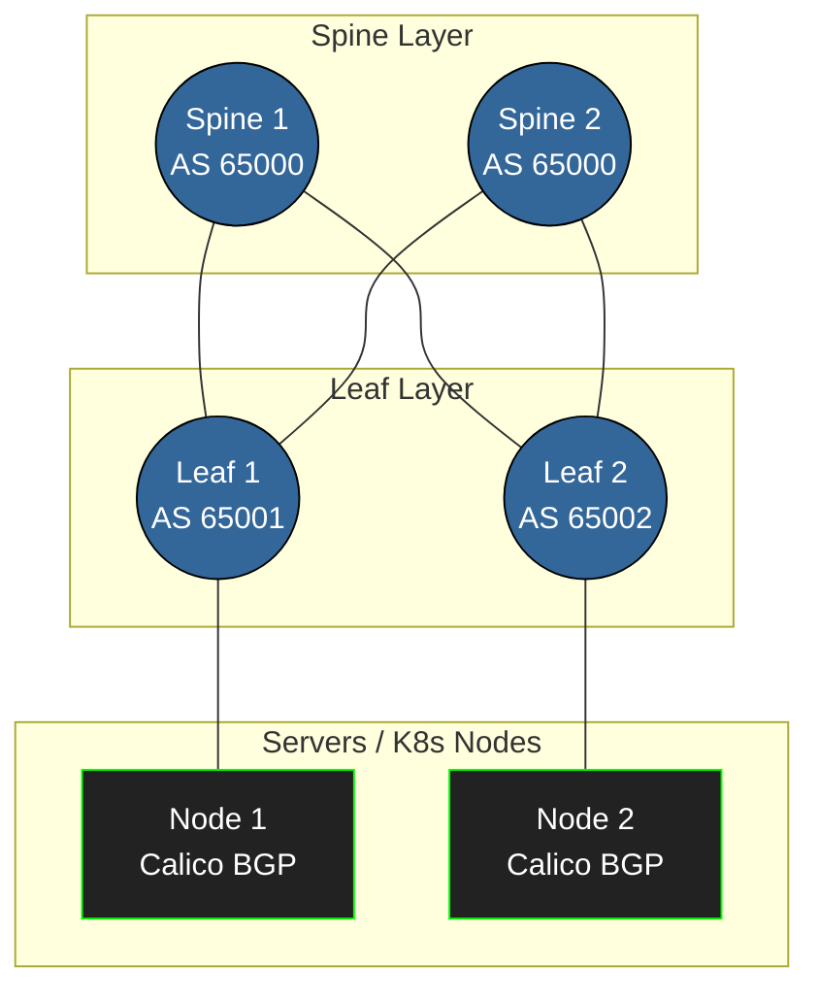

# Routing: OSPF и BGP в мире DevOps

## Боль статической маршрутизации

На заре администрирования многие довольствовались статическими маршрутами (`ip route add ...`). Пока серверов 10, это работает. Когда их становится 100, а каналы связи между стойками или ДЦ могут периодически падать, статика превращается в катастрофу. Чтобы трафик находил обходные пути автоматически, придумали протоколы динамической маршрутизации. Два главных столпа, с которыми сталкивается DevOps — это **OSPF** и **BGP**.

## OSPF: Быстрый, но ограниченный

**OSPF (Open Shortest Path First)** — это протокол состояния каналов (Link-State) для внутренней маршрутизации (IGP). Внутри OSPF каждый маршрутизатор знает *всю* топологию своей зоны (Area). 

* **Где применимо**: Enterprise-сети, небольшие дата-центры, маршрутизация между внутренними офисами.
* **Почему работает**: Очень быстрая сходимость (convergence). Если линк падает, OSPF мгновенно перестраивает маршрут по алгоритму Дейкстры.
* **Где отстреливает ногу**: OSPF плохо масштабируется на гигантские сети. Если у вас 10 000 маршрутов и постоянно «моргает» линк, алгоритм Дейкстры будет пересчитываться на всех роутерах, сжигая CPU. Поэтому OSPF делят на "Зоны" (Areas), дизайн которых — отдельное искусство, где легко совершить ошибку.

## BGP: Клей всего интернета и современных ДЦ

**BGP (Border Gateway Protocol)** — это протокол вектора пути (Path-Vector), созданный для связи автономных систем (AS) в интернете (EGP). Но сегодня BGP активно используют и *внутри* дата-центров (например, eBGP на Spine-Leaf).

* **Где применимо**: Связь с провайдером, Kubernetes CNI (Calico/Cilium для анонса Pod IP и LoadBalancers), топологии Spine-Leaf.
* **Почему работает**: Потрясающая масштабируемость (держит таблицу маршрутизации всего интернета — Full View) и гибкие политики (Route Maps, Local Preference, AS-Path prepending).
* **Где отстреливает ногу**: BGP медленный. Он не заточен на миллисекундную сходимость "из коробки" (хотя таймеры можно подкрутить). И он сложен в настройке. Неправильный анонс маршрутов может "угнать" трафик (BGP Hijacking), что периодически кладет крупные куски интернета.

### Архитектура BGP Spine-Leaf в дата-центре

Современные кластеры Kubernetes и серверные фермы маршрутизируются именно через BGP.


*Каждый Leaf имеет свою AS. Kubernetes узлы устанавливают BGP-соседство (peering) с Leaf-коммутаторами для анонса IP-адресов подов.*

## Практика: Настройка BGP в Calico (Kubernetes)

В мире Kubernetes мы часто используем BGP для анонса IP-адресов сервисов. Пример манифеста Calico `BGPPeer` для установления соседства с Leaf-свитчом (Top of Rack):

```yaml
apiVersion: projectcalico.org/v3
kind: BGPPeer
metadata:
  name: peer-to-leaf1
spec:
  # IP коммутатора
  peerIP: 192.168.10.1 
  # Номер AS коммутатора
  asNumber: 65001      
  nodeSelector: rack == "rack1"
```

## Нюансы Day 2 operations

При эксплуатации сетей на OSPF/BGP вы 100% столкнетесь со следующими ситуациями:

1. **Route Flapping (хлопающие маршруты)**:
   Если кабель нестабилен, линк будет подниматься и падать каждые пару секунд. В BGP это вызовет лавину обновлений (Update messages). Включайте **BGP Route Dampening**, который временно "штрафует" нестабильные маршруты и перестает их анонсировать, пока они не успокоятся.

2. **Split Brain и BFD (Bidirectional Forwarding Detection)**:
   Таймеры BGP по умолчанию огромны (Keepalive 60 сек, Hold-time 180 сек). Если коммутатор сгорит, сосед узнает об этом только через 3 минуты, и трафик будет лететь в черную дыру. Day 2 operations всегда включает настройку **BFD** под BGP. BFD отправляет легковесные пакеты каждую миллисекунду; если сосед не отвечает, BFD мгновенно рвет BGP-сессию, обеспечивая сходимость за доли секунды.

3. **Траблшутинг BGP**:
   В вашей консоли всегда будут команды `vtysh` (если это FRRouting).
   ```bash
   # Просмотр состояния соседей. 
   # Если State/PfxRcd показывает "Active" или "Idle" вместо числа префиксов — соседство не поднялось!
   show ip bgp summary 
   
   # Просмотр того, какие маршруты мы реально анонсируем соседу
   show ip bgp neighbors 192.168.10.1 advertised-routes
   ```
4. **Асимметричный роутинг**:
   Частая головная боль. Трафик уходит через провайдера А, а возвращается через провайдера Б, на котором фаервол дропает пакеты (т.к. не видел начало сессии). Балансировка и управление `Local Preference` (повлиять на исходящий трафик) и `AS-Path prepending` (повлиять на входящий) — ваши главные инструменты для решения этой проблемы.
