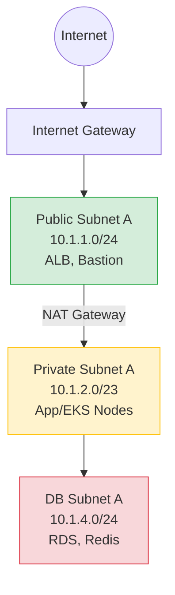

# Subnetting: Архитектура сетей или как не остаться без IP-адресов

Subnetting (разделение сети на подсети) — это искусство нарезки большого пирога IP-адресов так, чтобы всем хватило и никто не подрался. В DevOps это одна из первых задач при построении облачной инфраструктуры (VPC). Главная боль — пересечение IP-адресов (IP Overlap). Если вы выделите `10.0.0.0/16` для AWS VPC, а потом решите поднять VPN до on-premise дата-центра, который использует тот же диапазон, маршрутизация сломается. 

Правильный subnetting позволяет изолировать ресурсы (Public, Private, Database подсети), оптимизировать таблицы маршрутизации и заложить фундамент для будущего масштабирования кластеров (например, Kubernetes, где каждый Pod требует IP из VPC).

## Как это работает в Production

Обычно VPC делится на Availability Zones (AZ), а каждая AZ — на несколько слоев (Tiers) с разным уровнем доступа к интернету.



### Пример Terraform (AWS Subnets)
```hcl
resource "aws_vpc" "main" {
  cidr_block = "10.1.0.0/16"
}

# Большой блок для подов Kubernetes
resource "aws_subnet" "private_app" {
  vpc_id            = aws_vpc.main.id
  cidr_block        = "10.1.32.0/19" # 8192 адреса (минус резерв AWS)
  availability_zone = "eu-central-1a"
  tags = {
    Name = "Private-App-1a"
    "kubernetes.io/role/internal-elb" = "1"
  }
}
```

### Day 2 Operations: Где отстреливает ногу

1. **IP Exhaustion (Нехватка адресов):** Самая частая проблема с managed Kubernetes (AWS EKS, Azure AKS с CNI по умолчанию). Если выделить под Worker-ноды подсеть `/24` (256 адресов), то при активном автоскейлинге подов адреса кончатся очень быстро, и кластер не сможет запускать новые реплики. *Решение: считайте IP-адреса до создания сети, используйте Secondary CIDR blocks (например, CGNAT диапазон 100.64.0.0/10) специально для подов.*
2. **Маршрутизация (Route Tables):** Забыли добавить маршрут `0.0.0.0/0` к NAT Gateway в Private подсети? Узлы не смогут скачать Docker-образы из публичных registry или накатить обновления пакетов.
3. **VPC Peering и Transit Gateway:** Если вы нарезали сети неаккуратно, и диапазоны в разных окружениях (Dev, Prod, On-Prem) пересекаются, вы не сможете связать их напрямую через Peering без сложных костылей. *Решение: внедряйте централизованный IPAM (IP Address Management) и заранее резервируйте уникальные CIDR для разных бизнес-юнитов и сред.*
