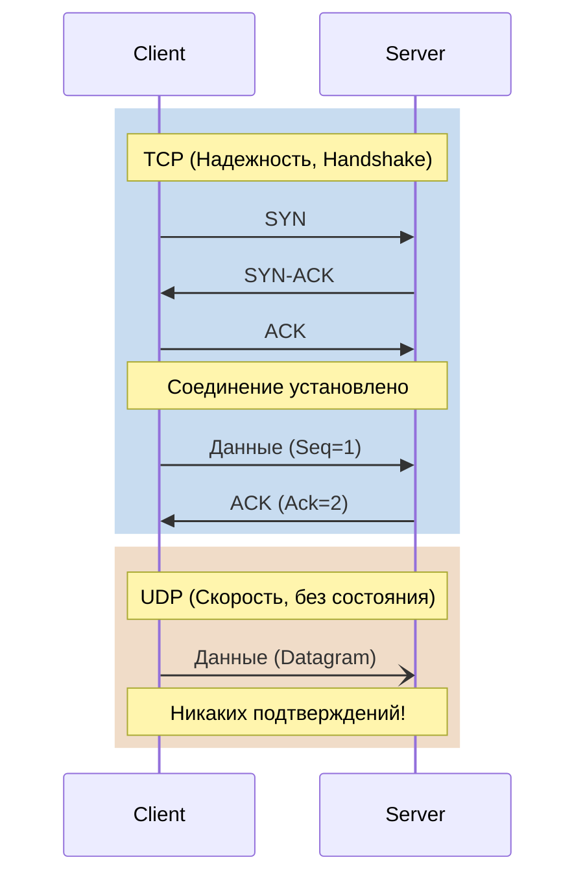

# TCP и UDP в реальной жизни DevOps

В мире DevOps сетевые протоколы транспортного уровня — это не просто строчки из учебника Таненбаума, это фундамент стабильности распределенных систем. Разница между TCP и UDP часто сводится к выбору между надежностью и производительностью. Наша задача при проектировании и эксплуатации — понимать, когда гарантия доставки важнее задержки, а когда — наоборот.

## Какую боль мы решаем?

В распределенных приложениях (микросервисах) компоненты постоянно общаются друг с другом. Боль возникает, когда сеть начинает "моргать", терять пакеты или перегружаться.
- Если мы используем неправильный протокол для потокового видео или сбора логов/метрик, мы можем положить систему из-за накладных расходов на установку соединений.
- Если мы используем ненадежный протокол для транзакций БД, мы получаем неконсистентные данные.

Выбор между TCP (Transmission Control Protocol) и UDP (User Datagram Protocol) решает проблему баланса между гарантиями доставки и накладными ресурсами сети и CPU.

## Как это работает в production

**TCP** — это джентльмен. Он сначала звонит (handshake), убеждается, что собеседник на связи, нумерует все фразы, переспрашивает, если что-то не расслышал, и вежливо прощается.
Применяется для HTTP/HTTPS, баз данных (PostgreSQL, MySQL), SSH.

**UDP** — это рупор. Он просто кричит в пространство, не заботясь, услышали его или нет. Никаких рукопожатий, никаких подтверждений.
Применяется для метрик (StatsD), видео/аудио стриминга, DNS-запросов (по умолчанию), и даже в современных протоколах (QUIC/HTTP3 построен поверх UDP).

### Визуализация процесса



## Примеры из практики

Проверка портов и соединений с помощью `nc` (netcat):

```bash
# Проверить TCP-соединение
nc -vz 10.0.0.5 5432

# Проверить UDP-порт (важно: UDP не отвечает на пустые коннекты, нужен таймаут)
nc -vzu 10.0.0.5 8125
```

Конфигурация Kubernetes Service. Мы можем явно указать протокол для балансировки:

```yaml
apiVersion: v1
kind: Service
metadata:
  name: metrics-receiver
spec:
  selector:
    app: statsd
  ports:
    - name: metrics
      protocol: UDP
      port: 8125
      targetPort: 8125
    - name: api
      protocol: TCP
      port: 8080
      targetPort: 8080
```

## Day 2 Operations: где отстреливает ногу

### TCP: Исчерпание портов и TIME_WAIT
Частая боль при высоких нагрузках (например, на балансировщиках) — скопление соединений в состоянии `TIME_WAIT`. Это защита от "запоздалых" пакетов, но она сжирает эфемерные порты (по умолчанию их около 28 тысяч).
**Симптомы:** Ошибки вида `Cannot assign requested address`.
**Тюнинг (sysctl):**
```bash
# Увеличение диапазона эфемерных портов
sysctl -w net.ipv4.ip_local_port_range="1024 65535"
# Быстрый реюз TIME_WAIT соединений
sysctl -w net.ipv4.tcp_tw_reuse=1
```

### UDP: Дропы буферов
Поскольку UDP не имеет контроля перегрузки, если сервис не успевает вычитывать пакеты из буфера операционной системы, они молча отбрасываются (drops). Для сбора метрик это значит, что графики начинают "врать".
**Симптомы:** Растут счетчики `RcvbufErrors` и `InErrors` в `netstat -su`.
**Тюнинг:** Увеличение размера receive buffer.
```bash
sysctl -w net.core.rmem_max=26214400
sysctl -w net.core.rmem_default=26214400
```
