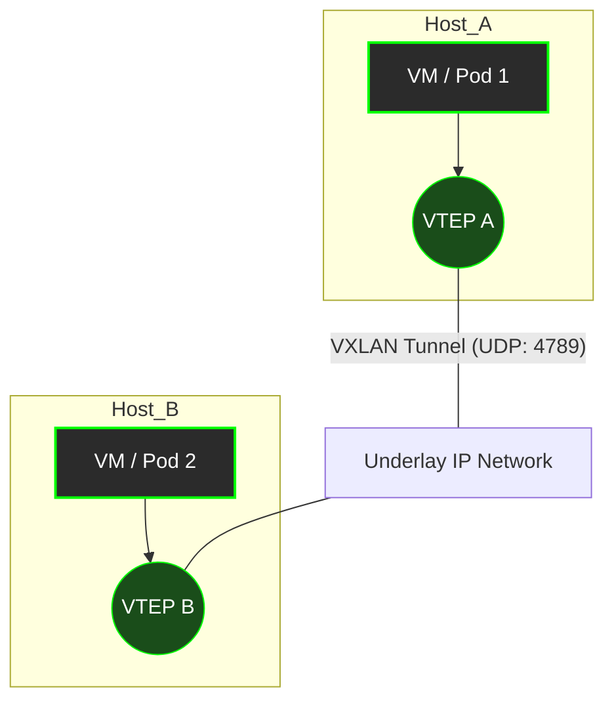

# VLAN и VXLAN: Эволюция изоляции сетей

## Боль изоляции и масштабирования

В традиционных дата-центрах всё начиналось с плоской L2-сети. Но когда количество серверов росло, широковещательный трафик (broadcast) начинал "затапливать" каналы. Чтобы изолировать трафик разных проектов или клиентов (multitenancy), инженеры стали использовать **VLAN** (Virtual Local Area Network, стандарт 802.1Q). 

VLAN решил проблему, добавив 4-байтный тег к кадрам Ethernet, позволяя логически разделять одну физическую сеть на несколько виртуальных. Но вскоре DevOps- и сетевые инженеры столкнулись с новыми болями:
1. **Лимит в 4096 сетей**: В эпоху облаков и контейнеров 4096 изоляций — это смешно.
2. **Растягивание L2 (Spanning Tree Protocol)**: Растягивание VLAN между стойками или дата-центрами приводило к блокировке портов (STP) для предотвращения петель, из-за чего половина дорогостоящей полосы пропускания простаивала.

## Приход VXLAN: Overlay спешит на помощь

Чтобы решить проблемы VLAN, индустрия перешла к **VXLAN** (Virtual eXtensible Local Area Network). VXLAN решает главную задачу — он инкапсулирует L2-кадры (MAC) в L3-пакеты (UDP/IP). Это называется технологией **Overlay** (сеть поверх сети). Физическая сеть (**Underlay**) теперь просто маршрутизирует IP-пакеты, а логическая топология строится поверх неё.

Вместо 4096 сетей VXLAN использует 24-битный идентификатор (VNI - VXLAN Network Identifier), что дает **16 миллионов** изолированных сетей. 

### Как это работает



**VTEP** (VXLAN Tunnel Endpoint) — это сущность, которая запаковывает MAC-кадр в UDP-пакет перед отправкой в сеть и распаковывает его на другой стороне. VTEP может быть аппаратным (на коммутаторе Leaf) или программным (на гипервизоре, или как `flannel`/`calico` в Kubernetes).

## Практика: Создаем VXLAN-интерфейс (Bash)

В Linux поднять VTEP можно парой команд, используя утилиту `iproute2`:

```bash
# Создаем интерфейс vxlan0 с VNI=42, используя физический интерфейс eth0
ip link add vxlan0 type vxlan id 42 dev eth0 dstport 4789

# Назначаем IP для нашего overlay-интерфейса
ip addr add 10.200.0.1/24 dev vxlan0

# Поднимаем интерфейс
ip link set vxlan0 up

# Добавляем FDB (Forwarding Database) запись для удаленного VTEP (IP 192.168.1.100)
bridge fdb append to 00:00:00:00:00:00 dst 192.168.1.100 dev vxlan0
```

## Где применимо и где отстреливает ногу

* **Применимо**: Современные Spine-Leaf фабрики дата-центров, Kubernetes CNI (Flannel, Cilium), облачные провайдеры (VPC).
* **Отстреливает ногу**: Если попытаться внедрить VXLAN без динамического Control Plane (например, BGP EVPN) в большой сети, придется управлять тысячами статических туннелей и бороться с мультикастом, что приведет к коллапсу эксплуатации.

## Нюансы Day 2 operations

В реальной эксплуатации VXLAN несет специфические проблемы, о которых нужно помнить каждый день:

1. **Проблема MTU (Maximum Transmission Unit)**: 
   VXLAN добавляет 50 байт оверхеда к оригинальному кадру (14 байт Ethernet + 20 байт IP + 8 байт UDP + 8 байт VXLAN). Если на Underlay интерфейсах не настроить Jumbo Frames (например, MTU 9000), пакеты начнут фрагментироваться или просто дропаться. Вы будете видеть зависающие TCP-соединения при `curl` и проходящие `ping`.

2. **Отказоустойчивость Control Plane**:
   Без Control Plane вроде **EVPN** (Ethernet VPN), VTEP'ы должны обмениваться информацией о MAC-адресах через мультикаст (flood-and-learn). Мультикаст в L3 сетях сложен в траблшутинге. Day 2 DevOps-инженера — это настройка BGP EVPN, чтобы коммутаторы/серверы обменивались MAC/IP-адресами по протоколу BGP, исключая мультикаст из сети вовсе.

3. **Аппаратный Offloading**:
   Заворачивание каждого пакета в UDP потребляет CPU сервера. В production-нагрузках всегда нужно проверять, поддерживают ли ваши NIC (сетевые карты) аппаратный *VXLAN offload*, чтобы освободить ядра сервера под полезную нагрузку.
