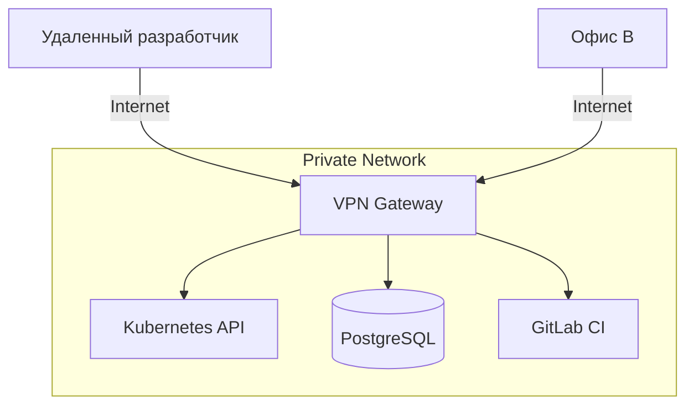

# VPN: WireGuard vs OpenVPN в production

## Боль и её решение

Когда компания вырастает из одного офиса или начинает активно нанимать удаленных сотрудников, возникает классическая проблема: как дать доступ к внутренним ресурсам (базам данных, админкам, приватным контурам) безопасно? Выставлять всё наружу через White-List IP — это путь к боли, когда у разработчика меняется IP-адрес провайдера. 

Здесь на сцену выходит VPN (Virtual Private Network). VPN объединяет разрозненные узлы в единую защищенную виртуальную сеть. Исторически стандартом de facto был **OpenVPN** — надежный, невероятно гибкий, но тяжелый, медленный и сложный в настройке комбайн. В последние годы на смену ему пришел **WireGuard** — современный, быстрый протокол, работающий в пространстве ядра и использующий передовую криптографию.

## Как это работает



### WireGuard
WireGuard работает по принципу Cryptokey Routing. У каждого узла есть публичный и приватный ключ. Пакеты шифруются и отправляются по UDP. Если узел меняет IP-адрес (например, переключился с Wi-Fi на LTE), сессия не рвется — WireGuard просто продолжает слать пакеты на новый адрес, если ключи совпадают.

### OpenVPN
OpenVPN может работать как поверх UDP, так и поверх TCP (что спасает, если провайдер блокирует нестандартные порты, и нужно прикинуться обычным HTTPS-трафиком). Поддерживает сложные схемы аутентификации (LDAP, сертификаты, MFA).

## Примеры конфигурации

### WireGuard (wg0.conf)
Пример минимального сервера:
```ini
[Interface]
Address = 10.8.0.1/24
ListenPort = 51820
PrivateKey = <SERVER_PRIVATE_KEY>
# Форвардинг трафика (NAT)
PostUp = iptables -A FORWARD -i %i -j ACCEPT; iptables -t nat -A POSTROUTING -o eth0 -j MASQUERADE
PostDown = iptables -D FORWARD -i %i -j ACCEPT; iptables -t nat -D POSTROUTING -o eth0 -j MASQUERADE

[Peer]
# Клиент 1
PublicKey = <CLIENT_PUBLIC_KEY>
AllowedIPs = 10.8.0.2/32
```

## Где отстреливает ногу и Day 2 Operations

### WireGuard
**Где применимо:** Site-to-site VPN, доступ сотрудников к инфраструктуре (особенно с мобильных устройств).
**Боль Day 2:** У WireGuard нет встроенного механизма выдачи IP-адресов (DHCP) и управления пользователями. Добавление 100 пользователей вручную через конфиги — это ад.
**Решение:** В production WireGuard редко используют "голым". Применяют обертки: **Tailscale**, **Netmaker**, **Headscale** или **wg-easy** (для небольших команд). Они берут на себя pain points ротации ключей, SSO и координации узлов.

### OpenVPN
**Где применимо:** Legacy-инфраструктуры, Enterprise с жесткими требованиями к аудиту и интеграции с Active Directory, обход жестких DPI-фильтров (через TCP).
**Боль Day 2:** Отладка проблем с производительностью. OpenVPN работает в user-space (переключение контекста ядро-пользователь съедает CPU при высоких скоростях). Мониторинг сертификатов (отзыв через CRL).
**Решение:** Использование prometheus-openvpn-exporter для мониторинга активных сессий и истекающих сертификатов. Переход на WireGuard там, где не нужны сложные фичи OpenVPN.
