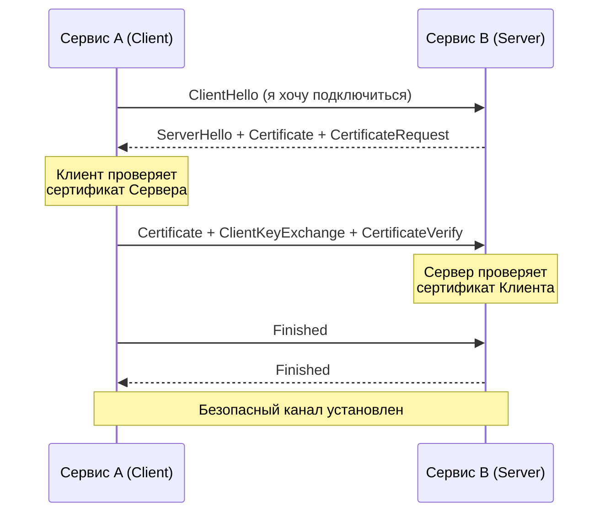

# mTLS: Взаимное доверие и шифрование (Zero Trust на практике)

Если классический TLS отвечает на вопрос клиента: "Действительно ли этот сервер тот, за кого себя выдает?", то mTLS (Mutual TLS) заставляет обе стороны доказывать свою идентичность.

Боль, которую мы решаем: в микросервисной архитектуре у вас могут быть сотни сервисов. Традиционный подход "доверять всем внутри VPC" означает, что если злоумышленник (или уязвимость) проникает в один незначительный сервис (например, сервис генерации PDF), он получает доступ к критичным базам данных, просто потому что они в одной сети. mTLS реализует принцип Zero Trust: сеть враждебна, доверяем только криптографии.

## Как работает mTLS

Вместо односторонней проверки сертификата сервера, происходит обоюдная:
1. Клиент стучится к Серверу.
2. Сервер отправляет свой сертификат. Клиент его валидирует.
3. **Сервер требует сертификат у Клиента.**
4. Клиент отправляет свой сертификат. Сервер его валидирует.
5. Устанавливается зашифрованный канал.



## Где применимо и где "отстреливает ногу"

**Где применимо:**
- Service Mesh (Istio, Linkerd) для шифрования трафика между подами (pod-to-pod) и строгой авторизации (кто куда может ходить).
- Защита критичных баз данных (Kafka, etcd, Vault), где доступ по паролю считается недостаточным.
- B2B API интеграции, когда нужно точно идентифицировать компанию-клиента.

**Где отстреливает ногу:**
- **Накладные расходы (Overhead):** mTLS утяжеляет установку соединения. Если сервисы общаются часто и создают новые коннекты вместо переиспользования пула (Connection Pooling), CPU-затраты и latency взлетят до небес.
- **Траблшутинг:** `curl`, `tcpdump` и Wireshark становятся бесполезными. Вы не можете просто перехватить трафик и посмотреть HTTP заголовки, всё зашифровано.
- **Управление сертификатами в масштабе:** Выдача, доставка и ротация тысяч клиентских сертификатов невозможна без автоматизации.

## Практика: Примеры использования

Часто mTLS настраивают на уровне инфраструктуры (например, через Istio), чтобы не менять код приложения.

**Пример: Строгий mTLS в Istio (PeerAuthentication)**

```yaml
apiVersion: security.istio.io/v1beta1
kind: PeerAuthentication
metadata:
  name: default
  namespace: prod-namespace
spec:
  mtls:
    mode: STRICT # Разрешаем только mTLS соединения. Никакого открытого текста.
```

**Пример: Проверка mTLS соединения через curl**

Чтобы сэмулировать клиента и проверить сервер с mTLS, нужно передать свой ключ, сертификат и сертификат CA:

```bash
curl -v https://api.internal.service:8443 \
  --cacert /path/to/ca.crt \
  --cert /path/to/client.crt \
  --key /path/to/client.key
```

## Day 2 Operations

1. **Миграция в STRICT mode:** Никогда не включайте mTLS в `STRICT` режим сразу. Используйте режим `PERMISSIVE` (в Istio), который разрешает и TLS, и plain-text. Соберите метрики, убедитесь, что весь трафик идет по TLS, и только затем затягивайте гайки.
2. **Автоматическая ротация:** В Service Mesh агенты (например, Envoy) автоматически ротируют сертификаты (часто каждые несколько часов), что снижает риск компрометации. Убедитесь, что эта ротация не обрывает активные long-lived соединения (например, gRPC стримы или WebSocket).
3. **Наблюдаемость (Observability):** Поскольку трафик зашифрован, используйте распределенную трассировку (Jaeger/Tempo) и sidecar-прокси для сбора L7 метрик до того, как трафик будет зашифрован и отправлен в сеть.
