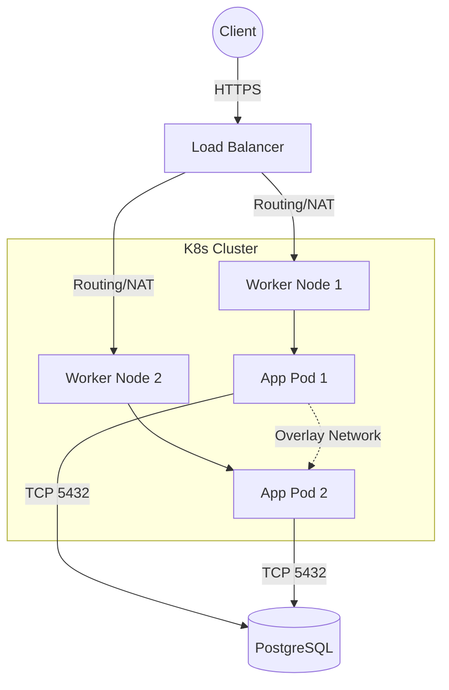

# Основы сетей для DevOps

Представь себе, что ты развернул идеальный кластер, приложения работают, CI/CD настроены, но... пользователи получают `504 Gateway Timeout` или `Connection Refused`. Большинство проблем в production так или иначе сводятся к сети. Сеть — это кровеносная система нашей инфраструктуры, и понимание её основ — это то, что отличает инженера, который просто деплоит манифесты, от того, кто действительно контролирует платформу. 

## Как это работает в Production

В современных DevOps-реалиях мы редко тянем физические кабели. Наша зона ответственности — программно-определяемые сети (SDN), виртуальные интерфейсы (veth), Linux-мосты (bridges) и оверлейные сети (VXLAN/Cilium/Calico). 

Мы решаем боль связности: как контейнеру A на узле X безопасно и быстро поговорить с базой данных B на узле Y, при этом не выпустив наружу приватные данные.



## Где применимо и где отстреливает ногу

Понимание маршрутизации, NAT, DNS и ARP применяется везде: от настройки VPC в AWS/Яндекс Облаке до дебага Service Mesh (Istio, Linkerd) в Kubernetes. 

**Где можно отстрелить ногу:**
- **MTU (Maximum Transmission Unit):** Несовпадение MTU в оверлейных сетях (например, при добавлении заголовков VXLAN/IPsec) приводит к тому, что маленькие пакеты проходят (ping работает, TCP handshake проходит), а большие — молча дропаются (соединение зависает при передаче данных, TLS handshake виснет). Это часто называют MTU Blackhole.
- **Асимметричная маршрутизация (Asymmetric Routing):** Когда пакет уходит по одному маршруту, а возвращается по другому, и по пути строгий firewall (или механизм conntrack) дропает ответный пакет, так как не видел начало сессии (SYN-пакет).

## Базовый инструментарий (Bash)

Для траблшутинга в проде тебе понадобятся эти друзья:

```bash
# Посмотреть, какие порты слушает машина (замена устаревшему netstat)
ss -tulpn

# Проверить таблицу маршрутизации (куда уйдет пакет?)
ip route show

# Посмотреть цепочку прыжков до хоста и найти где теряются пакеты
mtr 8.8.8.8

# Снять дамп трафика на определенном порту, чтобы доказать разработчикам, 
# что приложение возвращает HTTP 500, а не "сеть тормозит"
tcpdump -i eth0 port 8080 -w /tmp/app_traffic.pcap
```

## Нюансы Day 2 Operations

Когда инфраструктура живет и дышит под нагрузкой, возникают новые проблемы эксплуатации:
1. **Исчерпание портов (Port Exhaustion):** Огромное количество исходящих соединений (например, микросервис делает тысячи запросов в секунду к Redis или стороннему API) может исчерпать эфемерные порты (около 28 тысяч по умолчанию). Потребуется тюнинг параметров ядра `net.ipv4.ip_local_port_range` и `net.ipv4.tcp_tw_reuse`.
2. **Проблемы с DNS (CoreDNS bottleneck):** При масштабировании кластера Kubernetes DNS-запросы становятся узким местом из-за ограничения `conntrack` на UDP сессии. Внедрение `NodeLocal DNSCache` становится суровой необходимостью.
3. **Flapping routes:** Маршруты, которые постоянно появляются и исчезают из-за нестабильных линков или проблем с BGP-демонами (например, в Calico), приводят к микро-простоям, которые сложно отследить, но мониторинг будет сыпать алертами.
